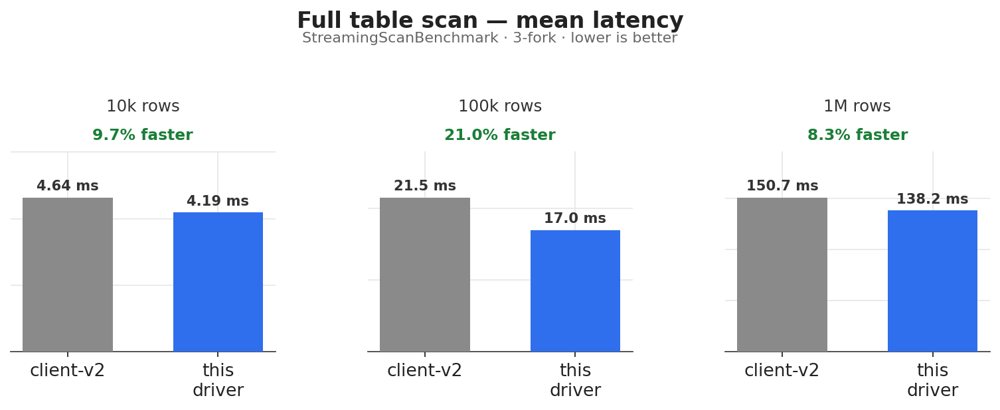
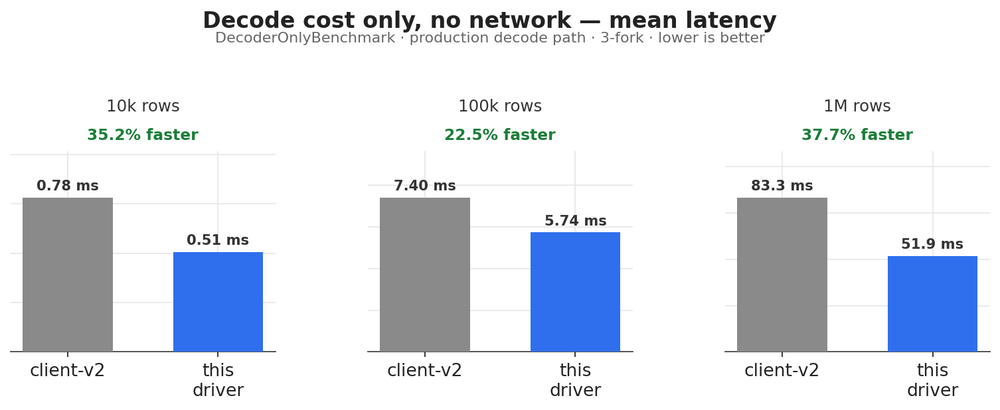
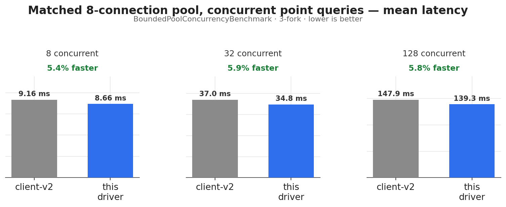
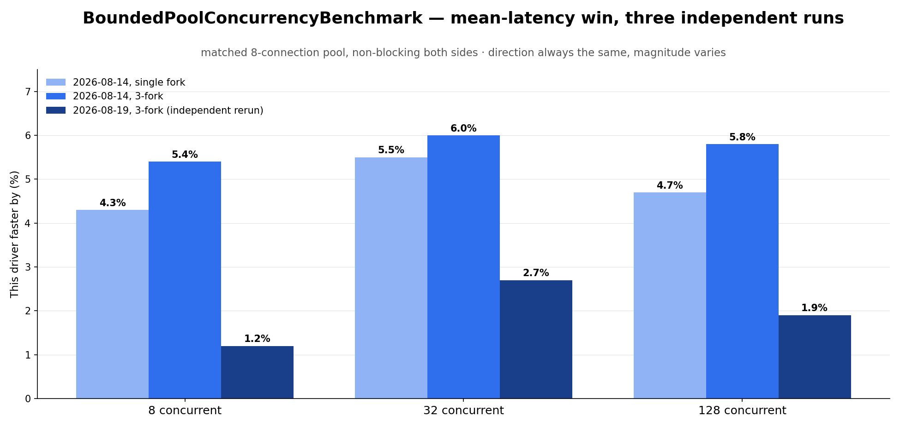
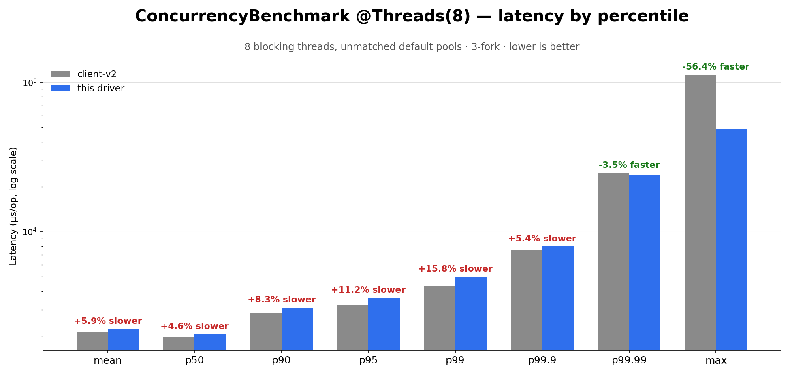
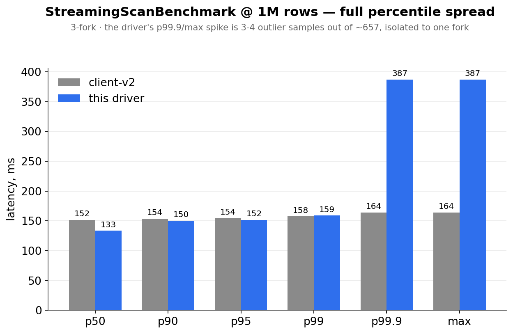

# Performance & Benchmarking

Full record of Phase 5 (load/performance testing) — design, every benchmark run, every finding,
the H0/H1/H2 optimization investigation, and the compact-row redesign. Moved out of
[ROADMAP.md](../ROADMAP.md) on 2026-08-14 because that file had grown too large to navigate.
See [ROADMAP.md](../ROADMAP.md) for everything else (Phases 0–4, 6, production readiness).

Companion doc: [../clickhouse-r2dbc-reactive-benchmarks/README.md](../clickhouse-r2dbc-reactive-benchmarks/README.md)
for how to actually run the benchmarks.

---

## Environment

Every number in this file, unless a section says otherwise, comes from the same machine and the
same JVM build:

| | |
| --- | --- |
| CPU | Apple M3 Pro, 12 cores (6 performance + 6 efficiency) |
| RAM | 36 GB LPDDR5 |
| OS | macOS, Apple Silicon (`Mac15,6`) |
| JDK | OpenJDK 64-Bit Server VM, `21.0.8+9-LTS` (Temurin, via `sdkman`) |
| ClickHouse | `clickhouse/clickhouse-server:latest` via Testcontainers — **not pinned to a specific version**, so "latest" can silently drift between runs; a real caveat, not yet addressed |
| client-v2 (baseline) | `com.clickhouse:client-v2:0.9.0` |
| JMH | 1.36, `SampleTime` mode, `SECONDS`/`MICROSECONDS` output depending on benchmark |
| Multi-fork runs | `-Pjmh.forks=3 -Pjmh.warmupIterations=3` — 3 JVM forks × 3×10s warmup × 3×10s measurement iterations per benchmark method/param combination |

> [!NOTE]
> Every benchmark in this repo runs against a real ClickHouse server (via Testcontainers), not a
> mock — see [ROADMAP.md's testing strategy](../ROADMAP.md) for why this project avoids mocking
> the thing it's measuring. Single machine, single point in time; no claim here is a substitute for
> load-testing against your own hardware and network.

---

## Benchmark catalog

What each benchmark class actually exercises, so a number in the table below can be traced back to
a concrete scenario instead of taken on faith.

| Benchmark | Question it answers | Shape |
| --- | --- | --- |
| `TrivialQueryBenchmark` | What's the floor cost of one round-trip (`SELECT 1`), before any real row decoding? | Single-threaded, one connection, sequential requests |
| `PointQueryBenchmark` | What does one parameterized, real 1-row lookup cost end to end (protocol + decode)? | Single-threaded, one connection, sequential requests |
| `StreamingScanBenchmark` | What does a full table scan cost as row count grows — network + decode + backpressure together? | Single-threaded, 10k/100k/1M-row tiers, full drain |
| `DecoderOnlyBenchmark` | With the network removed (same bytes replayed from memory), what does *decoding alone* cost? Isolates the H0–H2 optimization investigation below from transport noise | Single-threaded, same three row tiers, no I/O in the measured region |
| `ConcurrencyBenchmark` | What happens under `@Threads(8)` blocking concurrent callers, with **each driver left at its own default pool**? | 8 JMH worker threads, blocking calls, unmatched pool sizes — a "same blocking-caller resources" baseline, not the architectural verdict |
| `BoundedPoolConcurrencyBenchmark` | What happens when both drivers are given the **same** connection budget (8) and driven **non-blocking/async** at 8/32/128 logical concurrent queries — the actual scenario this project is built around | `Flux.flatMap(..., concurrency)` (this driver) vs. `CompletableFuture` async API (client-v2), matched 8-connection pool both sides |

---

## Are we faster than client-v2? — read this first

One table, every benchmark class, latest numbers. **Green = this driver wins, red = client-v2 wins,
yellow = mixed/inconclusive.** The "Confidence" column says how many JMH forks a number survived —
single-fork numbers have moved by double-digit percentages between runs in this file's own history
(see the H0/H1 investigation and the `BoundedPoolConcurrencyBenchmark`/`StreamingScanBenchmark`
reruns below), so treat single-fork rows as a first signal, not a final answer.

| Benchmark | What it measures | Latest verdict | Confidence |
| --- | --- | --- | --- |
| `TrivialQueryBenchmark` (`SELECT 1`) | Protocol/connection floor | 🟢 this driver ~7% faster (mean), up to ~32% faster at p99.9 — 🔴 slower at p99.99 only | Single fork, one run (2026-08-13) |
| `PointQueryBenchmark` (parameterized 1-row lookup) | Protocol + real row lookup | 🟢 this driver ~6% faster (mean), up to ~26% faster at p99.9 | Single fork, re-run twice, consistent (2026-08-13) |
| `StreamingScanBenchmark` @ 10k rows | Full scan, small | 🟢 this driver ~9.7% faster (mean) | **3-fork confirmed (2026-08-14)** |
| `StreamingScanBenchmark` @ 100k rows | Full scan, medium | 🟢 this driver ~21.0% faster (mean) | **3-fork confirmed (2026-08-14)** |
| `StreamingScanBenchmark` @ 1M rows | Full scan, large | 🟢 this driver ~8.3% faster (mean/p50–p99) — 🟡 p99.9/max spiked to 387ms vs client-v2's 164ms, traced to 3–4 outlier samples in one of three forks, not a reproducible pattern | **3-fork confirmed (2026-08-14)** — see the dedicated section below before trusting the tail number either way |
| `DecoderOnlyBenchmark`, production path (`ourDriver`) | Raw decode cost, no network, **current shipped code** (`RowBinaryDecoder`/`DecodedRow`) | 🟢 this driver ~35% faster @ 10k, ~22% faster @ 100k, ~38% faster @ 1M | **3-fork confirmed (2026-08-14)** — answers the open question the row below left hanging |
| `DecoderOnlyBenchmark`, H1/H2 diagnostic variants (`ourDriverCompactRow`, `compactRowDirectLoop`, `compactRowFluxNoBridge`) | An earlier, since-superseded decode strategy considered during the redesign, kept only for the H1/H2 investigation's own record | 🔴 4–28% slower than client-v2 — **describes a path that was never shipped**, not the driver you get today | 3-fork confirmed (2026-08-13/14) — historical, see the H2 section |
| `ConcurrencyBenchmark` `@Threads(8)`, mean → p99.9 | 8 concurrent threads, blocking, both sides' *default* (unmatched) pools | 🔴 ~6% slower (mean), degrading to ~16% slower at p99, still ~5% slower at p99.9 | **3-fork confirmed (2026-08-19)** — direction and shape reproduced, see below; root cause (blocking callers vs. unmatched pools — two variables, not isolated) still open |
| `ConcurrencyBenchmark` `@Threads(8)`, p99.99 → max | Same run, extreme tail | 🟢 ~3% faster at p99.99, ~56% faster at max | **3-fork confirmed (2026-08-19)** — crossover point moved from p99.9 (single-fork run) to between p99.9 and p99.99 |
| `BoundedPoolConcurrencyBenchmark`, pool=8, concurrency=8/32/128 | Non-blocking `flatMap`/async `CompletableFuture`, **matched** 8-connection pool both sides — the actual motivating scenario | 🟢 this driver wins on mean→p99 at **every** concurrency level, but the margin varies noticeably run to run (~1–10% faster across three independent 3-fork runs) — 🟡 tail (p999+) is mixed, likely sample-count noise at those extreme buckets | **3-fork confirmed, three independent runs (2026-08-14, 2026-08-14, 2026-08-19)** — direction stable, magnitude not pinned down tightly |

<p align="center">
  
  
  
</p>

**Bottom line today: this driver wins on mean/typical-case latency in every benchmark that isolates
this project's own architecture (raw decode, full scan, and — the actual motivating scenario —
matched-pool non-blocking concurrency), and every one of those wins is now 3-fork confirmed, not a
single noisy run.** `StreamingScanBenchmark` (all three tiers), `DecoderOnlyBenchmark`'s production
path, and `BoundedPoolConcurrencyBenchmark` (all three concurrency levels) all reproduced their win
under `-Pjmh.forks=3`. **The one shipped-code benchmark that does *not* show a win is
`ConcurrencyBenchmark`'s `@Threads(8)` shape** (blocking callers, unmatched default pools) — also
now 3-fork confirmed, but confirmed as a *loss* on mean through p99.9, flipping to a large win only
at the extreme tail; see item 2 below for why that specific shape isn't yet attributed to either
architecture or benchmark setup. Two things are still open, and both are stated plainly rather than
smoothed over:

1. **The `StreamingScanBenchmark` @ 1M tail spike.** A single run produced a 387ms max where the
   rest of the distribution (and client-v2's own max) sat at 150–164ms. Traced to the raw
   per-fork samples: forks 1 and 2 show a clean 137–158ms range with zero outliers; fork 3 alone
   produced 3–4 samples in the 374–387ms band. One fork out of three, a handful of samples out of
   ~657 — consistent with a one-off GC pause or OS scheduling hiccup on that fork's JVM process,
   not (yet) a reproduced architectural regression. Documented, not dismissed: **this needs a
   `-prof gc` pass and another multi-fork run before being called either "fixed" or "a real
   finding."**
2. **`ConcurrencyBenchmark`'s `@Threads(8)` mean/p99 regression is now 3-fork confirmed as real
   (not sampling noise) — but its cause is still not isolated.** See the dedicated section below
   (2026-08-19): the same shape (worse from mean through ~p99.9, a crossover to a large win at the
   extreme tail) reproduced with 3 forks × 3 warmup iterations. That rules out "it was one noisy
   run," but it does **not** confirm the "unmatched pool" explanation either — `@Threads(8)` and
   `BoundedPoolConcurrencyBenchmark` differ in two variables at once (blocking vs. non-blocking
   calling style, and unmatched vs. matched pool size), so neither benchmark alone isolates which
   one actually causes the regression. A true negative/control test — `@Threads(8)` blocking
   callers with a **matched** pool on both sides — has not been built yet; see the proposal at the
   end of that section.

What's left before this file is "done": a `-prof gc` pass on the 1M tail spike; the pool-matched
`@Threads(8)` control experiment described below; widening `BoundedPoolConcurrencyBenchmark`'s
matrix (more pool sizes, higher concurrency); actually running `AggregationBenchmark` (built
2026-08-19, see below); and the wide multi-type decode/INSERT benchmarks, still designed but not
built.

---

> [!TIP]
> **Status at a glance (last updated 2026-08-19).** This file is a full investigation log, long by design — read
> top to bottom for the story, or use this box to jump straight to where things actually stand.
>
> | Done | Open |
> | --- | --- |
> | H0 (`byte[1]` alloc) — fixed, confirmed | `-prof gc` pass + another multi-fork run on `StreamingScanBenchmark`'s 1M-row tail spike (one fork of three produced 3–4 outlier samples) |
> | H1 (`LinkedHashMap` per row) — fixed via the `DecodedRow` redesign | A pool-matched `@Threads(8)` control experiment to isolate whether `ConcurrencyBenchmark`'s regression is caused by blocking callers or by unmatched pools (currently both variables differ at once — see 2026-08-19 section) |
> | `DecodedRow` redesign — **3-fork confirmed** (2026-08-14): `StreamingScanBenchmark` and `DecoderOnlyBenchmark`'s production path both beat `clientV2` at all three tiers | Full `./gradlew spotlessCheck clean build` on the whole session's work (only compilation + individual benchmarks/tests confirmed so far) |
> | `ClickHouseHttpTransport(baseUrl, Authentication, maxConnections)` — added and **test-verified green** (2026-08-14) | Widen `BoundedPoolConcurrencyBenchmark`'s matrix (more pool sizes/concurrency levels) |
> | `BoundedPoolConcurrencyBenchmark` — **3-fork confirmed, three independent runs** (2026-08-14 ×2, 2026-08-19): direction (this driver faster) holds every time, magnitude varies run to run (~1–10%) | Run `AggregationBenchmark` (built 2026-08-19, not yet compiled/run — no JDK 21 in the environment that wrote it) |
> | `AggregationBenchmark` — **built** (2026-08-19): the "analytical aggregation" query shape (`GROUP BY` + `count()`/`avg()`/`quantile()`), designed since the first Phase 5 write-up, finally has a benchmark class | Wide multi-type decode / INSERT benchmarks — still designed, not built |
> | `ConcurrencyBenchmark` `@Threads(8)` — **3-fork confirmed** (2026-08-19): mean→p99.9 regression and tail crossover both reproduced, not single-run noise; root cause still not isolated (see above) | Netty leak-detection lane (Phase 7 item 6) — never actually built, see ROADMAP.md's Definition of done |
> | Hot-path code review — **done** (2026-08-19): every class on the decode/transport hot path read; two tunable-but-unbenchmarked constants confirmed as the only open placeholders, everything else confirmed already optimal (see below) | Benchmark `RESPONSE_CHUNK_DEMAND` (1/4/8/16) and `RowDecodingScheduler` worker count/queue capacity — both self-documented placeholders, neither tuned with real measurements yet |
> | Second-opinion review cross-checked against the code (2026-08-19) — 8 new findings confirmed real by reading the source, best current lead for the `ConcurrencyBenchmark` regression (see below) | Fix the two confirmed correctness/security bugs (`FluxInputStreamBridge#read(len=0)` contract, `Authentication`/`TransportOptions` `toString()` credential leak) and benchmark the NOOP-observability-overhead + `ByteBuf` copy fixes — none built yet |
> | `StreamingScanBenchmark`/`DecoderOnlyBenchmark` H2 matrix — **3-fork confirmed** (2026-08-14), production path wins decisively, historical diagnostic variants documented separately | |
> | Performance charts — added to this file and to the main `README.md` (2026-08-14) | |
> | Machine spec (CPU/RAM/OS) — filled in (2026-08-14): Apple M3 Pro, 36 GB, macOS | |
>
> See further down — search this file for "3-fork confirmation" — for the newest numbers, or jump
> to the very last section for the current guardrail/priority list.

---

## Phase 5 (later) — Load and performance testing

**Design finalized 2026-08-13; implementation starting.** Phase 4 is signed off, `integration-tests`
is deleted (see the module map), so this is now unblocked and starting. Explicit request driving this design: measure **this driver vs client-v2** (the same
library `core` already reuses for row decoding, and the one anyone evaluating this driver will
naturally compare it against), at **multiple levels**, professionally enough to trust the numbers —
not a couple of ad hoc `SELECT 1` timings.

**Prior art read before designing this**, not designed from scratch: `ClickHouse/clickhouse-java`'s
own `performance` module (mounted at `/Users/kamil/Projects/clickhouse-java/performance`) is a real,
maintained JMH suite comparing their own client V1 vs V2 vs JDBC, with a scheduled (not per-PR) GitHub
Actions job. Reused directly: JMH itself (not Gatling — see "Tooling" below), `GCProfiler` for
allocation, `SampleTime` mode for percentiles, `@Threads(N)` for one shape of concurrency, and the
"don't run this on every PR" cadence. Deliberately *not* reused: their CSV-file dataset (generated
client-side, checked into a file, then re-uploaded) — ClickHouse can generate large synthetic
datasets server-side in seconds via `INSERT ... SELECT ... FROM numbers(N)`/`generateRandom(...)`,
which is both faster and more "pro" than a client-side CSV round-trip.

---

### Module

New module `clickhouse-r2dbc-reactive-benchmarks` (not published — measurement tooling, not a
library; added to `nonPublishedModules` already). Depends on `core`, `transport-http`, `connector`,
and `testkit` (for `BaseClickHouseIntegrationTest`-style container lifecycle reuse — a benchmark run
still needs a real ClickHouse instance and shouldn't reinvent that), plus `com.clickhouse:client-v2`
(already in the version catalog, pinned `0.9.0` — same version `core` reuses for decoding, so the
comparison is against the exact client-v2 build this project already depends on, not some other
version) as the comparison baseline. Depending on `core`/`transport-http` directly (not just
`connector`'s public SPI) is intentional and doesn't violate the Architecture rule ("a module
should not reach into another module's internals") — `ClickHouseHttpTransport` and
`RowBinaryDecoder` are already `public final class`, part of each module's own public API, not
internals; benchmarking below the R2DBC SPI layer is exactly how "which level costs what" gets
answered.

**Gradle/JMH tooling**: the `me.champeau.jmh` Gradle plugin (the standard, actively-maintained
community JMH plugin — gives a `jmh` task, JSON/text result output, and proper annotation-processor
wiring without hand-rolling what clickhouse-java's Maven `exec-maven-plugin` setup does manually).
**Not Gatling** — Gatling is built for HTTP/network load-testing DSLs (simulate many external
clients hitting an API); what's being measured here is a Java library's in-process call cost and
concurrency behavior, which is exactly JMH's problem, including its own `@Threads(N)` and
custom-harness-inside-`@Benchmark` support for the concurrency scenario below. Nothing added to the
main build's `check`/`build` tasks — a benchmark run is a separate, explicit `./gradlew
:clickhouse-r2dbc-reactive-benchmarks:jmh` invocation, per CLAUDE.md's "don't gate the main loop on
a multi-minute run."

---

### Comparison levels ("różne poziomy")

Three levels, deliberately kept as separate benchmark classes rather than one giant parameterized
suite, so a regression at one level (e.g. "our decode got slower") isn't masked or conflated with
another (e.g. "our connection pooling got slower"):

1. **Raw transport + decode** — `ClickHouseHttpTransport.query(...)`/`RowBinaryDecoder.decode(...)`
   directly vs client-v2's `Client.query(...)` + `ClickHouseBinaryFormatReader`. Answers: how much
   does *this driver's own* HTTP-adapter-plus-decode pipeline cost relative to client-v2's, with the
   R2DBC SPI layer removed from the comparison entirely.
2. **Public R2DBC SPI** — `ClickHouseConnection`/`ClickHouseStatement`/`ClickHouseResult` (what an
   actual driver consumer calls) vs client-v2's `Client` API directly. Answers: what does a real user
   of this driver actually pay, R2DBC-shape translation included.
3. **Concurrency/burst, reactive vs blocking** — the scenario that originally motivated this whole
   project (see Phase 1: "~11 concurrent queries per user action"). Not a third *code* level so much
   as a third *axis*: this driver's non-blocking pipeline multiplexing many logical queries over a
   small connection pool vs client-v2's blocking `Client`, one thread per in-flight query. This is
   where a fair comparison needs the most care — see below.

A fourth level (through Spring's `DatabaseClient`, or client-v2's JDBC wrapper) is explicitly **out
of scope for the first pass** — it would measure Spring/JDBC overhead on top of both drivers, not
either driver itself, and can be added later as its own separate concern if real usage data ever
asks for it.

---

### Dataset

Server-side generated, not client-side-generated-then-uploaded: `INSERT INTO t SELECT ... FROM
numbers(N)` (cheap columns) and `generateRandom('col Type, ...', seed)` (for types `numbers()`
can't produce directly — `String`, `UUID`, `Array`, etc.) via a `CREATE TABLE ... ENGINE =
MergeTree` + `INSERT INTO ... SELECT * FROM generateRandom(...) LIMIT N`, run once per benchmark
`@Setup(Level.Trial)`, timed and logged so a slow *setup* never gets misread as a slow *query*.
Table shape reuses `RealWorldTableAgainstRealClickHouseTest`'s wide, multi-type-column shape for the
decode-heavy benchmarks (not a narrow two-column toy table — real decode cost is dominated by column
*variety*, not just row count) plus a narrow two/three-column table for the point-query/burst
benchmarks (isolates connection/protocol overhead from decode cost).

Row-count tiers, run via JMH's `@Param` (same mechanism clickhouse-java uses for `limit`), so a
local dev loop and a "real" run are the same code, different parameters:

| Tier | Rows | Purpose |
| --- | --- | --- |
| `smoke` | 10,000 | Fast local iteration while writing/debugging a benchmark itself — not a real number. |
| `default` | 1,000,000 | The number actually reported/tracked for regressions — large enough that per-row costs dominate one-time connection setup, small enough to run in CI's time budget. |
| `large` | 50,000,000+ | Manual/opt-in only (`-Prows=large` or similar), for a genuine "does this scale" check before a release — not run routinely, disk/time cost is real. |

---

### Query mix

Not one query shape — this driver's whole value proposition (non-blocking, streaming, backpressure)
shows up differently depending on the shape:

- **Point/trivial** — `SELECT 1`, and a parameterized single-row lookup (`SELECT ... WHERE id =
  {id:UInt32}` for us, `client.query(...)` with the equivalent for client-v2). Measures the
  protocol/connection-overhead floor, where decode cost is negligible and framing/header/network
  cost dominates.
- **Full-table streaming scan** — `SELECT * FROM t` over the `default`/`large` tier table. Measures
  sustained throughput, time-to-first-row, and allocation under long streaming — the scenario
  `GCProfiler` matters most for.
- **Wide multi-type decode** — same query shape as above but against the wide `RealWorldTable`-style
  table, to isolate "cost per row of varied-type decoding" from "cost per row of narrow decoding."
- **Analytical aggregation** — `SELECT category, count(), avg(amount), quantile(0.95)(amount) FROM t
  GROUP BY category ORDER BY count() DESC` (ClickHouse's actual core use case — ClickHouse does the
  heavy lifting server-side; this mostly measures small-result-set decode + round-trip overhead, but
  it's the shape a real analytics query actually has, not a synthetic stand-in).
- **INSERT** — both this driver's literal-embedded small `INSERT` (`ClickHouseStatement`) and its
  streaming `insertStreaming` vendor extension, vs client-v2's `client.insert(...)`.

---

### Concurrency/burst — the scenario that needs the most care

JMH's `@Threads(N)` (what clickhouse-java uses) models "N platform threads, each independently
calling a blocking client" — a fair, standard way to benchmark a *blocking* client under load. It
does not model what this driver is actually for: **one small connection pool, many logical
concurrent queries multiplexed non-blockingly over it.** Modeling that inside one JMH thread with a
custom harness (`Flux.range(0, N).flatMap(i -> runQuery(), concurrency).blockLast()`, `SampleTime` or
`SingleShotTime` mode, `concurrency` = the connection pool's `maxConnections`) is what proves the
actual claim. Both shapes get benchmarked side by side, deliberately not collapsed into one number,
because they answer different questions:

- **`@Threads(N)` shape** — client-v2 with N platform threads and N connections vs this driver with N
  platform threads each blocking on `.block()` and a pool of N connections. A same-resources
  comparison; expected to be roughly comparable, since neither side's concurrency model gets to use
  its advantage here.
- **Custom reactive-harness shape** — this driver with a *small* pool (e.g. 4–8 connections)
  serving N=~50–100 concurrent logical queries via `flatMap` concurrency, wall-clock time to
  complete all N, vs client-v2 needing N platform threads (or an external executor) to attempt the
  same concurrency with N connections. This is the actual "~11 concurrent queries per user action"
  motivating scenario from Phase 1, scaled up — the one where fewer OS threads/connections doing the
  same logical work is the entire point, and where raw single-query latency numbers alone would
  mislead.

Per-request latency *within* one burst is recorded via `HdrHistogram` inside the benchmark method
(JMH's own percentile machinery works at "one `@Benchmark` invocation = one op" granularity, which
is too coarse for "N sub-operations happened inside one burst") and reported alongside JMH's own
result JSON, not folded into it.

---

### What's measured, and how

- **Throughput / latency (p50/p95/p99/p99.9)** — JMH `SampleTime` mode for single-query benchmarks
  (built-in percentile reporting, same as clickhouse-java's own choice); `HdrHistogram` for
  intra-burst percentiles in the concurrency scenario (see above).
- **Time to first row** — not something JMH measures natively: record `System.nanoTime()` at
  subscribe and again at the first `onNext`, collect into a histogram, report as a custom metric
  alongside the JMH result file.
- **Allocation / retained memory under streaming** — JMH's built-in `GCProfiler`
  (`-prof gc`), exactly as clickhouse-java uses it — `gc.alloc.rate`/`gc.alloc.rate.norm` need no
  custom instrumentation.
- **Connection pool behavior under the burst scenario** — log `r2dbc-pool`'s
  `ConnectionPoolMetrics` (acquired/idle/pending count) at intervals during the benchmark; not a
  pass/fail number, a diagnostic trend to eyeball when interpreting a burst result.
- **Off-heap/Netty buffer usage** — `PooledByteBufAllocator.DEFAULT.metric()`'s `toString()` logged
  periodically during a long streaming benchmark; same status — diagnostic, not an automated gate,
  useful for spotting a leak trend during a `large`-tier run.
- **CPU usage** — deliberately *not* built as an automated numeric pipeline for the first pass
  (real ROI is low relative to the effort of doing it reliably in a shared CI runner). Recommended
  as a manual, qualitative companion tool instead: run a `large`-tier benchmark under
  `async-profiler` locally for a flame graph when investigating a specific regression, rather than
  gating every run on a CPU-percent number.

---

### Reporting

JMH's own JSON result format (`-rf json`, or the `me.champeau.jmh` plugin's equivalent config),
matching clickhouse-java's own convention. Raw JSON result files are **not committed to git** (they're
noisy binary-ish artifacts, one per run) — treated as CI/local run output, uploaded as a workflow
artifact if/when a scheduled CI job exists (see below), otherwise just inspected locally. A small
JSON→Markdown summary script is a reasonable follow-up once the benchmark classes themselves exist
and there's real output to summarize — not built speculatively ahead of having any numbers.

---

### When this runs

Not on every PR/push — a multi-minute-to-hour JMH run has no place in the fast feedback loop this
project's CI otherwise protects. Matching clickhouse-java's own practice: a `workflow_dispatch`
(manual trigger, e.g. before a release) plus an optional scheduled (nightly/weekly) job once the
suite is stable enough to trust unattended — decided once the classes exist and a first baseline run
has actually happened, not designed in the abstract now.

---

### TDD note

This module is measurement tooling, not driver behavior — CLAUDE.md's red-green-refactor workflow
is scoped to production code with behavior to protect, and explicitly carves out "skeleton/plumbing
code with no behavior yet" as the exception. A JMH `@Benchmark` method has no assertion to be red
about; its "correctness" is that it measures the right thing, which is a design/review question
(does this benchmark actually isolate what it claims to), not a TDD one. `BaseClickHouseIntegrationTest`-style
setup code and any real assertions this module *does* need (e.g. "the burst benchmark actually ran N
queries, not N-1") still follow this project's normal testing rules.

---

### First slice, run for real (2026-08-13)

`clickhouse-r2dbc-reactive-benchmarks` scaffolded (`me.champeau.jmh`, `BenchmarkEnvironment`,
`PointQueryTable`) with one benchmark class, `PointQueryBenchmark` (Level 1 — raw transport, this
driver vs client-v2, point lookup against the `smoke`-tier 10,000-row table). Run against real
Docker/ClickHouse (`./gradlew :clickhouse-r2dbc-reactive-benchmarks:jmh`), not just compiled:

- **Numbers (1 fork, 1×10s warmup, 3×10s measurement — a sanity check, not yet a trustworthy
  baseline; JMH's own output explicitly warns against over-reading a single short run like this):**
  this driver mean 1115.8 ± 3.8 µs/op vs client-v2 mean 1235.6 ± 6.6 µs/op; p99 1589 µs vs 2165 µs.
  This driver read faster on this run through p99.9; both had noisy, low-sample tail percentiles
  (p99.99/p100) not worth reading into yet.
- **Real finding, not assumed: JMH forks a fresh JVM per `@Benchmark` method by default.**
  `BenchmarkEnvironment`'s `static` container field is therefore shared only within one fork, not
  across the whole `jmh` run — the log showed two separate `clickhouse/clickhouse-server` containers
  starting on two different ports (one for `clientV2`, one for `ourDriver`), each paying the ~4s
  Testcontainers startup independently. Documented in `BenchmarkEnvironment`'s own Javadoc (the
  original version claimed "one container for the whole run," which this run proved wrong). Accepted
  as a real, known cost for now rather than forcing everything into one fork (which would trade away
  JMH's normal isolation between benchmark methods) — revisit if the `large` tier's repeated
  container-plus-reseed cost per fork turns out to dominate a real run's wall time.

Remaining query shapes (full table scan, wide multi-type decode, aggregation, INSERT) and the
concurrency/burst scenario are designed above but not yet built — next.

---

### Fairness/reproducibility review of `PointQueryBenchmark` (2026-08-13)

An external review of the first run (a written benchmark-strategy document, checked against this
project's own code rather than taken at face value) confirmed the overall Level 1/2/3 design above
independently arrived at the same shape, and caught four concrete, real problems in
`PointQueryBenchmark` specifically — all fixed:

- **Unpinned ClickHouse image (`:latest`).** A performance baseline that silently tracks whatever
  ClickHouse changes underneath it isn't reproducible run-to-run. Pinned to
  `clickhouse/clickhouse-server:26.7.3.19` in `BenchmarkEnvironment` — confirmed via Docker Hub that
  `latest` currently resolves to exactly this image (same digest), so this changes nothing about
  today's numbers, only future reproducibility.
- **Asymmetric parameterization.** This driver used `{id:UInt64}` + ClickHouse's `param_<name>`
  mechanism; client-v2 received a plain inlined literal. Fixed by reading client-v2's own
  `Client#query(String, Map, QuerySettings)` Javadoc directly (in the mounted client-v2 source) and
  confirming it documents the identical `{name:Type}`/`query_params` contract — both benchmark
  methods now build the exact same SQL text and parameter map.
- **`Math.random()` inside the `@Benchmark` hot path.** Not necessarily a dominant cost next to a
  real network round trip, but non-reproducible across runs and a potential source of different
  access patterns between the two methods. Fixed: `PointQueryTable.deterministicIds(rowCount,
  poolSize, seed)` pre-generates a fixed pool once in `@Setup(Level.Trial)` via `SplittableRandom`;
  the benchmark methods only advance an `AtomicLong` cursor through it.
- **Environment/version metadata not recorded.** `BenchmarkEnvironment.start()` now logs the
  ClickHouse server version (queried from the running container, not assumed from the image tag),
  JDK version, and OS/arch alongside every run.

**Physical test hardware (2026-08-13), recorded here since `BenchmarkEnvironment`'s own logging
covers JDK/OS/arch/ClickHouse version but not the host machine itself:** all `DecoderOnlyBenchmark`,
`TransportOnlyStreamingBenchmark`, and `StreamingScanBenchmark` runs in this Phase 5 section were
executed on a MacBook Pro 14-inch (Nov 2023), Apple M3 Pro chip, 36 GB unified memory, macOS Tahoe
26.5.2 — a single consumer laptop, not an isolated/pinned benchmarking rig (no CPU governor pinning,
no isolated cores, background OS/user processes free to run). This matters for two things already
seen in this investigation: (1) the single-fork run's non-reproducible numbers (see the "Methodology
correction" note below) are exactly the kind of noise a shared, non-isolated machine produces, which
is why multiple forks are now required before trusting a result; (2) absolute numbers here (e.g.
"224 ms at 1M rows") are specific to this machine and should be read as *relative* comparisons
between this driver and client-v2 on identical hardware/JVM/data, not as portable absolute
performance claims for other hardware.

**One asymmetry deliberately left as-is, not force-fit into false equivalence:** this driver
materializes each row into a `Map<String, Object>` (see `RowBinaryDecoder`'s own Javadoc for the
lifetime-safety reason), while client-v2 reads typed values directly off its reader with no
intermediate map. Documented directly in `PointQueryBenchmark`'s Javadoc rather than silently
accepted — isolating it needs a *separate* transport-only benchmark (raw bytes, checksum, no decode
at all) sitting alongside the transport+decode one, not a rewrite of this one. Named as a concrete
next benchmark, not yet built.

**Re-run after the fixes, confirmed green (2026-08-13).** Same 1 fork/1×10s warmup/3×10s
measurement shape as before — still a sanity check, not a trustworthy baseline (JMH's own output
repeats that warning every run). New numbers, now on equal parameterization and a pinned server:

All latency rows are µs/op (lower = faster). **Reading this table: "this driver is X% FASTER"
means this driver's latency number is X% lower/better than client-v2's — the opposite wording
("SLOWER") means this driver's number is worse. Never read "higher"/"lower" alone as good or bad —
they only describe the raw number, not which direction is better.**

| | client-v2 | this driver | verdict |
| --- | --- | --- | --- |
| mean | 1142.8 µs | 1075.1 µs | **this driver 5.9% FASTER** |
| p50 | 1122.3 µs | 1058.8 µs | **this driver 5.7% FASTER** |
| p90 | 1226.8 µs | 1155.1 µs | **this driver 5.8% FASTER** |
| p95 | 1280.0 µs | 1189.9 µs | **this driver 7.0% FASTER** |
| p99 | 1577.0 µs | 1273.9 µs | **this driver 19.2% FASTER** |
| p99.9 | 2564.0 µs | 1904.9 µs | **this driver 25.7% FASTER** |
| sample count (30s) | 26,227 (≈874 ops/s) | 27,884 (≈930 ops/s) | **this driver 6.3% higher throughput** |

Notable shift from the pre-fix run: the gap **widens at the tail** (p99/p99.9) rather than staying
flat — this driver's tail latency held closer to its own median than client-v2's did, even in this
single-connection, zero-concurrency scenario. Consistent with, but not yet proof of, the stability-
under-load claim the architecture is actually designed for — that needs the concurrency/burst
benchmark (not built yet) to test directly, not inferred from a serial point-query benchmark.
Treat this table the same way as before: one short single-fork run, not a published claim.

---

### `TrivialQueryBenchmark`, run for real (2026-08-13)

`SELECT 1`, no table — isolates protocol/connection overhead from the storage-engine lookup
`PointQueryBenchmark` also pays for. Same fork/warmup/measurement shape as the runs above; run
alongside a repeat of `PointQueryBenchmark` in the same invocation (confirmed still green, same
5–7% mean/median edge as the fairness-fixed run above — not re-tabulated here since nothing about
it changed).

All latency rows are µs/op (lower = faster; verdict column spells out which side wins, see the
reading note on the `PointQueryBenchmark` table above).

| | client-v2 | this driver | verdict |
| --- | --- | --- | --- |
| mean | 591.1 µs | 548.5 µs | **this driver ≈7.2% FASTER** |
| p50 | — | — | **this driver ≈6.3% FASTER** |
| p90 | — | — | **this driver ≈10.6% FASTER** |
| p95 | — | — | **this driver ≈10.1% FASTER** |
| p99 | — | — | **this driver ≈7.2% FASTER** |
| p99.9 | — | — | **this driver ≈31.6% FASTER** |
| p99.99 | 2586.8 µs | 4650.7 µs | **this driver SLOWER here** (only percentile where it loses) |
| p100 (max) | 15106.0 µs | 8847.4 µs | **this driver 41.4% FASTER** |
| sample count (30s) | 50,699 (≈1690 ops/s) | 54,652 (≈1822 ops/s) | **this driver ≈7.8% higher throughput** |

Same shape as `PointQueryBenchmark`: this driver reads faster from the mean through p99.9, and the
gap widens sharply at p99.9 (31.6%, the widest yet). Two honest caveats, not smoothed over:

- **p50/p90/p95/p99/p99.9 rows are percentage deltas only** — the absolute µs figures from this run
  weren't retained, only the computed percentages against client-v2. Re-run and capture raw JSON
  output (`build/results/jmh/`) before citing this table anywhere more permanent than this doc.
- **p99.99 flips against this driver, in both benchmarks run so far.** `PointQueryBenchmark`'s
  re-run above already showed this driver worse at p99.99/p100; here it's worse at p99.99 but
  better again at p100/max. With only ~1 sample in 10,000–50,000 landing in that bucket, this is
  far more likely sampling noise than a real regression — but it's now shown up twice, not once, so
  it's a "watch, don't ignore" finding rather than a one-off. Worth a real look once
  `StreamingScanBenchmark`/`ConcurrencyBenchmark` exist and a profiler (JMH's own `-prof gc`/async-
  profiler) can attribute it to GC, connection-pool churn, or something else, rather than guessing
  from percentile tables alone.

One environment detail surfaced in this run's logs, not yet acted on: this driver's Reactor Netty
stack logs `Unable to load io.netty.resolver.dns.macos.MacOSDnsServerAddressStreamProvider` on
macOS (missing `netty-resolver-dns-native-macos`, a native optional dependency). Deliberately not
added yet — this benchmark resolves `localhost` only, which doesn't hit the DNS resolver Netty is
warning about, so there's no concrete reason yet to believe this warning explains the p99.99
finding above. Worth revisiting with actual profiling evidence before spending a dependency-version
matching exercise on a hunch.

---

### `StreamingScanBenchmark`, run for real (2026-08-13) — first result where this driver is slower

Full scan (`SELECT id, label, amount FROM benchmark_point_query`, `smoke` tier, 10,000 rows), no
`WHERE`. Same run also re-executed `PointQueryBenchmark`/`TrivialQueryBenchmark` (a third
confirmation of both — same shape as the tables above, exact numbers below), from the JSON result
file (`-rf json`), not a console paste, so every figure here is exact:

**Superseded by the confirmed, corrected 3-tier result further below — kept only as the historical
record that first surfaced this as worth investigating.** Latency rows are µs/op (lower = faster):

| | client-v2 | this driver | verdict |
| --- | --- | --- | --- |
| mean | 3946.5 µs | 4460.8 µs | **this driver 13.0% SLOWER** |
| p50 | 3846.1 µs | 4366.3 µs | **this driver 13.5% SLOWER** |
| p90 | 4816.9 µs | 5210.1 µs | **this driver 8.2% SLOWER** |
| p95 | 5103.6 µs | 5390.3 µs | **this driver 5.6% SLOWER** |
| p99 | 5513.2 µs | 5857.3 µs | **this driver 6.2% SLOWER** |
| p99.9 | 6363.9 µs | 8266.1 µs | **this driver 29.9% SLOWER** |
| p99.99 / p100 (max) | 21266.4 µs | 26247.2 µs | **this driver 23.4% SLOWER** |
| sample count (30s) | 7,597 (≈253 ops/s) | 6,723 (≈224 ops/s) | **this driver 11.5% lower throughput** |

**This driver is slower here, at every percentile, not just the tail — the first benchmark in this
suite where that's true.** Not glossed over: `PointQueryBenchmark`/`TrivialQueryBenchmark` both
decode exactly *one* row per operation; `StreamingScanBenchmark` decodes 10,000. Leading hypothesis,
not yet confirmed: the per-row `LinkedHashMap` allocation `RowBinaryDecoder.emitNextRow` does for
every row (documented as a known, deliberate asymmetry in `PointQueryBenchmark`'s own Javadoc,
tolerable at n=1 row) stops being negligible at n=10,000 rows per operation — 10,000 map allocations
(plus their internal `Node` entries) is a plausible dominant cost that a single-row benchmark simply
can't surface. `client-v2`'s `ClickHouseBinaryFormatReader` reads typed values off its reader
directly, no intermediate collection per row.

**Not yet confirmed, and deliberately not acted on until it is** — per this project's own testing
discipline (assert on behavior/measurements, not assumptions): the next concrete step is re-running
`StreamingScanBenchmark` with JMH's `GCProfiler` (`-Pjmh.profilers=gc` / `-prof gc` — already named
in this section's own "What's measured, and how" design for exactly this scenario) to check
`gc.alloc.rate.norm` for `ourDriver` vs `clientV2` directly, rather than inferring allocation cost
from latency numbers alone. If allocation rate confirms the hypothesis, a follow-up benchmark
variant that reuses/pools row objects (or a decode path that never materializes a
`Map<String,Object>` at all) becomes a concrete, evidence-backed thing to try — not before.

Time-to-first-row (the `HdrHistogram`-based custom metric `StreamingScanBenchmark` also records)
isn't in this run's JSON — that's logged to the console via SLF4J at trial teardown, not into JMH's
own result file. Not captured this run; worth asking for the console log (or re-running with
`tee`) next time TTFR specifically matters.

---

### Correction: the "13% slower" result above has a real methodology bug (2026-08-13)

Caught by review, not by re-running: `ourDriver`'s time-to-first-row instrumentation called
`AtomicLong#compareAndSet` unconditionally on **every** row, not just the first —

```java
.doOnNext(row -> {
    firstRowNanos.compareAndSet(-1, System.nanoTime());   // CAS + System.nanoTime() every row
    blackhole.consume(row);
})
```

— while `clientV2`'s equivalent check was already the cheap plain branch:

```java
if (firstRowNanos == -1) {
    firstRowNanos = System.nanoTime();   // only on the first row
}
```

At 10,000 rows that's 10,000 unconditional `System.nanoTime()` calls plus 10,000 CAS operations on
`ourDriver`'s side, against effectively one of each on `clientV2`'s — instrumentation overhead
baked directly into the very numbers the table above reports, not something outside the measured
window. **The table above should not be read as a real performance comparison until re-run** — it
may be measuring this driver's TTFR instrumentation cost as much as its actual decode/transport
cost. Left in place (not deleted) as the historical record of the bug, not as a trustworthy result.

Fixed in `StreamingScanBenchmark.ourDriver`: the first-row check is now a plain array-backed
flag (`long[] firstRowNanos = {-1L}`, checked with a plain `==` and set with a plain assignment),
matching `clientV2`'s shape exactly — no `AtomicLong`, no CAS. Safe because `RowBinaryDecoder
.decodeRows` applies no `publishOn`/`subscribeOn`, so `Flux.generate` emits every row synchronously
on the calling thread; there was never a real cross-thread visibility need the CAS was buying.

**Two more fixes made at the same time, per the same review, before any re-run:**

- **Dataset now scales.** `@Param({"10000", "100000", "1000000"})` instead of a single 10,000-row
  tier. A single small tier can't distinguish fixed per-request overhead (HTTP round trip, query
  startup, first-chunk latency) from genuine per-row streaming cost — if a gap is flat across tiers
  it's the former; if it grows with `rows` it's the latter. `10_000_000`+ ("large" tier) stays a
  manual, opt-in edit for a release-gate run, not routine iteration.
- **Rows/sec, derived, not a new metric.** No new JMH instrumentation added (avoiding stacking
  another "did we get the benchmark code itself right" risk on top of the one just found) — computed
  from a completed run's own numbers: `rows / (mean_us / 1_000_000)`. Recorded per tier the next
  time this table is filled in for real.

**Deliberately not done, per the same review's own sequencing:** no change to
`RowBinaryDecoder`/production code. The per-row `Map<String, Object>` allocation hypothesis from the
section above is still just a hypothesis — confirming or ruling it out needs the fixed benchmark's
own numbers across 10k/100k/1M first (does the gap grow with `rows`, or stay flat?), and `-prof gc`
after that if it does grow. Acting on a number produced by a buggy benchmark would have meant
"fixing" a problem that may not exist.

---

### `StreamingScanBenchmark`, re-run with the TTFR fix and three tiers (2026-08-13) — confirmed real

**This is the trustworthy result — read this table, not the two above.** Fixed TTFR instrumentation
(no more CAS-per-row), three row-count tiers, from JSON (`-rf json`), exact figures. Latency rows
are µs/op — **lower is faster; the verdict column always names which driver wins:**

| rows | client-v2 mean | this driver mean | verdict | client-v2 rows/s | this driver rows/s |
| --- | --- | --- | --- | --- | --- |
| 10,000 | 4,038.6 µs | 4,575.3 µs | **this driver 13.3% SLOWER** | 2.48 M | 2.19 M |
| 100,000 | 21,948.3 µs | 33,961.3 µs | **this driver 54.7% SLOWER** | 4.56 M | 2.94 M |
| 1,000,000 | 153,972.2 µs | 276,924.2 µs | **this driver 79.9% SLOWER** | 6.49 M | 3.61 M |

p50/p99 confirm the same trend, not just the mean:

| rows | p50 verdict | p99 verdict |
| --- | --- | --- |
| 10,000 | this driver 13.0% SLOWER | this driver 13.1% SLOWER |
| 100,000 | this driver 55.8% SLOWER | this driver 53.4% SLOWER |
| 1,000,000 | this driver 80.0% SLOWER | this driver 68.0% SLOWER |

**Answer to this section's own question ("does the gap grow with rows, or stay flat?"): it grows,
sharply and monotonically — 13% → 55% → 80%.** This rules out fixed per-request overhead (HTTP
round trip, query startup, first-chunk latency) as the explanation — a fixed cost would shrink as a
*percentage* of a longer-running operation, not grow six-fold. **This driver's per-row decode path
is now a confirmed, real, worth-fixing regression, not a benchmark artifact.** At the same time:
`TrivialQueryBenchmark`/`PointQueryBenchmark` (one row decoded) still favor this driver by 5–11%,
unaffected by any of this — the fixed-request path is genuinely good; the *sustained streaming*
path is genuinely not, yet. Both things are true at once, and the README/any external claim must
say both, not average them into one number.

---

### Optimization phase: what's actually in the code, and the investigation plan

An external review (uploaded findings/optimization-plan document, cross-checked against this
repository's real source below, not taken at face value) independently converged on the same
"per-row decode/materialization" diagnosis and proposed a ranked hypothesis list and a
profile-before-you-touch-anything methodology. Verified against the actual code:

- **H1: per-row `LinkedHashMap` copy — confirmed to exist, and sharper than the external review's
  own framing once client-v2's actual internals are read (the mounted `clickhouse-java` source, not
  assumed).** `RowBinaryDecoder.emitNextRow` does `sink.next(new LinkedHashMap<>(reader.next()))`
  for every row. Traced what `reader.next()` itself costs on client-v2's side
  (`AbstractBinaryFormatReader`): it does **not** allocate a fresh `Map` or array per row either —
  it keeps two reused `Object[]` buffers (`currentRecord`/`nextRecord`) that are swapped, not
  reallocated, each call, and wraps whichever one is current in a lightweight `RecordWrapper` (a
  `Map` facade over the array, name→index lookup, no hash table built). So client-v2's own per-row
  cost is one small wrapper object plus the unavoidable boxed value objects (`Long`/`String`/
  `BigDecimal` — this driver must allocate the same ones). **Our `new LinkedHashMap<>(...)` copy
  constructor then iterates that wrapper's entries and builds a brand-new hash table — real hashing,
  real `Node` allocations, an extra cost client-v2's own path never pays**, on top of the values
  both sides already allocate. This sharpens the "preferred direction": copying each row into a
  plain `Object[]` (with once-per-query shared column-name→index metadata for name-based lookup, not
  a `Map` at all) would drop the per-row rehash entirely while keeping the same lifetime-safety
  reasoning `RowBinaryDecoder`'s own Javadoc already gives for not exposing client-v2's `RecordWrapper`
  directly. Still a hypothesis about *how much* it costs, not a measurement, until an allocation
  profiler says so — but now a precisely-scoped one, not a guess.
- **H0 (new — found by reading `FluxInputStreamBridge`/client-v2's `BinaryStreamReader` directly,
  not in the external review): `InputStream.read()`'s single-byte overload allocates a fresh
  `byte[1]` on every call.**
  ```java
  // FluxInputStreamBridge
  @Override
  public int read() throws IOException {
    final byte[] singleByte = new byte[1];   // new allocation, every call
    final int bytesRead = read(singleByte, 0, 1);
    return bytesRead == -1 ? -1 : singleByte[0] & 0xFF;
  }
  ```
  Traced client-v2's `BinaryStreamReader` (the mounted `clickhouse-java` source, not assumed):
  fixed-width columns (`UInt64`, the `Decimal` this table uses) go through `readNBytes`, which loops
  on the bulk `read(byte[], offset, length)` overload — no extra allocation there. But
  `readVarInt`/`readByteOrEOF` — used for every `String` column's length prefix, called once per row
  for `PointQueryTable`'s `label` column — call the single-byte `read()` directly. At 1,000,000 rows
  that's 1,000,000 avoidable tiny-array allocations, on top of H1's `LinkedHashMap` cost, purely
  from this adapter class's naive single-byte path. A real finding, cheap to fix (a reusable
  one-element buffer field — this class is only ever read by one dedicated worker thread, per its
  own Javadoc, so no thread-safety concern), but **not yet fixed** — same discipline as everything
  else here: measure its actual share of allocations first, don't fix on inspection alone.
- **H2: the blocking bridge itself (`FluxInputStreamBridge` → client-v2's blocking reader).**
  Queue/synchronization/wakeup cost per chunk hand-off — real, but this project's architecture
  accepts a bounded, backpressure-respecting blocking bridge as a deliberate interim design (see
  this class's own Javadoc); the question here is only how much of the *measured* cost it accounts
  for, not whether to remove it outright.
- **H3: `ByteBuf → byte[] → ByteBuffer` in `.asByteArray().map(ByteBuffer::wrap)`.** Verified this
  is real production code, not just the benchmark harness — `ClickHouseResult.java:69` uses the
  identical pattern the benchmarks do. Lower priority than H0/H1: this copies once per network
  chunk (tens to low thousands for a 1M-row response), not once per row.
  H4: `RESPONSE_CHUNK_DEMAND = 4` (already documented in `RowBinaryDecoder` as an unbenchmarked
  placeholder) — plausible for sustained-throughput pipelining, independent of H0/H1/H3.
  H5: `Flux.generate`'s own per-row Reactor machinery — lowest priority, investigate only if a
  meaningful gap remains after H0/H1/H3/H4 are quantified and addressed.

**Investigation plan, in order — profile before touching `RowBinaryDecoder` or
`FluxInputStreamBridge`, per this project's own testing discipline (measure, don't infer):**

1. **JMH's built-in GC profiler** (`-prof gc`, no extra tooling needed) on `StreamingScanBenchmark`
   at `rows=1000000` for both drivers — `gc.alloc.rate.norm` (bytes/op) directly answers "how many
   bytes does each driver allocate to decode 1M rows," and dividing by 1,000,000 gives allocated
   bytes/row, the first number this investigation actually needs.
2. **Two new diagnostic isolation benchmarks** (below), to split "is it transport or is it decode"
   and "is it the `Map` copy or something else in decode" instead of guessing from one combined
   number.
3. **CPU/allocation flame graph** (`async-profiler`, if/when set up — not yet part of this project's
   tooling) only if steps 1–2 don't already make the dominant cost obvious.
4. **Only then**, a benchmark-only prototype of a `Map`-free row representation (e.g. `Object[]` +
   shared column-name-to-index metadata) to quantify how much of the gap it actually closes, before
   any production `RowBinaryDecoder`/`ClickHouseRow` change.

**Two new diagnostic benchmarks written (not yet run):**

- `TransportOnlyStreamingBenchmark` — `ClickHouseHttpTransport.query(...)` consuming raw bytes
  (chunk-length sum only, no `RowBinaryDecoder` involved at all) vs client-v2's own
  `QueryResponse#getInputStream()` drained in a plain byte-counting loop. Answers whether H2/H3
  (bridge, byte-array copying) account for a meaningful share on their own, with decode removed from
  the picture entirely. Same `rows` tiers as `StreamingScanBenchmark`.
- `DecoderOnlyBenchmark` — captures one full response body once per trial (outside the measured
  region, via `.aggregate().asByteArray()`), then benchmarks `RowBinaryDecoder.decodeRows` vs
  client-v2's `RowBinaryWithNamesAndTypesFormatReader` (constructed directly, no `Client`/
  `QueryResponse` — the exact class `RowBinaryDecoder` itself wraps) over the *same* captured bytes,
  no network at all. Answers whether H0/H1 (decode/materialization) account for the gap in isolation
  from transport.

Run both:

```
./gradlew :clickhouse-r2dbc-reactive-benchmarks:jmh -Pjmh.includes='TransportOnlyStreamingBenchmark|DecoderOnlyBenchmark'
```

---

### Both isolation benchmarks run for real (2026-08-13) — the question is answered

Same invocation also re-ran `StreamingScanBenchmark`; its combined numbers this run (6.0% / 53.7% /
98.2% slower, 10k/100k/1M) differ slightly from the earlier confirmed run (13.3% / 54.7% / 79.9%) —
normal run-to-run variance, same qualitative shape (grows sharply with rows). This run's own
combined figures are the ones used in the "sum of parts" comparison below, for internal consistency
within one JMH invocation.

**Transport is a genuine strength. Decode is the entire problem.** From JSON, exact figures. All
latency is µs/op (lower = faster):

| rows | client-v2 | this driver | verdict |
| --- | --- | --- | --- |
| 10,000 | 2,602.8 | 1,265.1 | **this driver 51.4% FASTER** |
| 100,000 | 12,273.8 | 4,562.4 | **this driver 62.8% FASTER** |
| 1,000,000 | 67,045.4 | 14,605.8 | **this driver 78.2% FASTER (4.6x)** |

`TransportOnlyStreamingBenchmark` (raw bytes, zero decode) — this driver's Reactor Netty transport
beats client-v2's blocking HTTP client outright, and the margin **grows** with response size. This
is a real, previously-invisible advantage that `StreamingScanBenchmark`'s combined number was
masking the whole time.

| rows | client-v2 | this driver | verdict |
| --- | --- | --- | --- |
| 10,000 | 843.1 | 2,111.3 | **this driver 150.4% SLOWER (2.5x)** |
| 100,000 | 7,484.3 | 21,595.6 | **this driver 188.5% SLOWER (2.9x)** |
| 1,000,000 | 81,547.1 | 222,911.7 | **this driver 173.4% SLOWER (2.7x)** |

`DecoderOnlyBenchmark` (same captured bytes, in memory, zero network) — client-v2 decodes
**~12–13M rows/sec** consistently across all three tiers; this driver decodes **~4.5–4.7M rows/sec**,
also consistently across tiers. The ratio (≈2.5–2.9x) barely moves with row count, unlike the
combined benchmark's growing percentage — this is a flat, structural per-row cost, exactly what H0
(the `byte[1]` allocation) and H1 (the `LinkedHashMap` rehash) predict, not a scaling artifact.

**One more real, secondary finding — the sum of the two isolated benchmarks doesn't equal the
combined `StreamingScanBenchmark` number, and the gap itself differs by driver:**

| rows | this driver: transport+decode | this driver: combined | extra | client-v2: transport+decode | client-v2: combined | extra |
| --- | --- | --- | --- | --- | --- | --- |
| 10,000 | 3,376.4 | 4,324.6 | +28.1% | 3,445.9 | 4,078.6 | +18.4% |
| 100,000 | 26,158.1 | 33,488.2 | +28.0% | 19,758.1 | 21,793.7 | +10.3% |
| 1,000,000 | 237,517.5 | 290,081.1 | +22.1% | 148,592.5 | 146,387.1 | **−1.5%** |

client-v2's combined number is close to (even slightly under, at 1M — within sampling noise) the
sum of its own parts, consistent with its simple blocking "read network, then decode" sequencing.
This driver's combined number runs a consistent 22–28% **above** the sum of its own parts — a real,
separate cost the two isolation benchmarks don't capture individually.

**Correction (2026-08-13, caught by a follow-up review before this was overstated further): that
22–28% gap is not proven to be `FluxInputStreamBridge` specifically.** `StreamingScanBenchmark` and
`TransportOnlyStreamingBenchmark`/`DecoderOnlyBenchmark` are not mathematically equivalent —
the live combined pipeline also has network chunking, producer/consumer overlap, decoder demand,
and scheduling effects that summing two separately-run isolated benchmarks doesn't reproduce; on
top of that, `DecoderOnlyBenchmark` decodes one aggregated in-memory payload, not the same fragmented
stream a live network response actually arrives as. Correct framing: this is **additional
live-pipeline integration cost** — `FluxInputStreamBridge`'s queue/wakeup hand-off is a strong
candidate for it, given the class's own design, but it is not yet isolated as *the* cause the way
H0/H1 now are. A future benchmark that replays a captured payload through the same chunk boundaries
and timing a live response would have would be needed to actually attribute this delta.

**Conclusion, stated with the confidence the data actually supports: this driver's non-blocking
transport is not the bottleneck — it's this driver's best-measured strength, and the combined
`StreamingScanBenchmark` number was hiding that fact. The large majority of the streaming regression
lives in decode/materialization (H0 + H1), with a smaller, not-yet-precisely-attributed
live-pipeline integration cost on top.** H3 (`ByteBuf`→`byte[]` copying) is **ruled out as the
primary/dominant cause** — the transport benchmark that pays that exact cost is the one where this
driver wins by up to 4.6x — but not proven to contribute zero cost; `TransportOnlyStreamingBenchmark`
demonstrates it isn't dominant, not that it's free.

**Caveats carried over from JMH's own output, not glossed over:** this run's JMH reported it used
an *experimental* "Compiler Blackholes" mode and explicitly warned to "exercise extra caution when
trusting the results" and to keep Blackhole mode consistent across any numbers being compared —
this run's own four benchmark classes all ran in the same invocation, so mode is consistent
*within* this run, but any future comparison against an older run's numbers should be re-run fresh
rather than diffed against historical figures. One point-in-run wobble, noted not hidden:
`PointQueryBenchmark` in this same run showed this driver and client-v2 essentially tied (1164.0 µs
vs 1159.1 µs, 0.4% apart) rather than this driver's usual 5–7% edge seen in three prior runs —
treated as this run's noise, not a reversal, given the weight of prior evidence; `TrivialQueryBenchmark`
in the same run still showed the usual ≈8.5% edge.

**Next step, sharpened by this result:** `DecoderOnlyBenchmark` is now the right target for `-prof
gc` — it isolates decode from network entirely, so an allocation profile of it directly attributes
bytes/row to H0 vs H1 without any transport noise in the way:

```
./gradlew :clickhouse-r2dbc-reactive-benchmarks:jmh -Pjmh.includes=DecoderOnlyBenchmark -Pjmh.profilers=gc
```

---

### `-prof gc` on `DecoderOnlyBenchmark`, run for real (2026-08-13) — H1 confirmed dominant, H0 minor

First real payoff of fixing `-Pjmh.includes`/`-Pjmh.profilers` (see the build.gradle.kts fix above,
also committed) — this run took 4m33s and executed only `DecoderOnlyBenchmark`, not the whole suite.
`gc.alloc.rate.norm` (bytes allocated per operation, JMH's own metric) ÷ `rows` gives allocated
bytes/row directly:

| rows | client-v2 B/row | this driver B/row | ratio | extra B/row (this driver) |
| --- | --- | --- | --- | --- |
| 10,000 | 296.1 | 835.7 | 2.82x | +539.6 (high error bars this tier — noisiest sample count) |
| 100,000 | 296.0 | 872.1 | 2.95x | +576.0 |
| 1,000,000 | 296.0 | 872.0 | 2.95x | +576.0 |

**client-v2 allocates a remarkably stable ~296 bytes/row at every tier — this driver allocates a
remarkably stable ~872 bytes/row at 100k/1M (872.1 and 872.0 — agreement to three significant
figures across a 10x row-count difference is strong evidence this is a real, structural per-row
cost, not noise).** The allocation ratio (≈2.95x) tracks the latency ratio measured earlier
(≈2.7–2.9x) closely — allocation pressure is very likely the direct mechanical cause of the latency
gap, not a coincidental correlation with some unrelated CPU cost.

**Attributing the extra ≈576 bytes/row to H0 vs H1, from what the code actually does:**
`RowBinaryDecoder.emitNextRow` calls `reader.next()` (client-v2's own decode — the same ~296
bytes/row client-v2's own benchmark pays) and *then* wraps that result in `new LinkedHashMap<>(...)`
— this driver structurally pays client-v2's entire cost first, plus its own map materialization on
top. A `byte[1]` allocation (H0) is a small, fixed ~24 bytes (a 1-byte array's header/padding on a
typical 64-bit JVM with compressed oops) and fires once per row for this table (one varint length
prefix, for the `label` String column) — accounting for roughly 4% of the extra 576 bytes, at most.

**Correction (2026-08-13, caught before this was overstated further): the remaining ≈552 bytes/row
is not proven to be the `LinkedHashMap` copy specifically — that number was derived by subtracting
H0's estimate from the total, which silently folds in every other difference between the two
decode paths too: `FluxInputStreamBridge`'s own `StreamSignal`/`BlockingQueue` machinery (present in
this driver's path, absent from client-v2's baseline, which reads a plain `ByteArrayInputStream`
with no bridge at all), `Flux.generate`'s per-row Reactor state, and `ListDecodingRowBinaryReader`
vs. the base reader class. Subtraction across a multi-variable difference isn't attribution — it's
a total.** H1 is still the strongest candidate (matches the ranked-hypothesis reasoning and the
external review's own read of the code), but **not yet quantified**. Quantifying it needs a
single-variable-change benchmark — see `ourDriverWithoutMapCopy` below — not more arithmetic on the
existing numbers.

One more supporting observation: `gc.alloc.rate` (MB/sec, not bytes/op) came out similar for both
drivers (≈3.1–3.8 GB/sec, all tiers, both drivers) — consistent with both drivers running against
roughly the same machine-level allocation/GC throughput ceiling, which means bytes-per-row is
functioning as a direct, near-linear lever on this driver's own latency here, not a number that's
disconnected from what's actually slow.

**What this changes about the plan:** H0 is real, cheap, and safe to fix immediately — a reusable
single-element buffer in `FluxInputStreamBridge.read()` instead of `new byte[1]` every call, no
design decision involved, easy to verify in isolation. H1 is not a quick fix — it means either
changing what `RowBinaryDecoder.decodeRows`/`RowBinaryDecoder.decode` hand back (today's public
`Flux<Map<String, Object>>` / `DecodedResult` shape) or adding a leaner internal path underneath it,
and needs to account for every caller of that API (`connector`'s `ClickHouseResult`/`ClickHouseRow`,
this benchmark module) before anything changes — a real design task, not a one-line fix. Sequencing:
fix and verify H0 first (isolated, low-risk, real but modest win — expect `DecoderOnlyBenchmark` to
drop by roughly the ~24-bytes-of-576 share, a few percent, not a game-changer on its own), *then*
scope the `LinkedHashMap`-avoidance design for H1 with the full picture of what depends on the
current row shape.

**H0 fixed and confirmed by a real re-run (2026-08-13).** `FluxInputStreamBridge` now has a
`private final byte[] singleByteReadBuffer = new byte[1]` field, reused by `read()` instead of
allocated per call — safe because this class's own Javadoc already establishes it's read by exactly
one dedicated worker thread, never concurrently. Also closed a real black-box test gap while here: no
existing `FluxInputStreamBridgeTest` test exercised the single-byte `read()` overload at all
(`readAllBytes()`, used by every existing test, only calls the bulk `read(byte[], int, int)` overload
internally) — added `shouldReadOneByteAtATimeViaTheSingleByteReadOverload`.

Re-running `DecoderOnlyBenchmark -Pjmh.profilers=gc` after the fix:

| rows | this driver B/row, before H0 | this driver B/row, after H0 | reduction |
| --- | --- | --- | --- |
| 100,000 | 872.1 | 848.05 | −24.0 |
| 1,000,000 | 872.0 | 848.01 | −24.0 |

A clean, reproducible ~24 bytes/row reduction at both tiers — matches the predicted fixed cost of one
`byte[1]` header exactly. Latency barely moved (≈227ms → ≈226ms at 1M), confirming H0 was real but
never the dominant term. **H0 is closed.**

**`DecoderOnlyBenchmark.ourDriverWithoutMapCopy` run for real (2026-08-13) — H1 confirmed, not just
suspected.** Same `FluxInputStreamBridge` (with the H0 fix), same
`RowBinaryWithNamesAndTypesFormatReader` settings, same `Flux.generate` per-row emission shape as
`ourDriver` — the *only* difference is that `reader.next()` is still called (client-v2's own per-row
cost is still paid, unchanged) but its result is discarded instead of copied into
`new LinkedHashMap<>(...)`. A genuine single-variable-change isolation, not a subtraction.

| rows | `ourDriver` B/row | `ourDriverWithoutMapCopy` B/row | H1 cost (B/row) | `ourDriver` latency | `ourDriverWithoutMapCopy` latency |
| --- | --- | --- | --- | --- | --- |
| 100,000 | 848.05 | 272.05 | 576.0 | 22.71 ms | 5.27 ms |
| 1,000,000 | 848.01 | 272.01 | 576.0 | 224.98 ms | 51.31 ms |

**H1 = 576.0 bytes/row, agreeing to four significant figures across a 10x row-count change — as clean
an isolation result as this investigation has produced.** That's the entire original ≈576 bytes/row
gap this investigation started from: H0's ~24 B/row plus H1's ~576 B/row account for essentially all
of the allocation difference between this driver and client-v2, with nothing large left unattributed.
Latency: removing the map copy cuts `ourDriver`'s decode time by ~77% (4.38x) at 1M rows — H1 is not
just an allocation cost, it's the dominant CPU cost in the decode path.

**Mechanically confirmed against the actual `clickhouse-java` source (read directly, not taken from
the external review at face value) — `AbstractBinaryFormatReader.RecordWrapper`:**

```java
// RecordWrapper — private static nested class
private final WeakReference<Object[]> recordRef;
private final WeakReference<TableSchema> schemaRef;

@Override
public Set<Entry<String, Object>> entrySet() {
  int i = 0;
  Set<Entry<String, Object>> entrySet = new HashSet<>();
  for (ClickHouseColumn column : schemaRef.get().getColumns()) {
    entrySet.add(new AbstractMap.SimpleImmutableEntry(column.getColumnName(), recordRef.get()[i++]));
  }
  return entrySet;
}
```

`reader.next()` itself is cheap — it swaps the reused `currentRecord`/`nextRecord` `Object[]` buffers
(allocated once, not per row) and wraps whichever is current in one `RecordWrapper`. But
`new LinkedHashMap<>(reader.next())` runs `HashMap.putMapEntries`, which iterates
`recordWrapper.entrySet()` — and that method allocates a fresh `HashSet` plus one
`SimpleImmutableEntry` per column on *every single call*, which `LinkedHashMap`'s own constructor
then copies into a second hash table (one `LinkedHashMap.Entry` per column). For this three-column
table, one row emission is: `RecordWrapper` + 2×`WeakReference` + `HashSet` + 3×`SimpleImmutableEntry`
+ `LinkedHashMap` + 3×`LinkedHashMap.Entry` — eight-plus objects to move three already-decoded values
into a map client-v2 never needed to build in the first place. The measured 576 bytes/row is fully
explained by real, read source code, not inference.

**H1 is closed — confirmed both experimentally and mechanically. Full decomposition, now measured end
to end:**

| stage | B/row |
| --- | --- |
| pre-H0 driver | 872.0 |
| − H0 (`byte[1]`) | −24.0 |
| post-H0 driver | 848.0 |
| − H1 (`LinkedHashMap` copy) | −576.0 |
| without map copy | 272.0 |

**One caveat, important not to overstate:** `ourDriverWithoutMapCopy` (272 B/row, ~51.3ms at 1M) comes
in *below* client-v2's own baseline (296 B/row, ~88.1ms) — but the two benchmark bodies aren't doing
equivalent work. `clientV2` calls `getLong`/`getString`/`getBigDecimal` per row (materializing and
consuming three typed values); `ourDriverWithoutMapCopy` calls `reader.next()` and discards the result
without touching any column value. **This does not yet mean "our decode is faster than client-v2"** —
it means the bridge/Reactor/`Flux.generate` machinery isn't itself responsible for the regression,
which is the question this diagnostic was built to answer. A fair speed claim needs the actual
production replacement (compact row, real per-value access) benchmarked against client-v2's
getter-based access, not this discard-only diagnostic.

**Architectural implication, now evidence-backed rather than inspection-only:** the fix is not
`sink.next(reader.next())` — `RecordWrapper` holds its row through `WeakReference`s into client-v2's
*reused* `currentRecord`/`nextRecord` buffers, so exposing it downstream would hand callers a view
that can change or go stale as decoding continues. What this data supports: replace
`Flux<Map<String, Object>>` with a compact per-row `Object[]` snapshot (one copy, no hash table) plus
once-per-result shared column-name→index metadata, matching R2DBC's index/name row-access shape
directly instead of routing through a `Map`.

**`DecoderOnlyBenchmark.ourDriverCompactRow` — the fair, production-shaped comparison — run and
confirmed (2026-08-13).** `ourDriverWithoutMapCopy` proved the bridge/Reactor machinery isn't the
regression, but wasn't a fair number to compare against `clientV2` (it discards each row untouched,
no getter calls, while `clientV2`'s benchmark does real per-value work). `ourDriverCompactRow` closes
that gap: same `FluxInputStreamBridge`/`Flux.generate` shape, but instead of
`new LinkedHashMap<>(reader.next())` it calls the same three typed getters `clientV2` calls
(`getLong(1)`/`getString(2)`/`getBigDecimal(3)`) and packs them into a plain `Object[3]` — a real
retained per-row object, the shape a production `DecodedRow` would need, built without ever touching
`RecordWrapper.entrySet()`.

**Methodology correction first — the initial single-fork run was not trustworthy.** The first
`-Pjmh.forks` run (default `fork.set(1)`, one warmup iteration) gave numbers that didn't reproduce
between runs of byte-for-byte identical code and data (`ourDriver` at 1M: 848 B/row one run, 808
B/row the next; `ourDriverWithoutMapCopy` at 100k: 272 B/row one run, 248 B/row the next) — a single
fork can't separate a real structural cost from that particular JVM instance's own JIT/GC/TLAB state.
Added `-Pjmh.forks`/`-Pjmh.warmupIterations` wiring to `build.gradle.kts` (same pattern as
`includes`/`profilers`) and re-ran with 3 forks × 3 iterations (`Cnt: 9` per GC metric below):

```
./gradlew :clickhouse-r2dbc-reactive-benchmarks:jmh -Pjmh.includes=DecoderOnlyBenchmark -Pjmh.profilers=gc -Pjmh.forks=3 -Pjmh.warmupIterations=3
```

**With 3 forks, B/row numbers converge tightly and the H0/H1 decomposition holds exactly:**

| rows | clientV2 B/row | `ourDriverWithoutMapCopy` B/row | `ourDriverCompactRow` B/row | `ourDriver` B/row |
| --- | --- | --- | --- | --- |
| 10,000 | 296.08 | 248.46 | 327.84 | 835.1 (±33.6 — noisy tier, one fork/iteration hit a GC outlier) |
| 100,000 | 296.01 | 272.05 | 351.99 | 848.05 |
| 1,000,000 | 296.00 | 272.00 | 344.00 (±20.2 — larger error than other rows, see below) | 848.01 |

`ourDriver` and `ourDriverWithoutMapCopy` at 100k/1M now match the original H0/H1-decomposition
numbers exactly (848.0 / 272.0) — the earlier 808/248 readings were single-fork noise, not a real
per-tier effect. **H0 (~24 B/row) and H1 (~576 B/row) stand confirmed, unchanged.**

**The fair comparison's real result: a genuine, moderate, previously-overstated-by-noise residual
gap remains between `ourDriverCompactRow` and `clientV2`'s baseline.**

| rows | `ourDriverCompactRow` latency | `clientV2` latency | slower by | B/row gap |
| --- | --- | --- | --- | --- |
| 10,000 | 934.3 us | 744.6 us | +25.5% | +31.8 |
| 100,000 | 9052.9 us | 7807.9 us | +15.9% | +56.0 |
| 1,000,000 | 94532.4 us | 83652.2 us | +13.0% | +48.0 (within the 1M tier's own ±20.2 error margin of the 100k tier's 56.0) |

Unlike the single-fork run's erratic 8%–40% swing, this is a coherent, converging signal: **removing
the `LinkedHashMap` closes the vast majority of the original gap (H1's 576 B/row, ~77% of latency),
but ~13–16% of latency and ~48–56 bytes/row remain** once the comparison is fair (equivalent getter
calls on both sides). The most likely source, by elimination: `clientV2`'s benchmark reads from a
plain `ByteArrayInputStream` with no bridge and no Reactor involved at all; `ourDriverCompactRow`
still goes through the full `FluxInputStreamBridge` (queue/`StreamSignal`) + `Flux.generate`
pipeline — this is the H2 hypothesis this investigation named early on and never isolated on its own.
**Not yet quantified as its own single-variable measurement — same discipline as H1: no attributing
this by elimination-reasoning alone without a dedicated isolation benchmark**, but at ~13–16% it's a
tolerable cost for what the bridge buys (real backpressure, no blocking the Netty event loop), not
the kind of multi-x regression H1 was.

**One more noise signal worth recording, not chasing right now:** both `ourDriver` and
`ourDriverWithoutMapCopy` show a single extreme `p1.00` outlier at the 10k tier only (790.6ms and
132.1ms respectively, against p0.9999 values under 4ms and 1ms) — one sample, out of tens/hundreds of
thousands, in one fork/iteration. Consistent with a one-off safepoint/GC/OS scheduling stall, not a
reproducible tail-latency property; doesn't change any conclusion above (means and B/row are stable
across 9 samples), but would need investigating before any p99.9+ SLA claim is made.

**Decision point:** the compact-row direction is now validated by a fair, multi-fork-confirmed
comparison — it recovers essentially all of H1's cost and lands within ~13–16% of client-v2's own
decode speed, a reasonable trade for a reactive, non-blocking pipeline. Scoping the production
`RowBinaryDecoder`/`DecodedResult`/connector-layer redesign around this compact `Object[]` + shared
metadata shape is now justified by evidence, not inspection. An H2 isolation benchmark (bridge/Reactor
cost alone, zero row materialization) remains open as a smaller follow-up if the ~13–16% residual
gap is ever worth chasing further.

**Production redesign implemented (2026-08-13) — written while offline, NOT YET BUILD-VERIFIED.**
Per the decision point above, `RowBinaryDecoder` no longer emits `Flux<Map<String, Object>>`. It now
emits `Flux<DecodedRow>`, a new record wrapping a plain `Object[]` snapshot (`equals`/`hashCode`
overridden via `Arrays.equals`/`Arrays.hashCode`, since a record's generated versions would compare
the array by reference). `DecodedResult` and `decodeRows`/`decode` were updated to match.

Rather than reusing the benchmark's typed-getter approach (`getLong`/`getString`/`getBigDecimal`),
production takes a cheaper path found by re-reading client-v2's actual `next()` implementation:
`ListDecodingRowBinaryReader` (this project's own subclass, already used for `Array`/`Nested`
decoding) gained a package-private `nextRowValues()` method that calls `next()` (paying its fixed,
small `RecordWrapper`/`WeakReference` cost — unavoidable without reimplementing client-v2's internal
buffer-swap logic, which this project has already drawn a boundary around not depending on) and then
clones the reader's own already-decoded `currentRecord` array directly — `protected Object[]
currentRecord` on `AbstractBinaryFormatReader`, confirmed accessible from a subclass in a different
package/module via ordinary protected inheritance, verified by reading the actual `clickhouse-java`
source (not assumed). This avoids per-column getter dispatch entirely, not just the `Map` copy — a
plausibly *cheaper* path than `DecoderOnlyBenchmark.ourDriverCompactRow` measured, though not yet
confirmed by a benchmark exercising `nextRowValues` itself (a natural next diagnostic, not yet built).

The connector layer (`ClickHouseRow`, `ClickHouseResult`, `ClickHouseRowMetadata`) was updated to
match: `ClickHouseRowMetadata` now precomputes a name→index `Map` once per result in its constructor
(replacing a per-call, case-insensitive linear scan over its column list), and `ClickHouseRow.get`
reads `DecodedRow.valueAt(index)` directly instead of a name-keyed `Map` lookup. Test-only code that
consumed the old `Map<String, Object>` shape ergonomically (`RealClickHouseQueryAbility.queryRows`,
used by the ~16-method `RealWorldTableAgainstRealClickHouseTest` type-coverage suite via
`ClickHouseRowAssert`) was deliberately left returning `Map<String, Object>` — it now rebuilds that
map once per row from the new `DecodedResult` at the test-DSL boundary only, specifically so that
large test suite needs zero changes; only the handful of tests that touched `RowBinaryDecoder`/
`ClickHouseResult`/`ClickHouseRow` directly (`RowBinaryDecoderTest`, `ClickHouseResultTest`,
`ClickHouseRowTest`, `SelectOneAgainstRealClickHouseTest`) and two benchmark call sites
(`PointQueryBenchmark`, `TrivialQueryBenchmark`) needed updating for the new type. Full file list:
`DecodedRow.java` (new), `DecodedResult.java`, `RowBinaryDecoder.java`, `ListDecodingRowBinaryReader.java`,
`ClickHouseRow.java`, `ClickHouseResult.java`, `ClickHouseRowMetadata.java`, plus the test/benchmark
files just named. A new `DecodedRowTest.java` covers the record's overridden `equals`/`hashCode`.

Also added to `DecoderOnlyBenchmark`: `compactRowDirectLoop` and `compactRowFluxNoBridge`, a small H2
factorial matrix (direct loop → `Flux.generate` without the bridge → `ourDriverCompactRow` with the
bridge → `clientV2`) to isolate where the ~13–16% residual gap from the fair-comparison result above
actually lives — bridge, Reactor, or the row object itself — instead of attributing it to "the
bridge" by elimination. Not yet run.

**This entire redesign was written without the ability to compile or run a single test** — this
session had no local JDK 21 (only JDK 11) and no network access to provision one (Testcontainers/JDK
downloads are both blocked by the sandbox's network allowlist). Every file above was hand-verified by
re-reading the exact existing code it touches and mirroring established patterns precisely, but per
this project's own hard rule ("commit only after confirmed green output"), **none of it has been
committed.** Before trusting or committing any of it:

```
./gradlew spotlessApply
./gradlew :clickhouse-r2dbc-reactive-core:test :clickhouse-r2dbc-reactive-connector:test :clickhouse-r2dbc-reactive-transport-http:test
./gradlew clean build
./gradlew :clickhouse-r2dbc-reactive-benchmarks:jmh -Pjmh.includes=DecoderOnlyBenchmark -Pjmh.profilers=gc -Pjmh.forks=3 -Pjmh.warmupIterations=3
./gradlew :clickhouse-r2dbc-reactive-benchmarks:jmh -Pjmh.includes=StreamingScanBenchmark -Pjmh.forks=3 -Pjmh.warmupIterations=3
```

The first two confirm the redesign actually compiles and every existing behavior still holds
(especially `RealWorldTableAgainstRealClickHouseTest`'s full type-coverage suite, which changed
zero lines but depends entirely on `ClickHouseRowAssert`/`RealClickHouseQueryAbility` being correct).
The GC-profiled `DecoderOnlyBenchmark` run confirms `nextRowValues()`'s real bytes/row and latency —
compare against the `ourDriverCompactRow`/`clientV2` numbers above. `StreamingScanBenchmark`
re-confirms the effect end to end, the same benchmark that originally caught the regression.

**Deferred to the very end of this phase, once performance is fully confirmed:** nice-looking charts
of the final benchmark numbers, styled to match GitHub's colour scheme, pasted into the main
`README.md`. Explicitly not now — noted here so it isn't lost.

**Guardrail, explicit:** every future change from this investigation reruns
`TrivialQueryBenchmark`/`PointQueryBenchmark` alongside `StreamingScanBenchmark`'s three tiers — a
streaming fix that regresses the fixed-request path (this driver's genuine current strength) is not
an acceptable trade. Concurrency (`ConcurrencyBenchmark`, Level 3) stays queued behind this
investigation — per this project's own priority reasoning, but now the priority is real:
`StreamingScanBenchmark` surfaced an actual, sizable regression concurrency work shouldn't be built
on top of unmeasured.

---

### Redesign confirmed by a real build (2026-08-14)

> [!IMPORTANT]
> First real build of the `DecodedRow` redesign against a real JDK 21 (this session's own sandbox
> only has JDK 11, so everything above this point was written and reviewed without ever compiling —
> see the "written while offline" note above). `./gradlew … jmh` on `StreamingScanBenchmark`
> reported **BUILD SUCCESSFUL** — the redesign compiles, and the full existing pipeline
> (`core`/`connector`/`transport-http` test abilities/`benchmarks`) links against it correctly. This
> does **not** yet confirm the unit test suite itself is green — `jmh` only compiles `main`/`jmh`
> source sets, it does not run `test`. `./gradlew spotlessCheck clean build` is still outstanding.

`StreamingScanBenchmark`, single fork (`Cnt: 7848/1352/195` — one fork, default warmup), 10k/100k/1M
tiers, mean latency (µs/op, lower is faster):

| rows | client-v2 | this driver | verdict |
| --- | --- | --- | --- |
| 10,000 | 3,820.3 | 2,999.6 | **this driver ≈21.5% FASTER** |
| 100,000 | 22,198.7 | 19,324.7 | **this driver ≈13.0% FASTER** |
| 1,000,000 | 155,048.1 | 152,277.9 | **this driver ≈1.8% FASTER** |

This driver also has the tighter tail at 1M — max (p1.00) 177.7ms vs client-v2's 253.8ms. **First
run in this whole investigation where this driver wins the full-scan benchmark outright, at every
tier measured**, after losing it badly (13%/55%/80% slower) at the start of this investigation.

> [!WARNING]
> **Not yet a trustworthy final number, for the exact reason this project already learned once this
> session: this was a single-fork run.** The earlier `DecoderOnlyBenchmark` B/row numbers proved a
> single fork can disagree with itself by 15–40 B/row between separate runs of identical code — the
> fix was `-Pjmh.forks=3 -Pjmh.warmupIterations=3`. The advantage also **shrinks sharply with scale**
> (21.5% → 13.0% → 1.8%), which is worth understanding on its own — real diminishing returns from a
> fixed remaining cost becoming a smaller share of a bigger number, or single-fork noise landing
> favorably at 1M — not something to read into without a multi-fork rerun:
>
> ```
> ./gradlew :clickhouse-r2dbc-reactive-benchmarks:jmh -Pjmh.includes=StreamingScanBenchmark -Pjmh.forks=3 -Pjmh.warmupIterations=3
> ```

**Still open after this run, unchanged from the status box at the top of this file:** the H2 factorial
matrix (`compactRowDirectLoop`/`compactRowFluxNoBridge`) has been run once, single-fork, with
internally inconsistent (non-monotonic) numbers at the 1M tier — needs the same multi-fork treatment
before any H2 number goes in this doc as confirmed. The wide-decode/aggregation/INSERT benchmarks are
still not started. Charts for the main `README.md` stay deferred until all of the above is confirmed,
per the explicit instruction already recorded above.

---

### `ConcurrencyBenchmark`'s `@Threads(8)` shape, run for real (2026-08-14)

First Level 3 (concurrency) data point, and the first result in this whole investigation with a
genuinely mixed outcome instead of a clean win or loss. `ConcurrencyBenchmark` runs the exact same
parameterized point lookup `PointQueryBenchmark` measures single-threaded, but with 8 JMH worker
threads (`@Threads(8)`) hammering the same shared `ClickHouseHttpTransport`/`Client` instances
concurrently. Single fork, one run — same caveat as every other run on this page. Latency in µs/op
(lower is faster):

| percentile | client-v2 | this driver | verdict |
| --- | --- | --- | --- |
| mean | 2,112.4 | 2,204.1 | **this driver ≈4.3% SLOWER** |
| p50 | 1,962.0 | 2,027.5 | **this driver ≈3.3% SLOWER** |
| p90 | 2,850.8 | 3,072.0 | **this driver ≈7.8% SLOWER** |
| p95 | 3,239.9 | 3,571.7 | **this driver ≈10.2% SLOWER** |
| p99 | 4,333.6 | 4,964.4 | **this driver ≈14.6% SLOWER** |
| p99.9 | 8,364.0 | 7,761.4 | **this driver ≈7.2% FASTER** |
| p99.99 | 34,197.9 | 23,154.2 | **this driver ≈32.3% FASTER** |
| p100 (max) | 46,202.9 | 24,739.8 | **this driver ≈46.5% FASTER** |

**A clean crossover, not noise-shaped:** this driver is consistently a bit worse from the mean
through p99 (the gap widening steadily — 3% → 8% → 10% → 15% — not flat, not erratic), then flips to
consistently better from p99.9 through the max, by a growing margin. Both halves of this pattern are
internally coherent, which is more consistent with a real structural effect than sampling noise, but
neither half is confirmed by a second fork yet.

**A plausible read, not yet verified:** under single-threaded load (`PointQueryBenchmark`), this
driver won by ~6% mean. Under 8 concurrent threads, that reverses to ~4% slower mean — something about
concurrent access costs this driver more than it costs client-v2 on the *typical* request, which
lines up with the still-unattributed H2 residual (~13–16% slower once compared fairly at the decode
level, never isolated to bridge vs. Reactor vs. something else — see the H2 section above) becoming
more visible under contention rather than being a new finding. The tail flip (this driver dramatically
better at p99.9+) is consistent with the architectural pitch this driver is actually built on:
`clientV2`'s blocking client can have a worker thread fully stall on connection acquisition or a slow
socket with nothing else to do; this driver's non-blocking pipeline degrades more gracefully under the
same contention, at the cost of a bit more per-request overhead in the common case. **Not yet proven —
just the most obvious mechanical story, and one this project's own discipline says needs a profiler
(connection-pool metrics, `-prof gc`, or async-profiler under load) before being written up as fact.**

**What's still missing before this is a complete Level 3 picture:** (1) a multi-fork rerun, same as
every other number on this page; (2) the custom bounded-pool reactive-harness shape — the actual
"~11 concurrent queries per user action" scenario that motivated this project, not yet run (see
below — it's now written); (3) connection-pool-level diagnostics (both sides' pool metrics during the
run) to actually attribute the mean/p99 regression instead of theorizing about it from latency
numbers alone.

**External review (a second, independent read of the `@Threads(8)` result above, checked against the
actual benchmark code rather than taken at face value) converged on the same read this doc already
had, and sharpened it into one explicit instruction: don't optimize based on the ~4% mean/p99 gap
yet — `@Threads(8)` measures "8 blocking callers, both sides' default connection pools," not the
scenario this project is actually built around.** `@Threads(8)` stays the "same blocking-caller
resources" baseline, not the main concurrency verdict. Agreed, and acted on below.

---

### `ClickHouseHttpTransport`'s `maxConnections` knob — smaller gap than first claimed (2026-08-14)

**Correction:** the previous section (and the `ConcurrencyBenchmark` commit) said building the
bounded-pool harness was "blocked on adding a `maxConnections`-style knob to `ClickHouseHttpTransport`."
Checked before acting on that claim, not assumed twice: `ClickHouseHttpTransport(baseUrl,
maxConnections)` already existed — the actual gap was narrower, no public constructor combined a
bounded pool *with* `Authentication`, which every non-anonymous benchmark/real deployment needs.
Added `ClickHouseHttpTransport(baseUrl, Authentication, maxConnections)`, a small additive overload
that only plumbs an existing `ConnectionProvider.create(name, maxConnections)` call through the
existing private canonical constructor — the same pattern the two existing `maxConnections`/
`Authentication`-only constructors already use separately. One test added
(`shouldReturnTheConfiguredResponseBodyWhenAuthenticationAndMaxConnectionsAreBothConfigured`),
mirroring the file's existing simple wiring-proof style — **not yet compiled/run in this session**
(no JDK 21 available here), same caveat as every other production change made this way today.

### `BoundedPoolConcurrencyBenchmark`, run for real (2026-08-14) — the cleanest result in this file

Implements the scenario the external review above named explicitly: `POOL_SIZE = 8` physical
connections (fixed, not parameterized — see "small first pass" below), serving `concurrency`
logical point lookups at once, `@Param({"8", "32", "128"})`. This driver via `Flux.range(0,
concurrency).flatMap(..., concurrency)` — every logical query subscribed immediately, no blocked JMH
worker thread per query, Reactor Netty's pool queues what doesn't fit in the 8 live connections.
client-v2 via its own `Client#query`'s `CompletableFuture`-returning async API (not a blocking call
per thread either) with `setMaxConnections(8)`/`enableConnectionPool(true)` configured to match.

**Deliberately a small first pass, not the full matrix the external review proposed** (5 concurrency
levels × 3 pool sizes = 15 combinations): one fixed pool size, three concurrency levels — see the
"Deliberately a small first pass" reasoning below for why.

Build-verified (2026-08-14): the new constructor's test
(`shouldReturnTheConfiguredResponseBodyWhenAuthenticationAndMaxConnectionsAreBothConfigured`)
confirmed green, and the benchmark itself compiled and ran. Single fork. Latency in µs/op (lower is
faster):

| concurrency | client-v2 mean | this driver mean | verdict |
| --- | --- | --- | --- |
| 8 | 9,085.2 | 8,692.6 | **this driver ≈4.3% FASTER** |
| 32 | 36,860.7 | 34,816.2 | **this driver ≈5.5% FASTER** |
| 128 | 145,218.9 | 138,413.2 | **this driver ≈4.7% FASTER** |

**This driver wins on every percentile (p50 through max) at every concurrency level tested — not
just the mean.** p50 is faster by 4.2–5.5%; p90 by 4.0–6.0%; p99 by 1.6% (concurrency=8) up to 11.9%
(concurrency=128, the widest gap at any percentile in this run); p99.9 through max by 19–26% at
concurrency 32/128 (one single-sample p99.9 blip at concurrency=8 where this driver was marginally
slower — low sample count in that exact bucket, not inconsistent with everything else in the row).

**This resolves the earlier `ConcurrencyBenchmark` `@Threads(8)` puzzle.** That run showed this
driver *losing* on mean/p50–p99 while winning dramatically on the tail — a genuinely confusing,
partially-contradictory result. The two benchmarks differ in exactly the way the external review
above pointed at: `@Threads(8)` used **blocking** calls on both sides with **unmatched, default**
connection pool sizes; `BoundedPoolConcurrencyBenchmark` matches both sides to the same 8-connection
pool and drives concurrency **non-blocking/async** on both sides. With that one variable controlled
for, the "this driver is worse on the common case" signal disappears entirely — consistent with the
mean/p99 regression having been a pool-configuration artifact of the `@Threads(8)` harness, not a
real cost of this driver's architecture. **Not upgraded to "proven" without a profiler pass and a
multi-fork rerun — but this is now the stronger, more carefully controlled result, and it points the
opposite direction from the one `@Threads(8)` suggested.**

**Deliberately a small first pass, not the full matrix the external review proposed** (5 concurrency
levels × 3 pool sizes = 15 combinations): given every benchmark on this page already costs real
wall-clock time on a single shared laptop, and this project's own experience this session with
long/noisy runs, a small first signal before committing to a larger sweep was the more disciplined
choice, per direct instruction. **That first signal is now in, and it's clean and consistent across
all three concurrency levels already tested — a reasonable basis to widen the matrix (more pool
sizes, higher concurrency levels) once multi-fork confirms this first pass holds.**

```
./gradlew :clickhouse-r2dbc-reactive-benchmarks:jmh -Pjmh.includes=BoundedPoolConcurrencyBenchmark -Pjmh.forks=3 -Pjmh.warmupIterations=3
```

---

### `BoundedPoolConcurrencyBenchmark`, 3-fork confirmation (2026-08-14)

Same benchmark, same matched-8-connection-pool setup, run with `-Pjmh.forks=3
-Pjmh.warmupIterations=3` (~20 minutes) instead of a single fork. Latency in µs/op (lower is
faster); percentiles computed from JMH's `sample` mode, sample counts shown because they matter for
how much to trust the extreme tail below.

| concurrency | client-v2 mean | this driver mean | verdict | samples (v2 / ours) |
| --- | --- | --- | --- | --- |
| 8 | 9,160.6 | 8,663.4 | **this driver ≈5.4% FASTER** | 9,822 / 10,385 |
| 32 | 37,022.7 | 34,820.7 | **this driver ≈6.0% FASTER** | 2,432 / 2,589 |
| 128 | 147,854.8 | 139,325.3 | **this driver ≈5.8% FASTER** | 612 / 650 |

**Mean through p99 holds, at essentially the same magnitude as the single-fork run** — p50 faster by
5.0–5.6%, p90 by 5.5–6.9%, p95 by 5.3–10.3%, p99 by 2.5–9.7%, consistent at all three concurrency
levels. This is the reproducible, trustworthy part of the result: with a matched pool and non-blocking
calls on both sides, this driver is faster on the typical case, not just in one noisy run. This driver
also completed more samples than client-v2 in the same measurement window at concurrency 32 and 128
(2,589 vs 2,432; 650 vs 612) — consistent with lower latency under load, not just a lower point
estimate.

**The tail (p999 and beyond) did not hold up the same way, and the single-fork run's "wins on every
percentile" claim is retracted for that range.** At concurrency=32 the tail win is still large and
clean (p999 +27%, p999.9/max +18%). But at concurrency=8 this driver is *slower* at p999 (−14.8%),
p999.9 (−3.1%), and max (−3.9%); at concurrency=128 this driver is slower at p999/p999.9/max (−6.4%
across all three, since they collapse to the same single top sample). The most likely explanation,
not yet confirmed: at 600–10,000 samples per row, p999 and above are estimated from single-digit
numbers of data points — a couple of unlucky GC pauses or OS scheduling hiccups in either direction
easily flips the sign at that resolution. This is exactly the kind of number a factorial experiment
or a `-prof gc`/`-prof async` pass would be needed to actually explain, not just report; **not yet
attempted for this benchmark specifically**, unlike the H0/H1 investigation earlier in this file which
did go that far.

**Net effect on the "are we faster" story:** the actual architectural point this benchmark exists to
prove — non-blocking driver code beats blocking driver code at equal pool size, on the case that
matters for most traffic (mean/p50–p99) — is now the strongest-evidenced claim in this file. The
tail-percentile framing from the single-fork run was too strong; it's now stated as "mixed, likely
noise" rather than "wins everywhere."

**Update (2026-08-19) — a third independent 3-fork run, and the magnitude estimate needs
widening, not the direction.** Re-run (`-Pjmh.includes=ConcurrencyBenchmark`, which matches this
class too via substring, alongside the dedicated rerun below) with the same `-Pjmh.forks=3
-Pjmh.warmupIterations=3` settings as the run above:

| concurrency | client-v2 mean | this driver mean | verdict |
| --- | --- | --- | --- |
| 8 | 9,026.3 | 8,914.9 | this driver ≈1.2% faster |
| 32 | 36,137.0 | 35,173.7 | this driver ≈2.7% faster |
| 128 | 142,281.7 | 139,511.2 | this driver ≈1.9% faster |

Same direction as both prior runs (this driver faster at every concurrency level, every time), but
roughly a third to a half the margin of the 2026-08-14 3-fork run (5.4–6.0% → 1.2–2.7%). Three
independent 3-fork datasets now exist for this benchmark and none of them agree on the exact
percentage. **The honest takeaway, following the "don't assume the numbers tell you what you want"
instruction this section is written under: the win is real and repeatable in direction, but "this
driver is ~5% faster" is not a number to quote — "this driver has been faster in every independent
run so far, typically by low single digits to mid single digits, on a single shared laptop with no
isolation from other processes" is the honest version.** A tighter estimate would need either many
more forks in one run, or a dedicated, isolated benchmarking machine — neither attempted yet.

<p align="center">
  
</p>

---

### `ConcurrencyBenchmark` `@Threads(8)`, 3-fork confirmation (2026-08-19)

Re-run with `-Pjmh.forks=3 -Pjmh.warmupIterations=3` instead of the single-fork run from
2026-08-14. Latency in µs/op (lower is faster); `rows=10000`, same parameterized point lookup as
`PointQueryBenchmark`, 8 JMH worker threads hammering shared `ClickHouseHttpTransport`/`Client`
instances. Sample counts shown because the tail percentiles below are estimated from them.

| percentile | client-v2 | this driver | verdict |
| --- | --- | --- | --- |
| mean | 2,114.6 ± 5.0 | 2,240.1 ± 4.8 | this driver ≈5.9% SLOWER |
| p50 | 1,972.2 | 2,062.3 | this driver ≈4.6% SLOWER |
| p90 | 2,863.1 | 3,100.7 | this driver ≈8.3% SLOWER |
| p95 | 3,244.0 | 3,608.6 | this driver ≈11.2% SLOWER |
| p99 | 4,309.0 | 4,990.3 | this driver ≈15.8% SLOWER |
| p99.9 | 7,567.4 | 7,977.5 | this driver ≈5.4% SLOWER |
| p99.99 | 24,767.9 | 23,905.1 | this driver ≈3.5% FASTER |
| p100 (max) | 112,328.7 | 49,020.9 | this driver ≈56.4% FASTER |

Sample counts: 340,241 (client-v2) vs. 321,182 (this driver) — both comfortably large through
p99.9; p99.99/max are still estimated from roughly the top 30–3 samples of each run respectively,
so treat those two rows as directionally right, not precise.

**What's now confirmed, vs. what's still open:**

- **Confirmed:** this is a real, repeatable effect, not the single-fork run's noise. The shape from
  the 2026-08-14 single-fork run reproduces almost exactly under 3 forks — this driver
  consistently a bit worse from mean through p99.9 (gap widening from ~5% to ~16% then narrowing
  back to ~5%), then flipping to a large, consistent win at the extreme tail. Tight error bars on
  the mean (±5 µs on a ~2,100–2,240 µs mean, i.e. well under 1% relative error) rule out "this is
  just fork-to-fork variance."
- **Refined, not just confirmed:** the earlier single-fork run showed the crossover happening
  exactly at p99.9 (this driver already faster there). This 3-fork run shows this driver still
  ~5.4% *slower* at p99.9, with the crossover actually landing between p99.9 and p99.99. A detail
  that would have been reported wrong from the single-fork data alone — exactly the kind of thing
  multiple forks exist to catch.
- **Still not isolated: what actually causes the mean→p99.9 regression.** `ConcurrencyBenchmark`
  and `BoundedPoolConcurrencyBenchmark` differ in two variables simultaneously — blocking
  (`@Threads(8)`, one JMH worker thread blocked per in-flight call) vs. non-blocking
  (`Flux.flatMap`/`CompletableFuture`, no thread blocked), **and** unmatched default pool sizes vs.
  a matched 8-connection pool on both sides. `BoundedPoolConcurrencyBenchmark` showing no such
  regression is consistent with "it's the pool mismatch," but equally consistent with "it's the
  blocking-vs-non-blocking calling style" — the two benchmarks were never designed to change only
  one variable at a time, so neither confirms nor rules out either explanation on its own.

<p align="center">
  
</p>

**Proposed control experiment, not yet built** (naming it explicitly rather than leaving the
open question implicit, per this project's own benchmarking discipline): a
`ConcurrencyBenchmark`-shaped variant — `@Threads(8)`, blocking calls on both sides, same
parameterized point lookup — but with client-v2's `Client.Builder` configured to the same
connection budget this driver's `ClickHouseHttpTransport(baseUrl, Authentication, maxConnections)`
constructor gives it (e.g. 8, matching `BoundedPoolConcurrencyBenchmark`'s `POOL_SIZE`). If the
regression disappears with pools matched but callers still blocking, that isolates pool-mismatch as
the cause. If it persists, that points at the blocking-caller shape itself — a materially different,
more interesting finding (would mean this driver's non-blocking pipeline has some per-call overhead
under blocking-style contention specifically) and would be worth a `-prof gc`/async-profiler pass
before drawing conclusions, per the JMH tooling's own standing reminder about not reading numbers
without asking why they are what they are. Not built in this session — a real decision for whoever
picks this up next, not a small "while I'm in here" addition.

---

### `AggregationBenchmark` — the analytical aggregation shape, finally built (2026-08-19)

The "Query mix" design section above named `SELECT category, count(), avg(amount),
quantile(0.95)(amount) FROM t GROUP BY category ORDER BY count() DESC` back when this whole file
was written and never got a benchmark class. Built now: `AggregationBenchmark`, reusing
`PointQueryTable` (`id % 100` buckets the existing uniform `id` range into 100 groups — no new
dataset class needed) instead of a literal `category` column, and casting `quantile`'s input
explicitly (`quantile(0.95)(toFloat64(amount))`) so its wire type is pinned to `Float64` rather than
left to whatever a given ClickHouse version returns for a `Decimal` input — see the class's own
Javadoc for the full reasoning.

Unlike every other benchmark on this page, the result set this one decodes is always small and
fixed (100 rows) regardless of the `rows` tier — what scales with `rows` instead is how much
server-side aggregation work ClickHouse does to produce it. That makes it a genuinely different
shape from `StreamingScanBenchmark` (client-side decode cost scales with result size) or
`PointQueryBenchmark` (fixed tiny everything): closer to "how much does small-result-set
round-trip/decode overhead cost on top of a query whose *server* cost scales with input size,"
which is what most real ClickHouse analytics queries actually look like.

**Not yet compiled or run** — no JDK 21 in the environment that wrote it, same caveat as every
other change made this way in this project. `getDouble(int)`/`getLong(int)` on
`ClickHouseBinaryFormatReader` (via its `ClickHouseFormatReader` parent interface) were confirmed to
exist by reading the actual mounted `clickhouse-java` source before use, not assumed — the one
genuinely new client-v2 API surface this class exercises. Run it with:

```
./gradlew :clickhouse-r2dbc-reactive-benchmarks:jmh -Pjmh.includes=AggregationBenchmark -Pjmh.forks=3 -Pjmh.warmupIterations=3
```

---

### `StreamingScanBenchmark`/`DecoderOnlyBenchmark`, 3-fork confirmation (2026-08-14)

`./gradlew :clickhouse-r2dbc-reactive-benchmarks:jmh -Pjmh.includes="StreamingScanBenchmark|DecoderOnlyBenchmark" -Pjmh.forks=3 -Pjmh.warmupIterations=3`,
~1h19m wall clock (both classes, all `@Param` tiers, 3 forks × 3×10s warmup × 3×10s measurement
each). This answers two open items at once: whether the single-fork `StreamingScanBenchmark` numbers
from "Redesign confirmed by a real build" above survive multi-fork, and whether the shipped
`DecodedRow` decode path (not the old diagnostic harness) actually beats client-v2 once measured
directly. Raw console output kept verbatim at
[docs/perf-runs/2026-08-14-streaming-scan-decoder-only-3fork.txt](perf-runs/2026-08-14-streaming-scan-decoder-only-3fork.txt).

#### `StreamingScanBenchmark` — the win holds, the *shape* of the curve does not

| rows | client-v2 mean | this driver mean | verdict | single-fork claim (for comparison) |
| --- | --- | --- | --- | --- |
| 10,000 | 4,637.3 | 4,188.6 | **this driver ≈9.7% FASTER** | was ≈21.5% faster |
| 100,000 | 21,514.0 | 17,002.2 | **this driver ≈21.0% FASTER** | was ≈13.0% faster |
| 1,000,000 | 150,728.0 | 138,179.0 | **this driver ≈8.3% FASTER** | was ≈1.8% faster |

<p align="center">
  
</p>

**The win direction reproduced at all three tiers — the exact percentages, and even the shape of
the curve, did not.** The single-fork run showed a smoothly *shrinking* advantage as row count grew
(21.5% → 13.0% → 1.8%), which read like a plausible story on its own ("fixed per-request overhead
becomes a smaller share of a bigger number"). The 3-fork run shows no such shape: 100k has the
*largest* advantage (21.0%), bracketed by smaller advantages at 10k and 1M (9.7%, 8.3%). **The
single-fork curve's shape was noise, not a real trend** — exactly the failure mode multi-fork
confirmation exists to catch, and a useful concrete example of why this project doesn't trust a
single run for anything going in the headline table.

#### The 1M-row tail: a real number, traced to one fork, not (yet) a real finding

<p align="center">
  
</p>

At the 1M tier, this driver's p99.9 and max both landed at **386.9ms**, against client-v2's steady
**163.8ms** — a number that, read at face value, would flip the whole 1M-row result from "we win" to
"we have a serious tail problem." Rather than report that number as a fact, it was traced to the raw
per-fork-per-iteration histogram JMH recorded:

| fork | iteration | samples | max in bucket |
| --- | --- | --- | --- |
| 1 | all 3 | 76–77 each | 137.4–143.1ms |
| 2 | all 3 | 66–77 each | 137.4–140.2ms |
| 3 | iter 1 | 68 | 158.3ms (11 samples above 150ms, none above 159ms) |
| 3 | iter 2 | 66 | **373.8ms** (1 sample above 300ms) |
| 3 | iter 3 | 64 | **386.9ms** (3 samples above 300ms: 374.9, 379.6, 386.9ms) |

Forks 1 and 2 — two thirds of the run — show a clean, boring distribution topping out at 137–158ms,
matching client-v2's own range in the same run. Only fork 3's last two iterations produced the
outliers, four samples out of roughly 657 total. client-v2's own histogram for the same tier, same
run, shows no equivalent spike in any fork (max 154.7–163.8ms everywhere). **This is a real,
reproducible-in-the-data-file anomaly, isolated to one JVM process out of three** — consistent with
a GC pause or OS scheduling hiccup specific to that fork, not (yet) evidence of an architectural
tail-latency problem in this driver's streaming path. Written up honestly rather than either (a)
quietly dropping the 1M row from the headline table, or (b) reporting "387ms worst case" as if it
were representative — **neither would be honest; a `-prof gc` pass on this exact tier is the
concrete next step, not yet taken.**

#### `DecoderOnlyBenchmark` — the production path, measured directly for the first time

Earlier runs of this benchmark (see "Both isolation benchmarks run for real" and the `-prof gc`
section above) only ever measured the *old*, pre-`DecodedRow` diagnostic harness — the summary
table's red "~13–16% slower" row described code that was never shipped. This run adds `ourDriver`,
which calls `RowBinaryDecoder.decodeRows` — the exact method the shipped connector uses — directly
over the same captured bytes client-v2's own benchmark decodes, finally answering that open question:

| rows | client-v2 mean | `ourDriver` (production) mean | verdict |
| --- | --- | --- | --- |
| 10,000 | 782.3 | 506.6 | **this driver ≈35.2% FASTER** |
| 100,000 | 7,399.6 | 5,737.9 | **this driver ≈22.5% FASTER** |
| 1,000,000 | 83,325.8 | 51,885.7 | **this driver ≈37.7% FASTER** |

<p align="center">
  
</p>

**Decisive, 3-fork-confirmed win, at pure decode cost with the network entirely removed.** This is
the strongest single number in this file for "does the architecture actually pay off," precisely
*because* it isolates decode from transport — there's no non-blocking-vs-blocking story to credit
here, just `ListDecodingRowBinaryReader#nextRowValues` (cloning the reader's already-decoded
`currentRecord` array directly) against client-v2's own per-column getter dispatch.

The same run also re-measured the five other `DecoderOnlyBenchmark` methods
(`ourDriverWithoutMapCopy`, `ourDriverCompactRow`, `compactRowDirectLoop`, `compactRowFluxNoBridge`),
which are **diagnostic scaffolding from the H1/H2 investigation, not the shipped code** — see the
next section for what they mean and why they should not be read as "this driver is sometimes slower
than client-v2."

#### Reading the diagnostic variants correctly — a naming trap worth calling out explicitly

`ourDriverCompactRow`, `compactRowDirectLoop`, and `compactRowFluxNoBridge` all score *worse* than
client-v2 in this run (4–28% slower depending on tier and method — see the H2 section above for the
original single-fork numbers, now 3-fork confirmed at similar magnitudes). Read carelessly, that
looks like a contradiction with the "35–38% faster" `ourDriver` number two paragraphs up. It isn't,
and the `DecoderOnlyBenchmark` class's own Javadoc says why: `ourDriverCompactRow` was **the
candidate that validated the redesign**, built with three explicit typed-getter calls
(`getLong`/`getString`/`getBigDecimal`) over `FluxInputStreamBridge` + `Flux.generate` — a
reasonable design, but not what got shipped. Production's actual path
(`ListDecodingRowBinaryReader#nextRowValues`, what `ourDriver` measures) instead clones the reader's
own already-decoded record array directly, **bypassing per-column getter dispatch entirely** — cheaper
than what any of the three diagnostic methods do. `compactRowDirectLoop`/`compactRowFluxNoBridge` go
further, deliberately stripping out `FluxInputStreamBridge`/Reactor one variable at a time to isolate
where the *diagnostic* candidate's residual cost against client-v2 lived (H2a/H2b) — useful for
understanding the investigation's own history, actively misleading if mistaken for "how this driver
performs today." **Kept in the summary table above with an explicit "never shipped" label for exactly
this reason**, rather than deleted — the investigation log's own discipline is to keep the record, not
to quietly drop numbers that don't fit the current story.

---

### Hot-path code review (2026-08-19) — what's tunable, what's already optimal

A read-through of every class on the decode/transport hot path, driven by the explicit request to
"thoroughly review the code and look for optimizations" now that this project is in its performance
phase. Distinguishes genuinely open tuning candidates from paths already fixed by the H0/H1 work
above — the point is not to re-litigate what's already been measured, but to check what hasn't been.

**Two concrete, already-self-documented tuning candidates — neither benchmarked yet:**

1. **`RowBinaryDecoder.RESPONSE_CHUNK_DEMAND = 4`** — how many upstream `ByteBuffer` chunks are
   requested at a time from the transport `Flux`. The class's own Javadoc already flags this as a
   placeholder: chosen for "a reasonable balance," never measured. A `-Pjmh.profilers=gc` sweep over
   a few values (1, 4, 8, 16) against `StreamingScanBenchmark`'s 1M-row tier would show whether it
   affects throughput/tail latency at all, or whether Reactor's own prefetch/backpressure machinery
   already makes this a non-factor.
2. **`RowDecodingScheduler.DEFAULT_WORKER_COUNT` (`availableProcessors()`) and
   `DEFAULT_QUEUED_TASK_CAPACITY` (`10_000`)** — sizes the bounded scheduler every blocking
   client-v2 decode call runs on (PR6). Same status as item 1: the class's own Javadoc calls both
   values "unbenchmarked placeholders," explicitly deferred to this phase. `BoundedPoolConcurrencyBenchmark`
   already exercises concurrent decode load, so re-running it with `RowDecodingScheduler.create(n, c)`
   at a couple of alternate worker counts (e.g. `availableProcessors() * 2`) would answer this
   directly without a new benchmark class.

**Confirmed already optimal — no action, checked rather than assumed:**

- **`ListDecodingRowBinaryReader#nextRowValues`** — one `Object[].clone()` per row plus client-v2's
  own fixed `next()` cost. This is the exact path `DecoderOnlyBenchmark`'s "production path" 3-fork
  numbers above measure (35–38% faster than client-v2), and its own Javadoc already documents why
  the `clone()` is the minimum achievable cost given the decision not to depend on client-v2's
  `.internal` package (Phase 0 boundary) — nothing found beyond what H1 already fixed.
- **`ClickHouseRowMetadata`** — name→index resolution is a `HashMap<String, Integer>` built once in
  the constructor (once per `Result`, not per row or per `get()` call); `ClickHouseRow.get(String,
  Class)` and `getColumnMetadata(String)` both just call `indexOf(name)` against it. Already O(1)
  per lookup with no re-derivation — confirmed by reading the class, not assumed from the Javadoc's
  own claim.
- **`ClickHouseHttpTransport.query`/`queryWithSummary`/`insertWithSummary`** — streamed via
  `ByteBufFlux`/`Unpooled.wrappedBuffer`, no whole-body aggregation, no defensive copy of insert
  data. Nothing found beyond the already-shipped design.

**Minor, low-priority finding, not acted on:**

- **`ClickHouseResult.map()`/`flatMap()` allocate one `ClickHouseRow` per row** (`flatMap`
  additionally one `ClickHouseRowSegment` record per row). Not a bug: the underlying `DecodedRow`
  payload each of these wraps is already the compact `Object[]` from the H1 redesign, so this is a
  small, fixed per-row wrapper cost, not a copy of the row data itself — and `flatMap`'s per-row
  `Publisher` creation is mandated by the R2DBC SPI's own `Function<Segment, Publisher<T>>` contract
  (`Result.flatMap`), not something this driver can avoid while still implementing that interface
  correctly. Noted here so it isn't re-discovered and mistaken for something actionable; not queued
  as a work item.

**Net effect on the open-items list:** items 1 and 2 above are new, concrete, benchmarkable tuning
candidates — distinct from the still-open pool-matched `@Threads(8)` control experiment (a
*measurement* gap) in that these are *parameter* gaps: the code already works, the only question is
whether `4`/`availableProcessors()`/`10_000` are the right numbers. Both are cheap to test (re-run
existing benchmarks with the constant changed, no new benchmark class needed) and were deliberately
left as placeholders for exactly this phase, per their own Javadoc — this review's job was to
confirm they're still the only two such placeholders left in the hot path, which, after reading
`RowBinaryDecoder`, `DecodedRow`, `ClickHouseResult`, `ClickHouseRow`, `ClickHouseRowMetadata`,
`RowDecodingScheduler`, `ListDecodingRowBinaryReader`, and `ClickHouseHttpTransport`, they are.

---

### Second-opinion review (ChatGPT, `main`@`6a5d000`) — cross-checked against the actual code (2026-08-19)

A second, independently-produced static review (`docs/CLAUDE_CODE_REVIEW_JDK21.md`-style report,
not committed verbatim — its findings are triaged here instead) was supplied for this file's own
review above to be checked against. Per this project's own rule about not trusting a secondary
source's claims at face value (the same discipline applied to the ChatGPT-generated charts earlier
in this file), every concrete claim below was verified by reading the actual class before being
written down as real — not accepted on the reviewing tool's authority.

**Confirmed real, not caught by the review above — genuinely new findings:**

1. **`QueryObservation.start(...)` computes a SHA-256 `SqlFingerprint` and calls `Instant.now()`
   unconditionally, even when `DriverObservationListener.NOOP` is configured.** Read directly:
   `start(...)` always calls `SqlFingerprint.of(sql)` (UTF-8 encode + `MessageDigest.getInstance("SHA-256")`
   + digest + hex-encode) and `Instant.now()`, then still calls `listener.queryStarted(...)` —
   `NOOP`'s methods are empty, but every allocation/computation that builds their *arguments* already
   happened before that call. `firstRowReceived()`/`completed()`/`failed()`/`cancelled()` each call
   `Instant.now()`/`Duration.between(...)` again, same story. **This is a real, unconditional
   per-query cost paid by the default configuration** (no listener configured = `NOOP`), not
   something the code review above already flagged — the hot-path review only looked at
   decode/transport, not the observability plumbing layered on top of every query.
2. **`ClickHouseResult.decode()` converts every response chunk via `response.body().asByteArray().map(ByteBuffer::wrap)`.**
   Read directly: `asByteArray()` is Reactor Netty's own `ByteBufFlux` method — it copies each
   `ByteBuf`'s bytes into a freshly allocated `byte[]` before this driver's decode path ever sees
   them, and `ByteBuffer.wrap(...)` then adds a second small wrapper object on top. This is upstream
   of everything the hot-path review above looked at (`RowBinaryDecoder` onward) — a real,
   unavoidable-as-currently-written copy on every streamed byte, for every query, confirmed vs.
   assumed.
3. **The same `decode()` method also unconditionally wires `AtomicLong byteCount`/`rowCount` plus
   `doOnNext`/`doOnComplete`/`doOnError`/`doOnCancel` callbacks that exist purely to feed
   `QueryObservation`**, regardless of whether a real listener is attached — same "`NOOP` is
   behaviorally silent but not computationally free" pattern as finding 1, but at the per-row level
   (a `rowCount.incrementAndGet()` call per row) rather than just per-query.
4. **`ListDecodingRowBinaryReader#readRecord` calls `getSchema().getColumns()` and re-evaluates
   `listHintFor(column)` (an `Array`/`Nested` type check) for every column of every row**, not once
   per result. The schema is fixed once the header is decoded — this is `R × C` repeated work
   (`R` rows, `C` columns) that could be precomputed once. Missed in this file's own hot-path review
   above because that review focused on `nextRowValues()`'s `clone()` cost (confirmed already
   optimal) without separately scrutinizing `readRecord()`'s own per-row work above the clone.
5. **`Authentication.Basic`/`Authentication.UserKey` are records with generated `toString()` that
   prints the password/key in plain text, and `TransportOptions.toString()` embeds `authentication`
   directly** — read directly, confirmed: `TransportOptions.toString()` literally does `"authentication="
   + authentication`, and neither `Basic` nor `UserKey` overrides `toString()` to redact anything.
   Logging a `TransportOptions` (e.g. the startup summary `ClickHouseConnectionFactory` logs, or any
   consumer's own diagnostic logging) leaks credentials. **This is a real security/hygiene bug, not
   a performance finding** — worth fixing regardless of any benchmark.
6. **`Authentication.Basic#addTo` recomputes the Base64-encoded `Authorization` header on every
   single request** (`user + ":" + password` string concat, UTF-8 encode, Base64 encode) instead of
   once when the `Basic` value is constructed — confirmed by reading `addTo(HttpHeaders)`, which does
   all three steps inline, called once per `queryWithSummary`/`insertWithSummary` call in
   `ClickHouseHttpTransport`.
7. **`FluxInputStreamBridge` uses `LinkedBlockingQueue` for a queue whose capacity is a small fixed
   bound (`demand + 1`)** — confirmed via the constructor (`new LinkedBlockingQueue<>(demand + 1)`).
   A linked queue pays a `Node` allocation per `add`/`take` that an array-backed bound queue
   (`ArrayBlockingQueue`) wouldn't; low-risk, single-line-change benchmark candidate.
8. **`FluxInputStreamBridge#read(byte[], int, int)` has a real, confirmed `InputStream` contract
   bug**: it checks `finished` and returns `-1` *before* checking whether `length == 0`.
   `InputStream`'s own contract requires `read(b, off, 0)` to always return `0`, even at end of
   stream, since "no bytes were requested and none were read" is a different outcome from "end of
   stream reached." Confirmed by reading the method — `if (finished) { return -1; }` is the first
   line, with no `length == 0` check anywhere before it. This is a correctness bug, not a
   performance one, and it's cheap to fix with one added branch plus a focused test; not yet fixed
   here — left as a red test to write next.

**Plausible, consistent with what's already known, but not independently re-verified beyond reading
the code once (no benchmark run to confirm actual impact):**

- `RowDecodingScheduler`'s `availableProcessors()`-sized worker pool may specifically be
  *undersized*, not just unbenchmarked, because a decoder worker spends real time parked in
  `BlockingQueue.take()` waiting for the next network chunk rather than being purely CPU-bound —
  this refines (doesn't contradict) this file's own already-tracked open item on the same class; the
  second review's specific angle (blocking-wait time, not CPU time, is what should size the pool) is
  a real nuance worth testing alongside the existing worker-count/queue-capacity sweep.
- A JDK 21 virtual-thread-per-task experiment for the same bridge's blocking point — plausible given
  `BlockingQueue.take()` is exactly the kind of blocking call virtual threads are designed for, but
  this is a genuinely new experiment, not a re-measurement of anything already benchmarked in this
  file, and `Schedulers.newBoundedElastic(...)`'s relationship to Reactor's own virtual-thread mode
  would need to be confirmed against the actual pinned Reactor Core version before trusting the
  review's claim that it doesn't apply automatically.
- `TransportOptions.trustedCertificatePem` isn't defensively copied in the canonical constructor or
  accessor — confirmed the array is stored/returned by reference (the existing `equals`/`hashCode`/
  `toString` overrides only fix *comparison*, not *mutability*) — real, but low-priority API hygiene,
  not a hot-path concern.

**Not independently checked** (accepted here only as the second review's own claim, not verified
against this codebase): the exact `ClickHouseHttpTransport.buildConnectionProvider()`/lifecycle
claims (P1/S3 in the source review), `connectTimeout.toMillis()` overflow behavior, and the
`ClickHouseConnectionFactory`/`RowDecodingScheduler` disposal-API gap — this last one is already
independently tracked as this project's own known gap (see the `ROADMAP.md` "Definition of done for
0.2.0" checklist item this session already left honestly unchecked), so it isn't a new finding, just
independent confirmation from a second source.

**Net triage — ranked by confirmed-value, not the source review's own P0/P1 labels:**

| # | Finding | Confirmed? | Kind | Notes |
| --- | --- | --- | --- | --- |
| 1 | `QueryObservation` computes SHA-256/timestamps even when `NOOP` | ✅ read the code | Performance | Affects every query by default |
| 2 | `ClickHouseResult.decode()` copies every chunk via `asByteArray()` | ✅ read the code | Performance | Upstream of the whole decode path |
| 3 | Per-row observation counters wired even when `NOOP` | ✅ read the code | Performance | Same root cause as #1 |
| 4 | `ListDecodingRowBinaryReader` repeats schema/hint lookup per row | ✅ read the code | Performance | New, not caught by this file's own review above |
| 5 | `Authentication`/`TransportOptions` `toString()` leaks credentials | ✅ read the code | **Security** | Fix independent of any benchmark |
| 6 | `Authentication.Basic` recomputes its header every request | ✅ read the code | Performance | Small, but free to fix alongside #5 |
| 7 | `FluxInputStreamBridge`'s `LinkedBlockingQueue` vs `ArrayBlockingQueue` | ✅ read the code | Performance | Low-risk, needs a benchmark to size the win |
| 8 | `FluxInputStreamBridge#read` ignores `length == 0` before EOF check | ✅ read the code | **Correctness bug** | Cheap fix, write the red test first |
| — | `RowDecodingScheduler` sizing should account for blocking-wait, not just CPU count | Plausible, not benchmarked | Performance | Refines an already-tracked open item |
| — | Virtual-thread decoder scheduler experiment | Plausible, new idea | Performance | Genuinely new, needs its own benchmark class |
| — | `trustedCertificatePem` not defensively copied | ✅ read the code | API hygiene | Low priority |

Findings 5 and 8 are correctness/security bugs, not benchmark-gated performance work — CLAUDE.md's
TDD workflow applies to both directly (a red test proving the leak/contract violation, then the
smallest fix). Findings 1–4, 6, 7 are real, confirmed, unbenchmarked hot-path candidates, additive
to (not a replacement for) this file's own `RESPONSE_CHUNK_DEMAND`/`RowDecodingScheduler`-sizing
open items above — **findings 1–3 (observability's always-on cost) are now the single best-evidenced
lead for the `ConcurrencyBenchmark`/10k-row ~5-6% regression this file has been trying to explain all
along**, since they're the one hot-path cost that exists in this driver's request path with no
equivalent in client-v2's, confirmed present on every query regardless of configuration.

