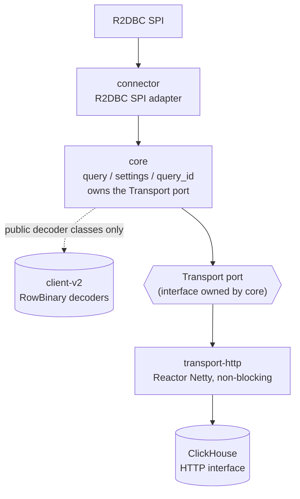

# Architecture direction

Only the dashed edge touches `client-v2`, and only for its public row-decoding classes
(`RowBinaryWithNamesAndTypesFormatReader` and friends). `client-v2`'s own HTTP client
(`internal.HttpAPIClientHelper`, classic Apache HttpClient5 I/O) is confirmed blocking by reading
its source and is **never called anywhere in this project** — `transport-http` owns its own
Reactor Netty client, from the socket up, independent of `client-v2` entirely. Full evidence in
[../../engineering/roadmap-archive.md's Phase 0
finding](../../engineering/roadmap-archive.md#phase-0--client-v2-execution-path-finding); a
complete audit of what `client-v2` actually sends on the wire (compression, auth, headers, error
semantics) is in [../CLIENT_V2_HTTP_REFERENCE.md](../CLIENT_V2_HTTP_REFERENCE.md) — useful
background even though none of that code is reused, since `transport-http` has to solve the same
wire-protocol problems independently.

## Responsibility boundaries

- **Connector** — R2DBC SPI discovery, URL/option parsing, connection lifecycle, statement
  creation and parameter binding, deferred execution, result/metadata adaptation, R2DBC exception
  mapping, cancellation propagation, explicit unsupported-transaction-semantics handling. No
  dependency on Spring.
- **Core** — query request representation, ClickHouse settings and `query_id`, protocol encoding,
  response metadata and row decoding, cancellation state, transport-independent lifecycle rules,
  and the `Transport` port interface that `transport-http` implements. Reuses `client-v2`'s public
  row-decoding classes only — never its transport; this is not a second general-purpose client.
- **Transport** — non-blocking connection acquisition, active/pending-request limits, connect/
  acquire/response/idle timeouts, streaming response chunks, aborting active requests, connection
  reuse, metrics. Built on Reactor Netty, entirely independent of `client-v2`.

A particular networking library is a swappable adapter behind the transport boundary, not a
public architectural dependency.

## Modules

See the [main ROADMAP.md's module map](../../ROADMAP.md#module-map) for the current module list
and what each is responsible for, and
[../../engineering/roadmap-archive.md's module map](../../engineering/roadmap-archive.md#module-map)
for the full reasoning behind each boundary (why five modules, why `testkit` isn't a Gradle
test-fixtures source set, why an `integration-tests` module was scaffolded and later deleted).
