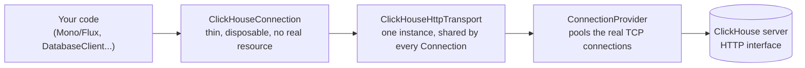

# Connection pooling

This driver owns one physical connection pool — a Reactor Netty `ConnectionProvider` inside
`ClickHouseHttpTransport` — shared by every `ClickHouseConnection` a factory produces. R2DBC
`Connection` objects handed out by this driver are cheap, disposable logical handles over that
shared pool, not separate physical resources. **Most applications don't need to add anything else
on top of it** — no `io.r2dbc:r2dbc-pool` dependency, no `pool:` URL prefix, no `spring.r2dbc.pool.*`
block. That's the setup shown in the [Spring Boot guide](../guide/spring-boot.md).

If you specifically need `io.r2dbc.pool`'s `ConnectionPool` on top of this — its
`validate(ValidationDepth)`/eviction behavior, or a framework that expects to manage R2DBC-SPI-level
pooling itself — see [optional-r2dbc-pool.md](optional-r2dbc-pool.md). It's a genuinely optional,
advanced layer, not the primary story; read it only once you know you need it.

## The transport-level pool (always on)

`ClickHouseHttpTransport`'s own Reactor Netty `ConnectionProvider` pools the actual TCP
connections. This is the pool this project's non-blocking architecture is actually built around.
Confirmed (not assumed) to correctly reuse one TCP connection across sequential queries — for both
a `.next()`-style single-row consumption pattern and a fully-drained stream — in
[`ClickHouseHttpTransportConnectionReuseTest`](../../clickhouse-r2dbc-reactive-transport-http/src/test/java/io/github/camilyed/clickhouse/r2dbc/transport/http/ClickHouseHttpTransportConnectionReuseTest.java),
including against Reactor Netty's own debug-level pool logging (`Channel acquired`/`Releasing
channel`/`Channel cleaned` against the same channel ID across requests) as independent
confirmation — an earlier draft of that investigation suspected a bug here and was wrong; see the
test's own Javadoc for why the first diagnostic signal was misleading.

### Configuring it

Five `transport...` R2DBC connection options — deliberately not `pool...`, so they're never
confused with `spring.r2dbc.pool.*`, which configures the *other*, optional R2DBC-SPI-level pool —
map directly onto Reactor Netty's own `ConnectionProvider.Builder`:

| R2DBC option | Reactor Netty `ConnectionProvider.Builder` method | Meaning |
| --- | --- | --- |
| `transportMaxConnections` | `maxConnections` | Physical TCP connections open to ClickHouse at once, per remote host |
| `transportPendingAcquireMaxCount` | `pendingAcquireMaxCount` | How many acquire requests queue once `transportMaxConnections` is saturated, before new ones fail fast |
| `transportPendingAcquireTimeout` | `pendingAcquireTimeout` | How long a queued acquire waits before failing with a pool-timeout error |
| `transportMaxIdleTime` | `maxIdleTime` | How long an idle pooled connection sits before it's closed and evicted |
| `transportMaxLifeTime` | `maxLifeTime` | Max total lifetime of a pooled connection, regardless of idle activity |

All five default to Reactor Netty's own default (see the table below) when not set — this driver
never invents a default of its own. Available both via `ConnectionFactoryOptions` (typed values,
e.g. `.option(ClickHouseConnectionFactoryProvider.TRANSPORT_MAX_CONNECTIONS, 8)`) and via the
R2DBC URL query string (e.g. `r2dbc:clickhouse://host?transportMaxConnections=8`, Duration values
as ISO-8601 text, e.g. `transportPendingAcquireTimeout=PT2S`) — so a Spring Boot app configuring
`spring.r2dbc.url=r2dbc:clickhouse://...` (the path almost everyone actually uses) can size this
pool the same way it configures everything else, no separate Java-only path needed. An invalid
value (e.g. a negative duration, a non-positive connection count) fails fast at factory creation,
never silently falling back to a default. Every construction path through `ClickHouseHttpTransport`
routes through one `TransportOptions` config object internally, so these five options and every
other transport-level setting (`responseTimeout`, a custom trusted certificate, `RetryPolicy`, ...)
compose freely instead of each needing its own constructor overload.

### Reactor Netty's own defaults

Since nothing here is required reading to use this driver — this is what `ConnectionProvider.create(name)`
gives you when nothing above is set:

| Setting | Default | Meaning |
| --- | --- | --- |
| `maxConnections` | `max(availableProcessors, 8) * 2` (at least 16) | Physical TCP connections open to ClickHouse at once, per remote host |
| `pendingAcquireMaxCount` | `500` | How many acquire requests queue once `maxConnections` is saturated, before new ones fail fast |
| `pendingAcquireTimeout` | `45s` | How long a queued acquire waits before failing with a pool-timeout error |
| `maxIdleTime` / `maxLifeTime` | unset (no eviction) | An idle or long-lived pooled connection is never proactively closed by the pool itself — it's held until the server closes it or the app shuts down |
| Leasing strategy | `fifo` | Idle connections are handed out oldest-released-first |

### The decode-worker pool tracks this pool's size, not the CPU core count

Row decoding runs on a separate, dedicated worker pool (`RowDecodingScheduler`) — see
[fully-reactive.md](../concepts/fully-reactive.md) for why this exists at all: client-v2's own
RowBinary reader is a blocking call, so it needs somewhere to run that isn't the Reactor Netty
event-loop thread that delivered the response. Until 2026-08-23 this pool defaulted to one worker
per CPU core, entirely independent of `transportMaxConnections` — on a machine with fewer cores
than physical connections (common on CI runners; a real, small-core-count GitHub Actions runner is
what surfaced this), the decoder became a smaller, silent concurrency ceiling *underneath* the
connection pool, regardless of how large `transportMaxConnections` was set. A query could acquire a
physical connection immediately and still queue waiting for a free decode worker.

Fixed: `ClickHouseConnectionFactory` now sizes `RowDecodingScheduler` to exactly the resolved
connection pool size — the explicit `transportMaxConnections` value when set, or this same
`max(availableProcessors, 8) * 2` formula (mirrored, not read back from Reactor Netty, which
doesn't expose it) when left at the default above. The decoder can no longer be a smaller ceiling
than the pool a caller explicitly configured, or than the pool's own documented default.

### Widening the decode pool beyond the connection pool: `decoderWorkerCount`

Phase 11 PR5 (see the root `ROADMAP.md`) added an explicit escape hatch from the 1:1 coupling just
above: `decoderWorkerCount` (`ClickHouseConnectionFactoryProvider.DECODER_WORKER_COUNT`) sizes
`RowDecodingScheduler` independently of `transportMaxConnections`, defaulting to `null` (meaning
"stay coupled to the pool", unchanged from the behavior above) when not set. It exists because a
trusted-profile benchmark run found this driver's p90-p99 per-query latency running 15-25% behind
client-v2's at every tested concurrency, with p50 tied and GC time equal between drivers despite
this driver allocating ~3.3x less per query — ruling out GC pauses and pointing at decode-worker
queueing as the more likely tail-latency source: a query whose decode has to wait for a free worker
pays that wait as pure added latency with no corresponding allocation cost, and the decoder pool is
never wider than the connection pool by default. Setting `decoderWorkerCount` higher gives decode
work more workers to spread across without also widening the physical connection pool itself (which
would change a different, unrelated tradeoff — see "Is it worth setting `maxConnections` yourself?"
below). `DecoderWorkerCountThroughputBenchmark` (in `clickhouse-r2dbc-reactive-benchmarks`) measures
whether this actually shrinks the p90-p99 gap in practice — see that class's own Javadoc and the
ROADMAP.md Phase 11 PR5 entry for the current state of that measurement; this option existing does
not by itself mean widening it is recommended for a given workload.

### Is it worth setting `maxConnections` yourself?

Usually not, and that's the point of this project: because the pipeline is non-blocking end to
end, many more *logical* concurrent queries can be in flight than there are physical connections —
`Flux.flatMap(..., concurrency)` submits all of them immediately, and whichever don't fit under
`maxConnections` simply queue inside Reactor Netty with no thread blocked waiting, up to
`pendingAcquireMaxCount`/`pendingAcquireTimeout`. `BoundedPoolConcurrencyBenchmark` (see
[../performance/results.md](../performance/results.md)) measures exactly this headroom at an artificially small
8-connection pool against 8/32/128 concurrent queries and this driver still wins on latency — the
default pool (≥16 connections) already has more headroom than that benchmark's deliberately tight
one. Reach for a higher `maxConnections` only if you've measured real pending-acquire waits under
your own load (Reactor Netty logs these at `DEBUG`), or you deliberately want more physical
parallelism against ClickHouse itself (e.g. ClickHouse's own `max_concurrent_queries` server-side
limit becomes the real ceiling before this pool would).

### Shutting it down

`ClickHouseConnectionFactory.dispose()` releases both resources this factory owns and shares
across every `Connection` it produces: this transport-level connection pool, and the dedicated
worker pool `RowBinaryDecoder` runs client-v2's blocking calls on (`RowDecodingScheduler`).
Fire-and-forget and idempotent, matching `ConnectionProvider`'s own `dispose()` contract;
`isDisposed()` reports `true` only once both are actually torn down. Nothing calls this
automatically — a Spring Boot app wrapping the factory in `io.r2dbc.pool`'s `ConnectionPool` still
needs to dispose the underlying `ClickHouseConnectionFactory` itself separately at shutdown
(confirmed directly against `ConnectionPool`'s own source: `ConnectionPool.dispose()`/
`disposeLater()` only tear down the pooled `Connection` handles it manages, never the factory's
own transport/scheduler underneath). The bundled demo proves this exact fix, real-server, not just
in prose: register the raw factory as its own bean with `@Bean(destroyMethod = "dispose")`, let
the outer `ConnectionPool` bean depend on it as a method parameter (so Spring destroys the pool
first, then this factory), and a real integration test
(`ConnectionFactoryShutdownDisposalAgainstRealClickHouseTest`) asserts a query against the raw
factory fails once `applicationContext.close()` returns — see
[../../engineering/roadmap-archive.md's Phase 8, item
10](../../engineering/roadmap-archive.md#phase-8--post-020-hardening-021) for the full write-up,
including why an earlier attempt at this same fix failed against a real build.

## Why this is the point of the whole project, not an implementation detail

client-v2's `Client`, run through its blocking default, needs *N* platform threads each blocked
waiting on a connection to serve *N* logical concurrent queries. This driver's non-blocking
pipeline lets many more logical queries than physical connections be *in flight* at once —
`Flux.flatMap(..., concurrency)` subscribes to all of them immediately; whichever don't fit in the
physical pool queue inside Reactor Netty itself, with no blocked thread paying for each one. That
architectural difference is real, but an earlier version of this page overstated what it currently
measures as: a "~4x throughput" / "3.5–4x" claim from `BoundedPoolConcurrencyBenchmark` turned out
to be measured against a client-v2 benchmark-harness bug (it was running near-serially, not
against its real 8-connection pool) — see
[../performance/results.md's retraction](../performance/results.md#non-blocking-matched-pool-numbers-below-are-retracted-pending-re-run)
for the full story.

The honest, cloud-verified number (`PublicApiMatchedPoolThroughputBenchmark`, `trusted` profile,
confirmed stable across two independent runs — see
[../performance/results.md's cloud-verified section](../performance/results.md#cloud-verified-matched-pool-real-async-on-both-sides-2026-08-23)):
with client-v2's own async dispatch correctly enabled on both sides, client-v2 is currently ahead
on throughput (~5–9%) and per-query latency (~5–18%) in this exact matched-pool scenario. This
driver's win that does hold up is **allocation per query — 2.7–2.9x less, widening as concurrency
rises**. The latency gap is an open, unresolved investigation (see that page's Open follow-ups),
not something to paper over with a bigger claim than the data currently supports.

> [!IMPORTANT]
> **Call this driver reactively (`Flux`/`Mono`/R2DBC), not wrapped in `.block()` per query.**
> `ConcurrencyBenchmark` and `MatchedPoolThreadsConcurrencyBenchmark` (see
> [../performance/results.md](../performance/results.md)) both drive this driver through `@Threads(N)`-blocking-
> callers — one platform thread blocked on `.block()` per in-flight query, the shape you get if you
> call this driver like a classic blocking JDBC driver. Both show this driver ~5–8% slower on mean
> than client-v2 under that calling style, reproducible whether the connection pool is matched to
> client-v2's or not — so it is not a pool-sizing problem and setting `transportMaxConnections` will
> not fix it. Note this is now a *smaller* gap than the non-blocking, matched-pool comparison above
> shows on latency — blocking-per-query is still the calling style to avoid (worse allocation
> profile than the reactive shape, on top of the platform-thread cost), but it is not, on today's
> evidence, the sole explanation for this driver's current latency deficit. If your application
> calls this driver through `.block()`/`.toFuture().get()` under real concurrent load, don't expect
> this driver's non-blocking design to pay off on latency — and per
> [../internals/testing-strategy.md](../internals/testing-strategy.md)/
> [../concepts/fully-reactive.md](../concepts/fully-reactive.md), that calling style is also the one
> thing this whole project is built to avoid you doing.
