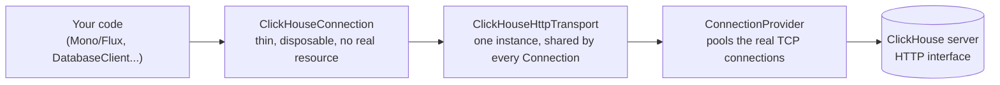

# Connection pooling

This driver owns one physical connection pool — a Reactor Netty `ConnectionProvider` inside
`ClickHouseHttpTransport` — shared by every `ClickHouseConnection` a factory produces. R2DBC
`Connection` objects handed out by this driver are cheap, disposable logical handles over that
shared pool, not separate physical resources. **Most applications don't need to add anything else
on top of it** — no `io.r2dbc:r2dbc-pool` dependency, no `pool:` URL prefix, no `spring.r2dbc.pool.*`
block. That's the setup shown in the [Spring Boot guide](../guide/spring-boot.md).

If you specifically need `io.r2dbc.pool`'s `ConnectionPool` on top of this — its
`validate(ValidationDepth)`/eviction behavior, or a framework that expects to manage R2DBC-SPI-level
pooling itself — see [optional-r2dbc-pool.md](optional-r2dbc-pool.md). It's a genuinely optional,
advanced layer, not the primary story; read it only once you know you need it.

## The transport-level pool (always on)

`ClickHouseHttpTransport`'s own Reactor Netty `ConnectionProvider` pools the actual TCP
connections. This is the pool this project's non-blocking architecture is actually built around.
Confirmed (not assumed) to correctly reuse one TCP connection across sequential queries — for both
a `.next()`-style single-row consumption pattern and a fully-drained stream — in
[`ClickHouseHttpTransportConnectionReuseTest`](../../clickhouse-r2dbc-reactive-transport-http/src/test/java/io/github/camilyed/clickhouse/r2dbc/transport/http/ClickHouseHttpTransportConnectionReuseTest.java),
including against Reactor Netty's own debug-level pool logging (`Channel acquired`/`Releasing
channel`/`Channel cleaned` against the same channel ID across requests) as independent
confirmation — an earlier draft of that investigation suspected a bug here and was wrong; see the
test's own Javadoc for why the first diagnostic signal was misleading.

### Configuring it

Five `transport...` R2DBC connection options — deliberately not `pool...`, so they're never
confused with `spring.r2dbc.pool.*`, which configures the *other*, optional R2DBC-SPI-level pool —
map directly onto Reactor Netty's own `ConnectionProvider.Builder`:

| R2DBC option | Reactor Netty `ConnectionProvider.Builder` method | Meaning |
| --- | --- | --- |
| `transportMaxConnections` | `maxConnections` | Physical TCP connections open to ClickHouse at once, per remote host |
| `transportPendingAcquireMaxCount` | `pendingAcquireMaxCount` | How many acquire requests queue once `transportMaxConnections` is saturated, before new ones fail fast |
| `transportPendingAcquireTimeout` | `pendingAcquireTimeout` | How long a queued acquire waits before failing with a pool-timeout error |
| `transportMaxIdleTime` | `maxIdleTime` | How long an idle pooled connection sits before it's closed and evicted |
| `transportMaxLifeTime` | `maxLifeTime` | Max total lifetime of a pooled connection, regardless of idle activity |

All five default to Reactor Netty's own default (see the table below) when not set — this driver
never invents a default of its own. Available both via `ConnectionFactoryOptions` (typed values,
e.g. `.option(ClickHouseConnectionFactoryProvider.TRANSPORT_MAX_CONNECTIONS, 8)`) and via the
R2DBC URL query string (e.g. `r2dbc:clickhouse://host?transportMaxConnections=8`, Duration values
as ISO-8601 text, e.g. `transportPendingAcquireTimeout=PT2S`) — so a Spring Boot app configuring
`spring.r2dbc.url=r2dbc:clickhouse://...` (the path almost everyone actually uses) can size this
pool the same way it configures everything else, no separate Java-only path needed. An invalid
value (e.g. a negative duration, a non-positive connection count) fails fast at factory creation,
never silently falling back to a default. Every construction path through `ClickHouseHttpTransport`
routes through one `TransportOptions` config object internally, so these five options and every
other transport-level setting (`responseTimeout`, a custom trusted certificate, `RetryPolicy`, ...)
compose freely instead of each needing its own constructor overload.

### Reactor Netty's own defaults

Since nothing here is required reading to use this driver — this is what `ConnectionProvider.create(name)`
gives you when nothing above is set:

| Setting | Default | Meaning |
| --- | --- | --- |
| `maxConnections` | `max(availableProcessors, 8) * 2` (at least 16) | Physical TCP connections open to ClickHouse at once, per remote host |
| `pendingAcquireMaxCount` | `500` | How many acquire requests queue once `maxConnections` is saturated, before new ones fail fast |
| `pendingAcquireTimeout` | `45s` | How long a queued acquire waits before failing with a pool-timeout error |
| `maxIdleTime` / `maxLifeTime` | unset (no eviction) | An idle or long-lived pooled connection is never proactively closed by the pool itself — it's held until the server closes it or the app shuts down |
| Leasing strategy | `fifo` | Idle connections are handed out oldest-released-first |

### Is it worth setting `maxConnections` yourself?

Usually not, and that's the point of this project: because the pipeline is non-blocking end to
end, many more *logical* concurrent queries can be in flight than there are physical connections —
`Flux.flatMap(..., concurrency)` submits all of them immediately, and whichever don't fit under
`maxConnections` simply queue inside Reactor Netty with no thread blocked waiting, up to
`pendingAcquireMaxCount`/`pendingAcquireTimeout`. `BoundedPoolConcurrencyBenchmark` (see
[../PERFORMANCE.md](../PERFORMANCE.md)) measures exactly this headroom at an artificially small
8-connection pool against 8/32/128 concurrent queries and this driver still wins on latency — the
default pool (≥16 connections) already has more headroom than that benchmark's deliberately tight
one. Reach for a higher `maxConnections` only if you've measured real pending-acquire waits under
your own load (Reactor Netty logs these at `DEBUG`), or you deliberately want more physical
parallelism against ClickHouse itself (e.g. ClickHouse's own `max_concurrent_queries` server-side
limit becomes the real ceiling before this pool would).

### Shutting it down

`ClickHouseConnectionFactory.dispose()` releases both resources this factory owns and shares
across every `Connection` it produces: this transport-level connection pool, and the dedicated
worker pool `RowBinaryDecoder` runs client-v2's blocking calls on (`RowDecodingScheduler`).
Fire-and-forget and idempotent, matching `ConnectionProvider`'s own `dispose()` contract;
`isDisposed()` reports `true` only once both are actually torn down. Nothing calls this
automatically — a Spring Boot app wrapping the factory in `io.r2dbc.pool`'s `ConnectionPool` still
needs to dispose the underlying `ClickHouseConnectionFactory` itself separately at shutdown
(confirmed directly against `ConnectionPool`'s own source: `ConnectionPool.dispose()`/
`disposeLater()` only tear down the pooled `Connection` handles it manages, never the factory's
own transport/scheduler underneath). The bundled demo proves this exact fix, real-server, not just
in prose: register the raw factory as its own bean with `@Bean(destroyMethod = "dispose")`, let
the outer `ConnectionPool` bean depend on it as a method parameter (so Spring destroys the pool
first, then this factory), and a real integration test
(`ConnectionFactoryShutdownDisposalAgainstRealClickHouseTest`) asserts a query against the raw
factory fails once `applicationContext.close()` returns — see
[../../engineering/roadmap-archive.md's Phase 8, item
10](../../engineering/roadmap-archive.md#phase-8--post-020-hardening-021) for the full write-up,
including why an earlier attempt at this same fix failed against a real build.

## Why this is the point of the whole project, not an implementation detail

client-v2's `Client` is blocking — serving *N* logical concurrent queries needs *N* platform
threads each blocked waiting on a connection, one way or another. This driver's non-blocking
pipeline lets many more logical queries than physical connections be *in flight* at once —
`Flux.flatMap(..., concurrency)` subscribes to all of them immediately; whichever don't fit in the
physical pool queue inside Reactor Netty itself, with no blocked thread paying for each one.
Measured directly: `BoundedPoolConcurrencyBenchmark` and `PublicApiMatchedPoolThroughputBenchmark`
(see [../PERFORMANCE.md](../PERFORMANCE.md)) configure both this driver and client-v2 with the
*same* 8-connection pool and drive 8/32/128 logical concurrent point queries at once (async on
both sides, not one blocking thread per query) — this driver wins decisively, **~4x the real
throughput** through the public R2DBC SPI at every concurrency level tested. Latest run is
single-fork, not yet multi-fork confirmed — still the strongest measured evidence so far for the
architectural property this project set out to provide. Still one pool size / three concurrency
levels, not yet a full scalability sweep — see that doc for the full caveats and what's still open.

> [!IMPORTANT]
> **Call this driver reactively (`Flux`/`Mono`/R2DBC), not wrapped in `.block()` per query.**
> `ConcurrencyBenchmark` and `MatchedPoolThreadsConcurrencyBenchmark` (see
> [../PERFORMANCE.md](../PERFORMANCE.md)) both drive this driver through `@Threads(N)`-blocking-
> callers — one platform thread blocked on `.block()` per in-flight query, the shape you get if you
> call this driver like a classic blocking JDBC driver. Both show this driver ~5–8% slower on mean
> than client-v2 under that calling style, reproducible whether the connection pool is matched to
> client-v2's or not — so it is not a pool-sizing problem and setting `transportMaxConnections` will
> not fix it. It is specifically the blocking calling style that forfeits this driver's advantage:
> `BoundedPoolConcurrencyBenchmark` above uses the identical pool size but drives concurrency
> through `Flux.flatMap` instead, and wins by 3.5–4x. If your application calls this driver through
> `.block()`/`.toFuture().get()` under real concurrent load, don't expect this driver's non-blocking
> design to pay off — and per [../internals/testing-strategy.md](../internals/testing-strategy.md)/
> [../concepts/fully-reactive.md](../concepts/fully-reactive.md), that calling style is also the one
> thing this whole project is built to avoid you doing.
