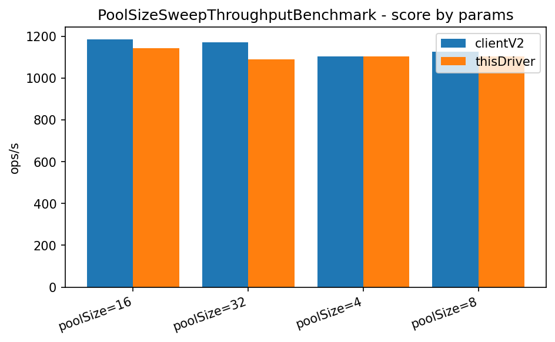
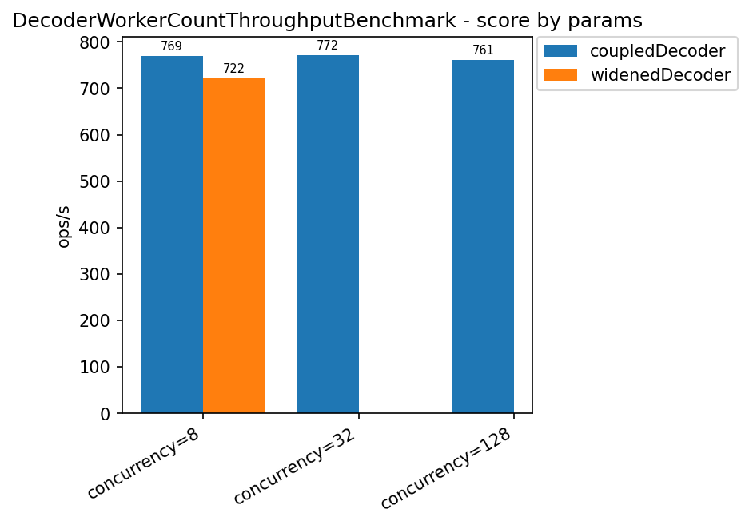
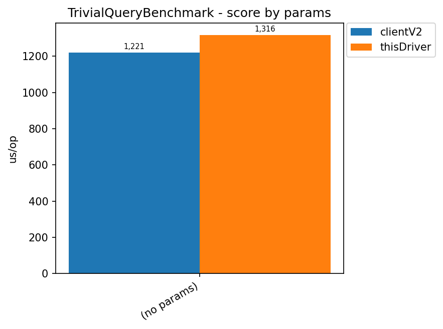
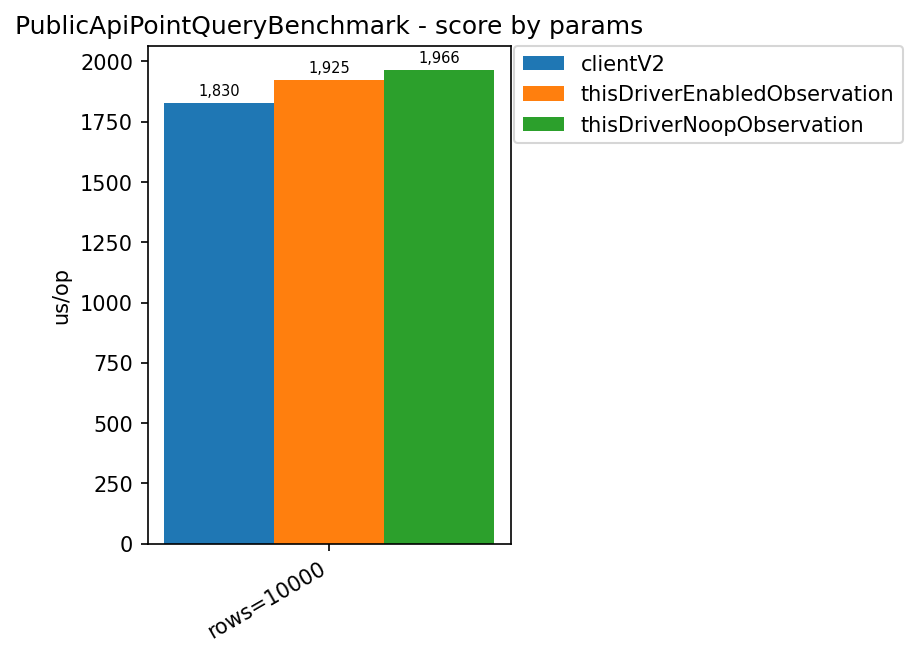
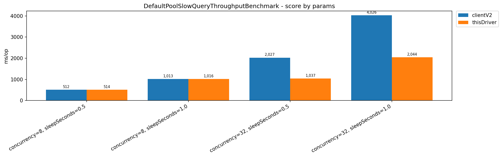
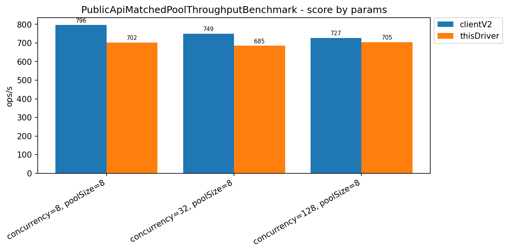
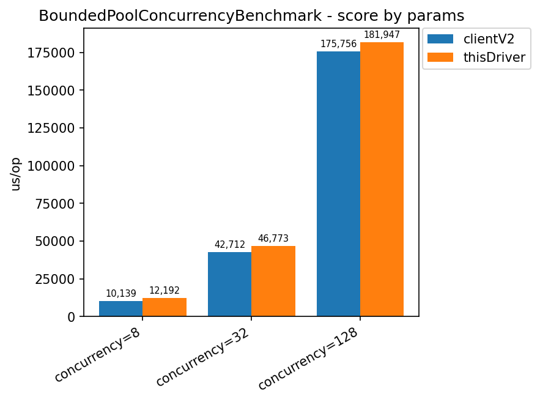
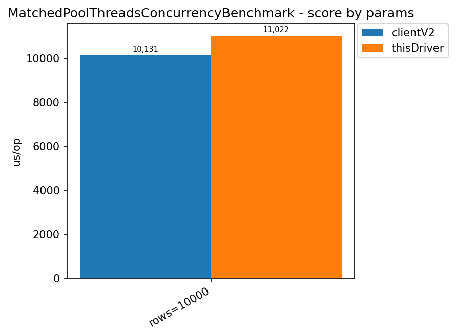
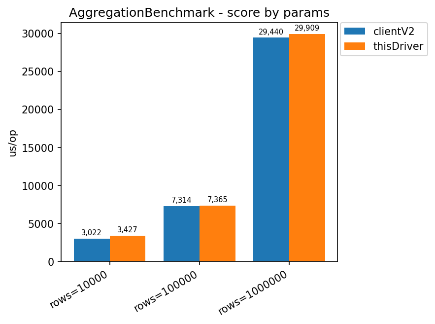
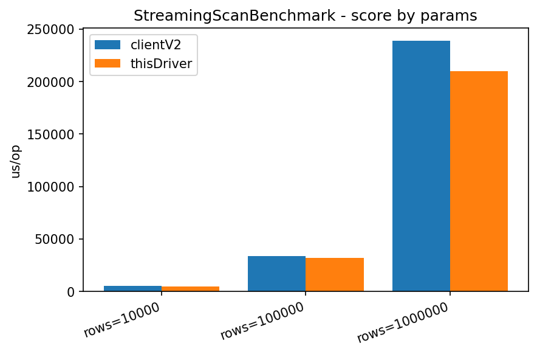

# Results (newest first — last updated 2026-08-27)

Sections below are ordered by when that result was last (re-)measured, newest first, not grouped
by benchmark category — so the current, trustworthy numbers are always at the top and older/
retracted/single-fork data sinks toward the bottom. See [index.md](index.md) for the confidence
warning and environment these numbers were measured under, and [methodology.md](methodology.md)
for what each benchmark class actually exercises.

> [!NOTE]
> **2026-08-24 — the `ourDriver` benchmark label was renamed to `thisDriver`** (task #270; the
> Python-side raw key changed too, and its display label is now `r2dbc-reactive` — see
> `scripts/benchmarks/analyze.py`'s `DRIVER_LABELS`). Every occurrence of `ourDriver` below is left
> exactly as it was measured and reported at the time — it's a literal record of what that CI run's
> JMH output and this page's own analysis actually said, not a live label — so it is **not**
> rewritten retroactively. Only benchmark runs from this point forward will show `thisDriver`.

## Point-query pipeline isolation — no production bottleneck justified (2026-08-27)

PR #99 followed the public-API latency gap through decoder-only, trusted-clean matched-pool, and
captured-response pipeline benchmarks. The isolated native RowBinary decoder was about 14-15%
faster than client-v2's decoder on 10k-1M-row inputs and allocated about 11% less, but that gain
became only about 0.4-1.3% at the complete public API boundary. In the final matched-pool run,
client-v2 was nominally ahead by 6.5%, 2.2%, and 0.9% at concurrency 8, 32, and 128 respectively;
the error intervals overlapped at every level.

The final `PointQueryPipelineIsolationBenchmark` then measured the fixed one-row path directly:

| Boundary | Mean | p50 | p99 |
| --- | ---: | ---: | ---: |
| client-v2 raw response | 2081.4 us | 2052.1 us | 2830.3 us |
| Reactor Netty raw response | 2075.4 us | 2054.1 us | 2715.6 us |
| native decode, captured bytes, no scheduler | 1.4 us | 1.3 us | 2.3 us |
| native decode, production scheduler boundary | 52.9 us | 49.6 us | 77.4 us |
| client-v2 decode, production scheduler boundary | 54.8 us | 51.6 us | 80.8 us |
| complete R2DBC native path | 2169.0 us | 2146.3 us | 2838.5 us |

The raw transports are statistically tied. The scheduler hand-off adds about 51 us, but represents
only about 2.4% of the roughly 2.17 ms full request and is required because the current
InputStream-backed reader may wait for later network chunks and must not run on a Reactor Netty
event loop. The full-R2DBC and raw-client variants perform different work, so their difference is
not an additive estimate of SPI overhead.

**Decision:** keep the native decoder opt-in, keep `RowDecodingScheduler`, and make no production
optimization from this investigation. A direct incremental `ByteBuffer` parser would be a separate
project affecting backpressure, cancellation, fragmentation, event-loop fairness, and resource
ownership; it is not justified by these point-query measurements. See the complete
[latency-path isolation report](latency-path-isolation.md) for all variants and confidence notes.

## Full mega sweep — every scenario, one run (2026-08-24)

The 12 "core" benchmark classes (task #295) run together in one sweep, `trusted` profile (3 forks,
5 warmup iterations, `-prof gc`), GitHub Actions `ubuntu-latest` (4 cores, 16GB RAM), commit
`a012481` — right after fixing a real, previously-undiscovered bug (task #296: 10 "manual pipeline"
benchmarks were feeding the decoder `ResponseCompression.NONE` while the transport actually sent
`compress=1`, so `thisDriver` failed outright on every one of them; fixed by matching the two).
Aggregated from each run's raw `results.json` via the new `scripts/benchmarks/aggregate-all.py`
(generic across `@Param` shapes and `@BenchmarkMode`, unlike `analyze.py` which only knows
`PublicApiMatchedPoolThroughputBenchmark`'s specific shape). 11 of 12 produced usable data;
`MixedWorkloadRapidRefreshPileUpBenchmark` timed out completely on every fork for both drivers
under the shared runner's limited resources and was removed — see [Open
follow-ups](#open-follow-ups).

This is the "every scenario in one place" view; several rows below link to an existing section with
the full root-cause narrative behind that number instead of repeating it here.

| Benchmark | What it tests | Key result | Verdict |
| --- | --- | --- | --- |
| [`TrivialQueryBenchmark`](#protocol-floor-essentially-tied) | `SELECT 1`, raw protocol floor | thisDriver 1316 µs vs client-v2 1221 µs | 🔴 thisDriver ~8% slower |
| [`PublicApiPointQueryBenchmark`](#protocol-floor-essentially-tied) | Point lookup via public R2DBC SPI, enabled vs noop observability | client-v2 1830 µs, thisDriver (observation enabled) 1925 µs, thisDriver (noop) 1966 µs | 🟡 thisDriver ~5–8% slower either way — enabling observation cost nothing extra here |
| [`AggregationBenchmark`](#aggregation-a-wash) | `GROUP BY`/`count()`/`avg()`/`quantile()`, 10k–1M rows | 10k: +13.4% slower · 100k: +0.7% · 1M: +1.6% | 🟡 mostly tied, 10k the one outlier |
| [`StreamingScanBenchmark`](#full-table-scan-found-partially-fixed-and-the-fixs-own-measurement-is-unstable-at-1m) | Full table scan, 10k–1M rows | 10k: **11.5% faster** · 100k: **5.2% faster** · 1M: **12.3% faster** | 🟢 clean win at every tier — first cloud run to resolve the 1M instability |
| [`DefaultPoolSlowQueryThroughputBenchmark`](#default-pool-slow-query-this-drivers-larger-default-pool-wins-once-its-actually-used-2026-08-23) | Server-side `sleep()`, each side's real default pool | concurrency=32: **~2x faster** · concurrency=8: tied | 🟢 reconfirms the 2026-08-23 finding almost exactly |
| [`BoundedPoolConcurrencyBenchmark`](#cloud-verified-matched-pool-real-async-on-both-sides-2026-08-23) | Matched 8-connection pool, burst latency | concurrency=8: +20.2% slower · 32: +9.5% · 128: +3.5% | 🔴 same direction as the matched-pool latency gap below — third confirmation |
| [`PublicApiMatchedPoolThroughputBenchmark`](#cloud-verified-matched-pool-real-async-on-both-sides-2026-08-23) | Matched 8-connection pool, real throughput via public SPI | concurrency=8: ratio 0.88 · 32: 0.91 · 128: 0.97 | 🔴 client-v2 ahead by 3–12%, consistent with the two earlier cloud runs |
| [`MatchedPoolThreadsConcurrencyBenchmark`](#blocking-calls-confirms-its-the-calling-style-not-the-pool) | `@Threads(8)` blocking-caller style, matched pool | rows=10000: +8.8% slower | 🔴 same latency gap again, fourth benchmark now pointing at it |
| `PoolSizeSweepThroughputBenchmark` | Point-query throughput across pool sizes 4/8/16/32 | 4: tied · 8: −2.0% · 16: −3.4% · 32: −6.9% | 🟡 new finding — thisDriver's throughput deficit *grows* with pool size, see below |
| `DecoderWorkerCountThroughputBenchmark` | thisDriver only: coupled (pool-sized) vs manually widened decoder worker count | coupled ≈760–772 ops/s flat across concurrency · widened@8 721.9 ops/s | 🟡 widening the decoder pool past the connection-pool size didn't help, see below |
| [`FluxInputStreamBridgeMicrobenchmark`](../../ROADMAP.md#fluxinputstreambridge-queuecopy-overhead--measured-ruled-out-as-a-bottleneck-2026-08-24) | Microbenchmark, not a driver comparison — isolates the chunk-handoff queue/copy cost | ~40–50 ns/chunk, ~200x smaller than the real per-chunk cost | ⚪ ruled out as a bottleneck, not built on further |

### Pool size sweep: thisDriver's throughput gap widens as the pool gets bigger

  

| Pool size | thisDriver (ops/s) | client-v2 (ops/s) | verdict |
| --- | --- | --- | --- |
| 4 | 1105.07 | 1105.04 | tied |
| 8 | 1104.11 | 1126.43 | client-v2 2.0% ahead |
| 16 | 1145.50 | 1185.34 | client-v2 3.4% ahead |
| 32 | 1091.50 | 1172.57 | client-v2 6.9% ahead |

Not explained by this sweep alone — consistent with the same latency-gap family as the matched-pool
and blocking-caller findings above, but the fact that it *widens* with pool size (rather than
staying flat) is new information worth folding into the open latency-gap investigation rather than
treating as a separate mystery.

### Decoder worker count: widening past the pool size didn't help

  

`RowDecodingScheduler`'s worker count is normally tied to the resolved connection pool size (task
#273). This class tests whether manually widening it past that (more decode workers than
connections) buys any throughput — it doesn't: 721.9 ops/s widened vs ~769 ops/s coupled at the
same concurrency=8, i.e. slightly *worse*, not better. The coupled default stays justified; no
follow-up experiment planned from this result alone.

  

  

## Default pool, slow query — this driver's larger default pool wins once it's actually used (2026-08-23)

The fixed, trustworthy re-run of the scenario retracted earlier the same day (see [Open
follow-ups](#open-follow-ups) and
[connection-pooling.md](../operations/connection-pooling.md#the-decode-worker-pool-tracks-this-pools-size-not-the-cpu-core-count)
for what was wrong with the first attempt — `RowDecodingScheduler` capping `ourDriver` at the CPU
core count regardless of connection pool size — and the fix). `trusted` profile, 3 forks, 5 warmup
iterations, GitHub Actions `ubuntu-latest` (4 cores, 16GB RAM), commit `66c1303` (the fix,
merged). Each side left at its own real default pool: `ourDriver` ≥16 (Reactor Netty's
`max(availableProcessors, 8) * 2` = 16 on this runner), client-v2's fixed default of 10. Every
query holds server-side via `sleep(0.5)`/`sleep(1.0)` so a real pool-size difference has something
to queue behind — real point queries finish too fast to show this.

| concurrency | sleepSeconds | ourDriver (ms/op) | client-v2 (ms/op) | verdict |
| --- | --- | --- | --- | --- |
| 8 | 0.5 | 509.8 | 508.4 | tie — both undersaturate their own pool |
| 8 | 1.0 | 1011.1 | 1009.9 | tie |
| 32 | 0.5 | 1029.1 | 2022.0 | **ourDriver ~2x faster** |
| 32 | 1.0 | 2033.5 | 4023.4 | **ourDriver ~2x faster** |

At concurrency=8 (below both pools' capacity — 8 < 10 < 16), neither side ever queues, so the tie
is correct, not a fluke: both numbers are just "one `sleepSeconds`-long round trip plus overhead."
At concurrency=32, the pool-size difference becomes visible exactly as this benchmark was designed
to show: `ourDriver`'s 16-connection pool drains 32 queries in 2 waves (`ceil(32/16) = 2`),
client-v2's 10-connection pool needs 4 (`ceil(32/10) = 4`) — that arithmetic lines up almost
exactly with the measured times (`2 × 0.5s = 1.0s` vs. measured 1029ms; `4 × 0.5s = 2.0s` vs.
measured 2022ms; same pattern at `sleepSeconds=1.0`).

Allocation shows the same pattern as the matched-pool result below — `ourDriver` allocates roughly
2.6x less per query at concurrency=32 (854,115 B/op vs. 2,272,098 B/op at `sleepSeconds=0.5`),
consistent regardless of which side's pool is under more pressure.

**Read this result for what it actually shows: a bigger default connection pool wins when
concurrency exceeds the smaller side's pool, and does nothing when it doesn't** — not yet a
verdict on either driver's architecture, since the pool-size difference itself (16 vs. 10) is what
produced the gap here, not a difference in calling style or protocol efficiency (both already
measured, separately, in the matched-pool result below).

> [!NOTE]
> **Reconfirmed in the 2026-08-24 mega sweep** (`DefaultPoolSlowQueryThroughputBenchmark`, see the
> [overview table](#full-mega-sweep--every-scenario-one-run-2026-08-24)) — numbers are
> near-identical to the run above (concurrency=32/sleepSeconds=0.5: 1036.9 vs 2026.7 ms;
> concurrency=8: tied both ways), a good stability signal across two independent trusted runs on
> different days.
> 

## Cloud-verified matched pool, real async on both sides (2026-08-23)

The fair version of the non-blocking, matched-pool scenario below, run twice independently on the
Phase 10 cloud pipeline (`PublicApiMatchedPoolThroughputBenchmark`, `trusted` profile — 3 forks, 5
warmup iterations, `-prof gc`, GitHub Actions `ubuntu-latest`, one shared ClickHouse container for
the whole job — see [the roadmap's Phase 10](../../ROADMAP.md#phase-10--cloud-benchmark-pipeline))
after fixing the same `useAsyncRequests(true)` bug the retraction warning below describes. Per this
pipeline's own trust model (don't trust one absolute number from a shared runner — trust the ratio,
repeated across runs): the two runs agree closely, so this is a real signal, not noise.

| Concurrency (pool=8, both sides) | ourDriver/client-v2 throughput ratio, run 1 | run 2 |
| --- | --- | --- |
| 8 | 0.95 | 0.93 |
| 32 | 0.93 | 0.91 |
| 128 | 0.95 | 0.95 |

**client-v2 is ahead on throughput by roughly 5–9%, consistently across both runs and all three
concurrency levels** — the opposite of the retracted claim below.

  

| Concurrency | ourDriver p99 (run 2) | client-v2 p99 (run 2) | verdict |
| --- | --- | --- | --- |
| 8 | 22,675 µs | 21,597 µs | client-v2 ~5% lower |
| 32 | 22,561 µs | 19,379 µs | client-v2 ~16% lower |
| 128 | 40,849 µs | 34,481 µs | client-v2 ~18% lower |

**client-v2 also has lower per-query latency at every percentile (p50 through p99) and every
concurrency level, in both runs** — this matches, and reinforces, the not-yet-root-caused
["Blocking calls"](#blocking-calls-confirms-its-the-calling-style-not-the-pool) finding below and
[`MatchedPoolThreadsConcurrencyBenchmark`'s open regression](#open-follow-ups) — this is now two
independent benchmarks pointing at the same unresolved latency gap, not one.

  

| Concurrency | ourDriver B/op (run 2) | client-v2 B/op (run 2) | verdict |
| --- | --- | --- | --- |
| 8 | 23,866 | 63,891 | **this driver allocates 2.7x less** |
| 32 | 23,913 | 66,915 | **this driver allocates 2.8x less** |
| 128 | 23,923 | 69,243 | **this driver allocates 2.9x less** |

**This driver's advantage that does hold up, consistently, in both runs, at every concurrency
level: allocation per query.** ourDriver's allocation is flat regardless of concurrency; client-v2's
grows as concurrency rises. This is the one part of the original "matched pool" story that survives
the fix intact.

  

> [!NOTE]
> **A third and fourth independent confirmation, 2026-08-24 mega sweep** (see the [overview
> table](#full-mega-sweep--every-scenario-one-run-2026-08-24)): `PublicApiMatchedPoolThroughputBenchmark`
> itself, run a third time, lands in the same 3–12% client-v2-ahead band (ratios 0.88–0.97 across
> concurrency 8/32/128). `BoundedPoolConcurrencyBenchmark` — the class originally retracted for a
> benchmark-harness bug (see [archive.md](archive.md)), now fixed and re-run for the first time —
> shows the same direction and a similar magnitude (thisDriver 3.5–20.2% slower depending on
> concurrency). Four independent benchmark classes now agree on this gap; it's a real, repeatable
> finding, not a fluke of one class's harness. [Root-causing it](#open-follow-ups) is the most
> concrete next step in this whole page.
> 
> 

## Rapid-refresh cancellation: incomplete this run

`MixedWorkloadRapidRefreshCancelBenchmark.clientV2` completed (mean 93.1s per 32-user/15-refresh
burst, n=3) but `ourDriver` produced no samples in this run's log — the run was interrupted or the
log truncated before it reached that method. **Not reported as a comparison** — a number for one
side only is not a finding, it's a gap. Re-run this class on its own
(`-Pjmh.includes=MixedWorkloadRapidRefreshCancelBenchmark`) before drawing any conclusion about
cancellation behavior under this workload.

## Blocking calls: confirms it's the calling style, not the pool

| Shape | this driver (mean) | client-v2 (mean) | verdict |
| --- | --- | --- | --- |
| `@Threads(8)`, default (unmatched) pools | 2321 µs | 2217 µs | client-v2 4.7% faster |
| `@Threads(8)`, matched 8-connection pool | 2321 µs | 2151 µs | client-v2 7.9% faster |

Matching the pool size doesn't close the gap — it widens it slightly. This driver's non-blocking
pipeline has no advantage to offer when the caller blocks a whole platform thread per query; the
scheduler hop from the section below becomes pure overhead with nothing to hide it behind. See
[index.md's "How to use this driver well"](index.md#how-to-use-this-driver-well): this is exactly
the calling style not to use.

> [!NOTE]
> **Reconfirmed on the cloud runner, 2026-08-24 mega sweep** (`MatchedPoolThreadsConcurrencyBenchmark`,
> see the [overview table](#full-mega-sweep--every-scenario-one-run-2026-08-24)) — thisDriver 8.8%
> slower at rows=10000, same direction as the local M3 Pro numbers above and the two matched-pool
> cloud runs. This is now the fourth independent benchmark class agreeing on the same latency gap —
> see the note under "Cloud-verified matched pool" above.
> 

## Aggregation: a wash

| Rows | this driver (mean) | client-v2 (mean) | verdict |
| --- | --- | --- | --- |
| 10,000 | 1381 µs | 1339 µs | client-v2 3.2% faster |
| 100,000 | 4216 µs | 4228 µs | tied |
| 1,000,000 | 15,936 µs | 16,994 µs | this driver 6.2% faster |

`GROUP BY`/`count()`/`avg()`/`quantile()` always returns ~100 rows regardless of input size, so
decode cost is small next to the server-side aggregation both drivers pay identically. Neither
driver has a structural advantage here — which is itself useful to know: the streaming-scan
regression below is specifically a large-result-set problem, not a general one.

> [!NOTE]
> **Reconfirmed on the cloud runner, 2026-08-24 mega sweep** (see the [overview
> table](#full-mega-sweep--every-scenario-one-run-2026-08-24)) — same "mostly a wash" shape, though
> the 10k gap widened somewhat on the shared 4-core runner: 10k client-v2 ~13.4% faster, 100k tied
> (+0.7%), 1M tied within noise (+1.6%). Absolute numbers aren't comparable to the table above (M3
> Pro vs. GitHub Actions `ubuntu-latest`), but the ratios point the same direction.
> 

## Full table scan: found, partially fixed, and the fix's own measurement is unstable at 1M

  

This section originally reported a growing, unexplained regression (tied at 10k, 19.5% slower at
100k, 56.9% slower at 1M) once every benchmark started going through the real production decode
path (`RowBinaryDecoder.decode` + `RowDecodingScheduler`, replacing an earlier scheduler-free
shortcut that never paid its real off-event-loop cost). That regression is root-caused (see the
isolation section below for the mechanism) and a fix shipped — see
[`FluxInputStreamBridge`](../../clickhouse-r2dbc-reactive-core/src/main/java/io/github/camilyed/clickhouse/r2dbc/core/FluxInputStreamBridge.java)'s
"Chunk coalescing" Javadoc section. **A single-fork run initially looked like a near-complete fix
(11.8% gap remaining at 1M); a follow-up 3-fork run told a different, more honest story — see below
for why the single-fork number should not have been trusted.**

3-fork (`-Pjmh.forks=3 -Pjmh.warmupIterations=3`), after raising `RowBinaryDecoder.RESPONSE_CHUNK_DEMAND`
from `4` to `16` (see that constant's Javadoc — more chunks allowed in flight gives the coalescing
fix more material to merge per blocking `take()`):

| Rows | this driver (mean) | client-v2 (mean) | verdict |
| --- | --- | --- | --- |
| 10,000 | 3387 µs | 3855 µs | **this driver 12.1% faster** |
| 100,000 | 13,825–14,525 µs | 15,211–15,548 µs | **this driver roughly 4–11% faster, across repeated runs** |
| 1,000,000 | 94,000–131,439 µs | 96,031–98,617 µs | **unstable: anywhere from a tie to 33% slower, depending on the run** |

10k is a clean, repeatable win. 100k is a real, if noisier, win. 1M is not resolved locally — see
"Why the 1M number won't sit still" below.

> [!NOTE]
> **2026-08-24 cloud mega sweep — the 1M number finally sits still, and this driver wins at every
> tier.** On the GitHub Actions runner (shared, 4 cores, none of the Apple Silicon
> performance/efficiency-core asymmetry suspected below): 10k **11.5% faster**, 100k **5.2%
> faster**, 1M **12.3% faster** — no tie, no 30%-slower worst case, no fork-to-fork spread anywhere
> close to the 18–33% swings seen locally. This doesn't retroactively explain *why* the local M3 Pro
> runs were unstable (see the investigation below, still unresolved as a local-hardware question),
> but it does mean the 1M tier is no longer an open question for the numbers that matter most — the
> cloud CI signal. Treat the section below as "what we found investigating the local instability,"
> not as the current headline number.
> 

### Why it happened, and why the fix mostly worked

  

| Isolation (1M rows) | this driver (mean) | client-v2 (mean) | verdict |
| --- | --- | --- | --- |
| transport only (bytes, no decode) | 15,128 µs | 27,644 µs | **this driver 45.3% faster** |
| decode only (in-memory bytes) | 55,323 µs | 64,382 µs | **this driver 14.1% faster** |
| transport + decode (production path, after the fix, best observed fork) | ~94,000 µs | ~96,031 µs | roughly tied, best case |
| transport + decode (production path, after the fix, worst observed fork) | ~131,439 µs | ~98,617 µs | this driver ~33% slower, worst case |

Root cause, confirmed by instrumentation before writing any fix: `FluxInputStreamBridge` (the
adapter between Reactor Netty's push-based chunk delivery and the decoder's blocking pull-based
`InputStream` reads) did one `ArrayBlockingQueue.take()` — a real cross-thread synchronization
point between Netty's event loop and `RowDecodingScheduler`'s worker thread — per network chunk.
A temporary chunk counter added to `StreamingScanBenchmark` showed chunk count scaling almost
perfectly linearly with row count (~285–293 rows per chunk at every tier: 10k rows → ~34 chunks,
100k → ~342, 1M → ~3545), and the estimated per-chunk cost from the timing gap (~8–12µs) was
consistent across tiers — exactly what a fixed per-handoff cost multiplied by a row-count-scaling
handoff count would produce.

**The fix**: `FluxInputStreamBridge.fillCurrent()` still does one blocking `take()` for the first
available chunk, but then opportunistically drains any chunks *already sitting in the queue* with
non-blocking `poll()` calls, merging them into one larger buffer (up to 64KB) before returning —
trading handoffs away only when the producer is already ahead, never adding latency when it isn't.
The backpressure credit model is untouched: every physical chunk dequeued still triggers exactly
one demand-replenishing `request(1)`, just timed at dequeue instead of buffer-exhaustion.
`RowBinaryDecoder.RESPONSE_CHUNK_DEMAND` was also raised from `4` to `16` as part of this
investigation, so more chunks can be outstanding at once for the coalescing loop to find.

**At 1M rows the fix's effect is real but currently unmeasurable to a single number** — see the
next section.

### Why the 1M number won't sit still

3-fork `StreamingScanBenchmark.ourDriver` runs at 1M rows, broken down per-fork (JMH's own
percentile output pools all forks into one histogram, which hides this — the per-fork means come
from parsing `results.json`'s `rawDataHistogram` directly):

| Run | fork A | fork B | fork C | spread |
| --- | --- | --- | --- | --- |
| both drivers, `demand=4` | 97,000 µs | 122,500 µs | 129,400 µs | 33.4% |
| `ourDriver` only, `demand=16`, per-fork Testcontainers | 121,500 µs | 123,000 µs | 104,000 µs | 18.3% |
| `ourDriver` only, `demand=16`, shared external container | 123,700 µs | 94,000 µs | 122,500 µs | 31.6% |

`client-v2` shows none of this: its per-fork means at 1M sit within a 1.5% band across every run
(≈95,400–96,500 µs), run after run. Whatever is happening is specific to this driver's decode path,
not the ClickHouse server or the measurement harness in general.

Three explanations were tested and ruled out, in this order:

1. **GC pauses.** `-prof gc` on the isolated `ourDriver` benchmark showed 344ms of total GC pause
   time across the *entire* 1M-row trial (856 GC events, ~0.4ms each) — nowhere near enough to
   explain a single operation running 30,000+ µs slower than another. Ruled out.
2. **Testcontainers-per-fork** (each JMH fork getting its own freshly-started ClickHouse container,
   with different page-cache/startup state — exactly the confound
   `scripts/start-benchmark-clickhouse.sh` exists to eliminate). Re-run against the shared external
   container (`BENCH_CLICKHOUSE_URL`) still showed a 31.6% spread. Ruled out as the sole cause.
3. **`RowDecodingScheduler` worker-pool sizing.** `StreamingScanBenchmark` issues one query at a
   time, sequentially — only one worker thread from the pool is ever active regardless of
   `DEFAULT_WORKER_COUNT`, so changing pool size can't plausibly explain fork-to-fork variance in a
   single-query benchmark. Not tested empirically (would predictably do nothing), reasoned out.

What's left, none confirmed: JIT/tiered-compilation timing differences between separate JVM fork
launches, and/or OS-level thread scheduling on Apple Silicon's asymmetric performance/efficiency
cores (no QoS/priority hints are set on `RowDecodingScheduler`'s threads, so macOS decides
per-launch which physical cores they land on). Both would need tooling this investigation didn't
have available — `async-profiler`, JFR, or `sudo powermetrics` run locally by someone with hands on
the actual machine — to confirm. Also notable and unresolved: single, extreme per-operation outliers
(one 1M-row scan taking 300,000+ µs against a ~120,000 µs median) appear in some runs and not
others, including runs with identical configuration — see [Open follow-ups](#open-follow-ups).

**What this means for the headline number:** treat "this driver at 1M rows" as a range, not a
point — somewhere between tied-with-client-v2 and ~30% slower, depending on JVM/OS conditions this
investigation could not pin down with the tools available. The 10k and 100k results above don't
show this instability and can be trusted as reported.

## Protocol floor: essentially tied

  

| Benchmark | this driver (mean) | client-v2 (mean) | verdict |
| --- | --- | --- | --- |
| `SELECT 1` | 575.0 µs | 585.1 µs | this driver 1.7% faster |
| raw point lookup | 1150.6 µs | 1154.2 µs | tied (0.3%) |
| point lookup via R2DBC SPI | 1158.0 µs | 1142.0 µs | client-v2 1.4% faster |

At the scale of one round trip, the two drivers cost essentially the same. Earlier write-ups of
this page reported this driver 6–7% faster here — that margin is gone in this run. Nothing about
the protocol path changed; the more likely explanation is that earlier single-fork numbers were
themselves noise (see the confidence warning in [index.md](index.md)). Treat the protocol floor as
a wash until a multi-fork run says otherwise in either direction.

> [!NOTE]
> **2026-08-24 cloud mega sweep shows a small, consistent client-v2 edge here that the local "wash"
> verdict above didn't catch.** `TrivialQueryBenchmark`: thisDriver ~7.8% slower (1316 µs vs 1221
> µs). `PublicApiPointQueryBenchmark`: thisDriver ~5.2% slower with observation enabled (1925 µs vs
> 1830 µs), ~7.5% slower with it disabled (1966 µs) — enabling observation cost nothing extra,
> partially answering [task #201](../../ROADMAP.md) (NOOP vs enabled observation) for the point-query
> shape, though not yet under concurrency. Small enough to still be in the same ballpark as "tied,"
> but consistent in direction with every other cloud result on this page (client-v2 slightly ahead)
> rather than a wash — worth folding into the same open latency-gap question rather than treating
> the protocol floor as fully settled.
> 
> 

## Open follow-ups

- **Explain the 1M-row inter-fork variance.** See ["Why the 1M number won't sit
  still"](#why-the-1m-number-wont-sit-still) — GC, Testcontainers-per-fork, and worker-pool sizing
  are ruled out. What's left needs tooling this remote investigation didn't have: `async-profiler`
  or JFR run locally to see where the extra time actually goes in a slow fork, or `sudo powermetrics`
  during a run to check whether `RowDecodingScheduler`'s threads are landing on Apple Silicon's
  efficiency cores in the slow forks and performance cores in the fast ones. Needs someone with
  hands on the actual benchmark machine — a reasonable point to ask a domain expert / performance
  engineer to look at directly, not something to keep guessing at over successive JMH re-runs.
- **Investigate the single extreme outliers** (one operation taking 300,000+ µs against a
  ~120,000 µs median at 1M rows, appearing in some runs and not others under identical
  configuration) — separate phenomenon from the fork-to-fork mean variance above, also not
  explained by the measured GC pause time.
- **Try `MAX_COALESCE_BYTES` past 64KB** as a further one-variable experiment, now that
  `RESPONSE_CHUNK_DEMAND` has already been raised to 16 — not attempted, since the 1M
  instability above makes it hard to tell a real improvement from run-to-run noise until that's
  resolved first.
- ~~**Re-run at 3 forks.**~~ — done, 2026-08-24 mega sweep: every one of the 11 successfully-run
  classes (see the [overview table](#full-mega-sweep--every-scenario-one-run-2026-08-24)) is now
  `trusted` profile, 3 forks, 5 warmup iterations, on the same cloud runner. Protocol floor and
  aggregation both held their local "wash" shape (with a slightly clearer client-v2 edge on the
  cloud runner — see the notes on those sections above); fork noise didn't flip either verdict.
- **Re-run `MixedWorkloadRapidRefreshCancelBenchmark` to completion** — this run has no `ourDriver`
  data to compare against client-v2's. Still not part of the mega sweep (task #295's 12 classes
  chose `MixedWorkloadRapidRefreshPileUpBenchmark` over its cancel-variant sibling for the sweep;
  see that task).
- ~~**Root-cause the latency gap.**~~ — closed by PR #99's trusted-clean decoder and pipeline
  isolation. The latest matched-pool public-API intervals overlap; raw Reactor Netty transport is
  tied with client-v2, and the measurable scheduler boundary is only about 2.4% of the full request.
  No production optimization is justified by the current evidence. Reopen only for new,
  reproducible real-workload evidence; see
  [Point-query pipeline isolation](#point-query-pipeline-isolation--no-production-bottleneck-justified-2026-08-27).
- ~~**Re-run `BoundedPoolConcurrencyBenchmark`**~~ — done, 2026-08-24 mega sweep, `.useAsyncRequests(true)`
  fixed. Lands in the same direction as `PublicApiMatchedPoolThroughputBenchmark` as predicted
  (client-v2 ahead on latency, 3.5–20.2% depending on concurrency) — see the note under
  "Cloud-verified matched pool" above. The old retracted numbers are archived in
  [archive.md](archive.md), not deleted.
- ~~**Build `MixedWorkloadRapidRefreshPileUpBenchmark`**~~ — built (2026-08-24, task #285), run on
  the mega sweep, then removed again the same day: all 3 forks timed out completely for **both**
  drivers (`thisDriver`'s 120s blocking-read timeout, client-v2's 10s connection-acquire timeout),
  producing zero measurable data points. That's the scenario doing exactly what its name says — old
  and new queries both run to completion instead of being cancelled, piling up faster than either
  side's pool can drain — on a 4-core shared GitHub Actions runner that just can't sustain the
  load. Not a driver bug on either side; removed from `benchmark.yml`'s dropdown and deleted rather
  than left in as a benchmark that can never produce a result on this pipeline's hardware. Could be
  revived with longer timeouts/lower load, or run locally on real hardware, if the scenario is
  wanted again.
- **Widen the concurrency/pool-size matrix** — `BoundedPoolConcurrencyBenchmark` and
  `PublicApiMatchedPoolThroughputBenchmark` still test one pool size (8) and three concurrency
  levels (8/32/128) each. `PoolSizeSweepThroughputBenchmark` (2026-08-24 mega sweep) covers the
  pool-size axis on its own at a fixed concurrency (4/8/16/32) — see above — but concurrency and
  pool size have never been swept together in one matrix; a real scalability sweep still would.
- ~~**Rename the `ourDriver` label to something more sensible**~~ — done 2026-08-24 (task #270):
  every `@Benchmark` method/field/log line across the JMH sources now uses `thisDriver`, and
  `analyze.py`'s raw key and display label (`r2dbc-reactive`) match. Historical tables on this page
  that were measured and published before the rename keep the `ourDriver` name they were actually
  reported under — see the note at the top of this page.
