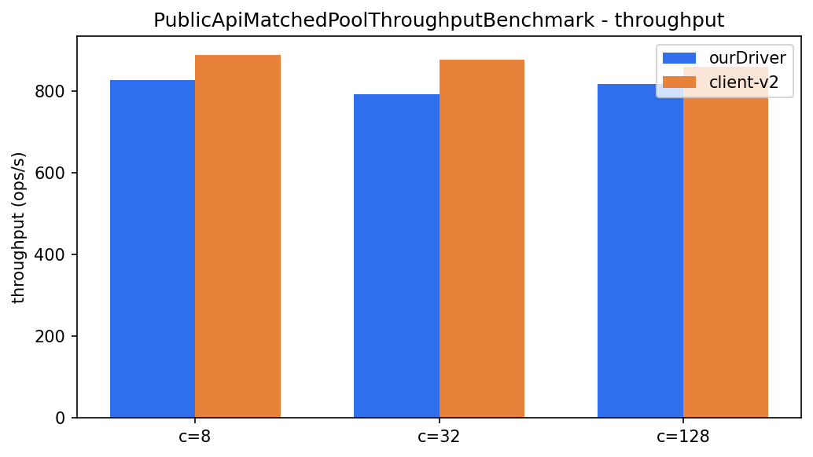
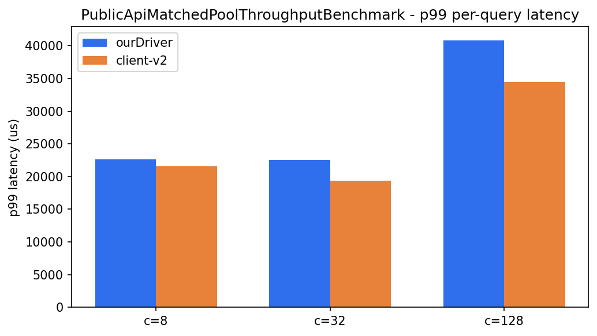
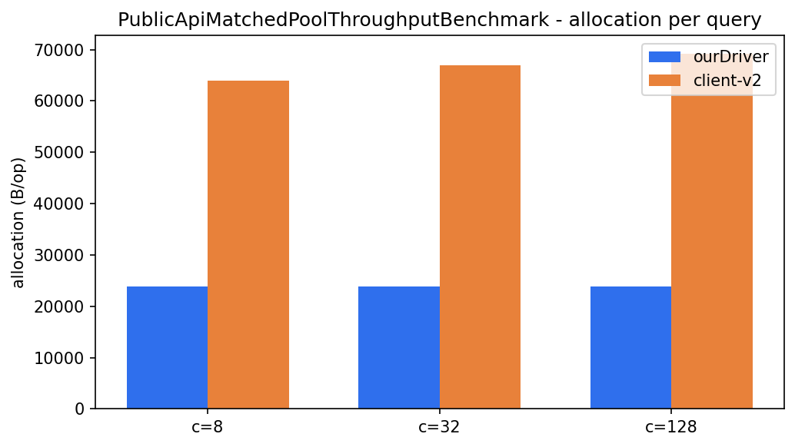
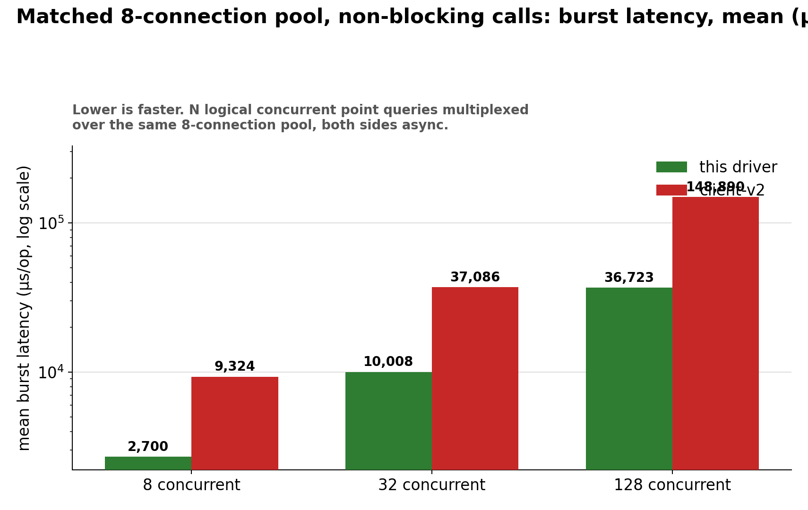
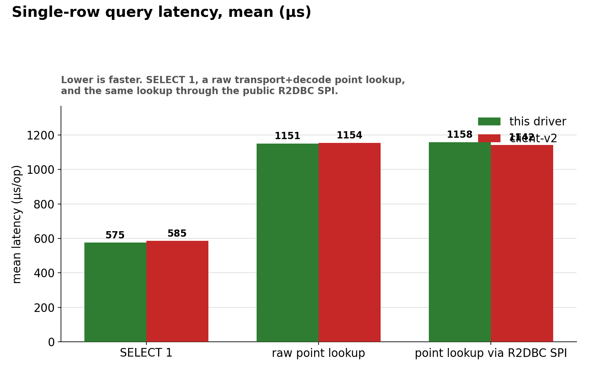

# Results (newest first — last updated 2026-08-23)

Sections below are ordered by when that result was last (re-)measured, newest first, not grouped
by benchmark category — so the current, trustworthy numbers are always at the top and older/
retracted/single-fork data sinks toward the bottom. See [index.md](index.md) for the confidence
warning and environment these numbers were measured under, and [methodology.md](methodology.md)
for what each benchmark class actually exercises.

## Cloud-verified matched pool, real async on both sides (2026-08-23)

The fair version of the non-blocking, matched-pool scenario below, run twice independently on the
Phase 10 cloud pipeline (`PublicApiMatchedPoolThroughputBenchmark`, `trusted` profile — 3 forks, 5
warmup iterations, `-prof gc`, GitHub Actions `ubuntu-latest`, one shared ClickHouse container for
the whole job — see [the roadmap's Phase 10](../../ROADMAP.md#phase-10--cloud-benchmark-pipeline))
after fixing the same `useAsyncRequests(true)` bug the retraction warning below describes. Per this
pipeline's own trust model (don't trust one absolute number from a shared runner — trust the ratio,
repeated across runs): the two runs agree closely, so this is a real signal, not noise.

| Concurrency (pool=8, both sides) | ourDriver/client-v2 throughput ratio, run 1 | run 2 |
| --- | --- | --- |
| 8 | 0.95 | 0.93 |
| 32 | 0.93 | 0.91 |
| 128 | 0.95 | 0.95 |

**client-v2 is ahead on throughput by roughly 5–9%, consistently across both runs and all three
concurrency levels** — the opposite of the retracted claim below.

  

| Concurrency | ourDriver p99 (run 2) | client-v2 p99 (run 2) | verdict |
| --- | --- | --- | --- |
| 8 | 22,675 µs | 21,597 µs | client-v2 ~5% lower |
| 32 | 22,561 µs | 19,379 µs | client-v2 ~16% lower |
| 128 | 40,849 µs | 34,481 µs | client-v2 ~18% lower |

**client-v2 also has lower per-query latency at every percentile (p50 through p99) and every
concurrency level, in both runs** — this matches, and reinforces, the not-yet-root-caused
["Blocking calls"](#blocking-calls-confirms-its-the-calling-style-not-the-pool) finding below and
[`MatchedPoolThreadsConcurrencyBenchmark`'s open regression](#open-follow-ups) — this is now two
independent benchmarks pointing at the same unresolved latency gap, not one.

  

| Concurrency | ourDriver B/op (run 2) | client-v2 B/op (run 2) | verdict |
| --- | --- | --- | --- |
| 8 | 23,866 | 63,891 | **this driver allocates 2.7x less** |
| 32 | 23,913 | 66,915 | **this driver allocates 2.8x less** |
| 128 | 23,923 | 69,243 | **this driver allocates 2.9x less** |

**This driver's advantage that does hold up, consistently, in both runs, at every concurrency
level: allocation per query.** ourDriver's allocation is flat regardless of concurrency; client-v2's
grows as concurrency rises. This is the one part of the original "matched pool" story that survives
the fix intact.

  

## Non-blocking, matched pool: numbers below are retracted pending re-run

> [!WARNING]
> **The `BoundedPoolConcurrencyBenchmark` numbers in this section (3.5–4.1x latency, ~4x
> throughput) were measured against a client-v2 benchmark-harness bug, not a fair comparison —
> treat them as retracted until this class is re-run with the fix.** client-v2's async client
> defaults `ClientConfigProperties.ASYNC_OPERATIONS` to `false`; without `.useAsyncRequests(true)`
> on the `Client.Builder` used here, `Client#query(...)` runs synchronously on the calling thread
> and returns an already-completed future — every client-v2 query in this benchmark's
> `Flux.flatMap(..., concurrency)` therefore ran on one sequential worker, not the matched
> 8-connection pool the table below claims. Confirmed by the math: client-v2's own numbers here
> show flat throughput and latency scaling almost exactly linearly with concurrency (8→32→128
> tracks 4x→4x) — the textbook signature of a single-server queue, not an 8-way pool. See
> ["Cloud-verified matched pool" above](#cloud-verified-matched-pool-real-async-on-both-sides-2026-08-23)
> for the same scenario re-run with the bug fixed — a materially different, honest result. This
> section is kept for the record, not as a current claim.

  

| Concurrency (pool=8, both sides) | this driver (mean) | client-v2 (mean) | verdict |
| --- | --- | --- | --- |
| 8 | 2700 µs | 9324 µs | ~~this driver 71.0% faster (3.5x)~~ retracted |
| 32 | 10,008 µs | 37,086 µs | ~~this driver 73.0% faster (3.7x)~~ retracted |
| 128 | 36,723 µs | 148,890 µs | ~~this driver 75.3% faster (4.1x)~~ retracted |

  

| Concurrency (pool=8, both sides) | this driver (ops/s) | client-v2 (ops/s) | verdict |
| --- | --- | --- | --- |
| 8 | 3516 | 900 | ~~3.9x throughput~~ retracted |
| 32 | 3615 | 900 | ~~4.0x throughput~~ retracted |
| 128 | 3541 | 893 | ~~4.0x throughput~~ retracted |

`BoundedPoolConcurrencyBenchmark` itself now has `.useAsyncRequests(true)` fixed (same fix as
`PublicApiMatchedPoolThroughputBenchmark` above) — this table just hasn't been re-run yet. Until it
is, don't cite the numbers above.

## Rapid-refresh cancellation: incomplete this run

`MixedWorkloadRapidRefreshCancelBenchmark.clientV2` completed (mean 93.1s per 32-user/15-refresh
burst, n=3) but `ourDriver` produced no samples in this run's log — the run was interrupted or the
log truncated before it reached that method. **Not reported as a comparison** — a number for one
side only is not a finding, it's a gap. Re-run this class on its own
(`-Pjmh.includes=MixedWorkloadRapidRefreshCancelBenchmark`) before drawing any conclusion about
cancellation behavior under this workload.

## Blocking calls: confirms it's the calling style, not the pool

| Shape | this driver (mean) | client-v2 (mean) | verdict |
| --- | --- | --- | --- |
| `@Threads(8)`, default (unmatched) pools | 2321 µs | 2217 µs | client-v2 4.7% faster |
| `@Threads(8)`, matched 8-connection pool | 2321 µs | 2151 µs | client-v2 7.9% faster |

Matching the pool size doesn't close the gap — it widens it slightly. This driver's non-blocking
pipeline has no advantage to offer when the caller blocks a whole platform thread per query; the
scheduler hop from the section below becomes pure overhead with nothing to hide it behind. See
[index.md's "How to use this driver well"](index.md#how-to-use-this-driver-well): this is exactly
the calling style not to use.

## Aggregation: a wash

| Rows | this driver (mean) | client-v2 (mean) | verdict |
| --- | --- | --- | --- |
| 10,000 | 1381 µs | 1339 µs | client-v2 3.2% faster |
| 100,000 | 4216 µs | 4228 µs | tied |
| 1,000,000 | 15,936 µs | 16,994 µs | this driver 6.2% faster |

`GROUP BY`/`count()`/`avg()`/`quantile()` always returns ~100 rows regardless of input size, so
decode cost is small next to the server-side aggregation both drivers pay identically. Neither
driver has a structural advantage here — which is itself useful to know: the streaming-scan
regression below is specifically a large-result-set problem, not a general one.

## Full table scan: found, partially fixed, and the fix's own measurement is unstable at 1M

  

This section originally reported a growing, unexplained regression (tied at 10k, 19.5% slower at
100k, 56.9% slower at 1M) once every benchmark started going through the real production decode
path (`RowBinaryDecoder.decode` + `RowDecodingScheduler`, replacing an earlier scheduler-free
shortcut that never paid its real off-event-loop cost). That regression is root-caused (see the
isolation section below for the mechanism) and a fix shipped — see
[`FluxInputStreamBridge`](../../clickhouse-r2dbc-reactive-core/src/main/java/io/github/camilyed/clickhouse/r2dbc/core/FluxInputStreamBridge.java)'s
"Chunk coalescing" Javadoc section. **A single-fork run initially looked like a near-complete fix
(11.8% gap remaining at 1M); a follow-up 3-fork run told a different, more honest story — see below
for why the single-fork number should not have been trusted.**

3-fork (`-Pjmh.forks=3 -Pjmh.warmupIterations=3`), after raising `RowBinaryDecoder.RESPONSE_CHUNK_DEMAND`
from `4` to `16` (see that constant's Javadoc — more chunks allowed in flight gives the coalescing
fix more material to merge per blocking `take()`):

| Rows | this driver (mean) | client-v2 (mean) | verdict |
| --- | --- | --- | --- |
| 10,000 | 3387 µs | 3855 µs | **this driver 12.1% faster** |
| 100,000 | 13,825–14,525 µs | 15,211–15,548 µs | **this driver roughly 4–11% faster, across repeated runs** |
| 1,000,000 | 94,000–131,439 µs | 96,031–98,617 µs | **unstable: anywhere from a tie to 33% slower, depending on the run** |

10k is a clean, repeatable win. 100k is a real, if noisier, win. 1M is not resolved — see "Why the
1M number won't sit still" below before treating any single 1M number on this page as the answer.

### Why it happened, and why the fix mostly worked

  

| Isolation (1M rows) | this driver (mean) | client-v2 (mean) | verdict |
| --- | --- | --- | --- |
| transport only (bytes, no decode) | 15,128 µs | 27,644 µs | **this driver 45.3% faster** |
| decode only (in-memory bytes) | 55,323 µs | 64,382 µs | **this driver 14.1% faster** |
| transport + decode (production path, after the fix, best observed fork) | ~94,000 µs | ~96,031 µs | roughly tied, best case |
| transport + decode (production path, after the fix, worst observed fork) | ~131,439 µs | ~98,617 µs | this driver ~33% slower, worst case |

Root cause, confirmed by instrumentation before writing any fix: `FluxInputStreamBridge` (the
adapter between Reactor Netty's push-based chunk delivery and the decoder's blocking pull-based
`InputStream` reads) did one `ArrayBlockingQueue.take()` — a real cross-thread synchronization
point between Netty's event loop and `RowDecodingScheduler`'s worker thread — per network chunk.
A temporary chunk counter added to `StreamingScanBenchmark` showed chunk count scaling almost
perfectly linearly with row count (~285–293 rows per chunk at every tier: 10k rows → ~34 chunks,
100k → ~342, 1M → ~3545), and the estimated per-chunk cost from the timing gap (~8–12µs) was
consistent across tiers — exactly what a fixed per-handoff cost multiplied by a row-count-scaling
handoff count would produce.

**The fix**: `FluxInputStreamBridge.fillCurrent()` still does one blocking `take()` for the first
available chunk, but then opportunistically drains any chunks *already sitting in the queue* with
non-blocking `poll()` calls, merging them into one larger buffer (up to 64KB) before returning —
trading handoffs away only when the producer is already ahead, never adding latency when it isn't.
The backpressure credit model is untouched: every physical chunk dequeued still triggers exactly
one demand-replenishing `request(1)`, just timed at dequeue instead of buffer-exhaustion.
`RowBinaryDecoder.RESPONSE_CHUNK_DEMAND` was also raised from `4` to `16` as part of this
investigation, so more chunks can be outstanding at once for the coalescing loop to find.

**At 1M rows the fix's effect is real but currently unmeasurable to a single number** — see the
next section.

### Why the 1M number won't sit still

3-fork `StreamingScanBenchmark.ourDriver` runs at 1M rows, broken down per-fork (JMH's own
percentile output pools all forks into one histogram, which hides this — the per-fork means come
from parsing `results.json`'s `rawDataHistogram` directly):

| Run | fork A | fork B | fork C | spread |
| --- | --- | --- | --- | --- |
| both drivers, `demand=4` | 97,000 µs | 122,500 µs | 129,400 µs | 33.4% |
| `ourDriver` only, `demand=16`, per-fork Testcontainers | 121,500 µs | 123,000 µs | 104,000 µs | 18.3% |
| `ourDriver` only, `demand=16`, shared external container | 123,700 µs | 94,000 µs | 122,500 µs | 31.6% |

`client-v2` shows none of this: its per-fork means at 1M sit within a 1.5% band across every run
(≈95,400–96,500 µs), run after run. Whatever is happening is specific to this driver's decode path,
not the ClickHouse server or the measurement harness in general.

Three explanations were tested and ruled out, in this order:

1. **GC pauses.** `-prof gc` on the isolated `ourDriver` benchmark showed 344ms of total GC pause
   time across the *entire* 1M-row trial (856 GC events, ~0.4ms each) — nowhere near enough to
   explain a single operation running 30,000+ µs slower than another. Ruled out.
2. **Testcontainers-per-fork** (each JMH fork getting its own freshly-started ClickHouse container,
   with different page-cache/startup state — exactly the confound
   `scripts/start-benchmark-clickhouse.sh` exists to eliminate). Re-run against the shared external
   container (`BENCH_CLICKHOUSE_URL`) still showed a 31.6% spread. Ruled out as the sole cause.
3. **`RowDecodingScheduler` worker-pool sizing.** `StreamingScanBenchmark` issues one query at a
   time, sequentially — only one worker thread from the pool is ever active regardless of
   `DEFAULT_WORKER_COUNT`, so changing pool size can't plausibly explain fork-to-fork variance in a
   single-query benchmark. Not tested empirically (would predictably do nothing), reasoned out.

What's left, none confirmed: JIT/tiered-compilation timing differences between separate JVM fork
launches, and/or OS-level thread scheduling on Apple Silicon's asymmetric performance/efficiency
cores (no QoS/priority hints are set on `RowDecodingScheduler`'s threads, so macOS decides
per-launch which physical cores they land on). Both would need tooling this investigation didn't
have available — `async-profiler`, JFR, or `sudo powermetrics` run locally by someone with hands on
the actual machine — to confirm. Also notable and unresolved: single, extreme per-operation outliers
(one 1M-row scan taking 300,000+ µs against a ~120,000 µs median) appear in some runs and not
others, including runs with identical configuration — see [Open follow-ups](#open-follow-ups).

**What this means for the headline number:** treat "this driver at 1M rows" as a range, not a
point — somewhere between tied-with-client-v2 and ~30% slower, depending on JVM/OS conditions this
investigation could not pin down with the tools available. The 10k and 100k results above don't
show this instability and can be trusted as reported.

## Protocol floor: essentially tied

  

| Benchmark | this driver (mean) | client-v2 (mean) | verdict |
| --- | --- | --- | --- |
| `SELECT 1` | 575.0 µs | 585.1 µs | this driver 1.7% faster |
| raw point lookup | 1150.6 µs | 1154.2 µs | tied (0.3%) |
| point lookup via R2DBC SPI | 1158.0 µs | 1142.0 µs | client-v2 1.4% faster |

At the scale of one round trip, the two drivers cost essentially the same. Earlier write-ups of
this page reported this driver 6–7% faster here — that margin is gone in this run. Nothing about
the protocol path changed; the more likely explanation is that earlier single-fork numbers were
themselves noise (see the confidence warning in [index.md](index.md)). Treat the protocol floor as
a wash until a multi-fork run says otherwise in either direction.

## Open follow-ups

- **Explain the 1M-row inter-fork variance.** See ["Why the 1M number won't sit
  still"](#why-the-1m-number-wont-sit-still) — GC, Testcontainers-per-fork, and worker-pool sizing
  are ruled out. What's left needs tooling this remote investigation didn't have: `async-profiler`
  or JFR run locally to see where the extra time actually goes in a slow fork, or `sudo powermetrics`
  during a run to check whether `RowDecodingScheduler`'s threads are landing on Apple Silicon's
  efficiency cores in the slow forks and performance cores in the fast ones. Needs someone with
  hands on the actual benchmark machine — a reasonable point to ask a domain expert / performance
  engineer to look at directly, not something to keep guessing at over successive JMH re-runs.
- **Investigate the single extreme outliers** (one operation taking 300,000+ µs against a
  ~120,000 µs median at 1M rows, appearing in some runs and not others under identical
  configuration) — separate phenomenon from the fork-to-fork mean variance above, also not
  explained by the measured GC pause time.
- **Try `MAX_COALESCE_BYTES` past 64KB** as a further one-variable experiment, now that
  `RESPONSE_CHUNK_DEMAND` has already been raised to 16 — not attempted, since the 1M
  instability above makes it hard to tell a real improvement from run-to-run noise until that's
  resolved first.
- **Re-run at 3 forks.** `StreamingScanBenchmark` now has 3-fork data; every other benchmark family
  (protocol floor, aggregation, blocking calls, concurrency, throughput) is still single-fork and
  several of those results (protocol floor, aggregation) are close enough that fork noise could
  plausibly change the verdict.
- **Re-run `MixedWorkloadRapidRefreshCancelBenchmark` to completion** — this run has no `ourDriver`
  data to compare against client-v2's.
- **Root-cause the latency gap** — now confirmed by two independent benchmarks, not one:
  `MatchedPoolThreadsConcurrencyBenchmark`'s blocking-caller regression, and the cloud-verified
  `PublicApiMatchedPoolThroughputBenchmark` result above (real async on both sides, still client-v2
  ahead on p50–p99 at every concurrency level). `RowDecodingScheduler`'s cross-thread hand-off is
  the leading suspect (see the streaming-scan root cause above for the same mechanism at a
  different scale) — `-prof gc` plus `async-profiler`/JFR on `PublicApiMatchedPoolThroughputBenchmark`
  is the next concrete step, not another blind re-run.
- **Re-run `BoundedPoolConcurrencyBenchmark`** now that it has `.useAsyncRequests(true)` fixed —
  see the retraction warning above. Its numbers should land in the same shape as the cloud-verified
  `PublicApiMatchedPoolThroughputBenchmark` result, since both now exercise the same fair
  matched-pool scenario; if they don't agree, that's itself worth explaining.
- **Build `MixedWorkloadRapidRefreshPileUpBenchmark`**, the no-cancellation counterpart to the
  rapid-refresh scenario above (old and new queries both run to completion) — a named, not-yet-built
  companion benchmark.
- **Widen the concurrency/pool-size matrix** — `BoundedPoolConcurrencyBenchmark` and
  `PublicApiMatchedPoolThroughputBenchmark` currently test one pool size (8) and three concurrency
  levels (8/32/128); a real scalability sweep would cover more of both.
- **Rename the `ourDriver` label to something more sensible** across every benchmark method,
  `analyze.py`'s `DRIVER_LABELS`, and every table on this page — flagged 2026-08-23, deliberately
  not done yet: waiting on the first `DefaultPoolSlowQueryThroughputBenchmark` CI results before
  touching benchmark naming, so a rename doesn't get tangled up with reading that run's numbers.
